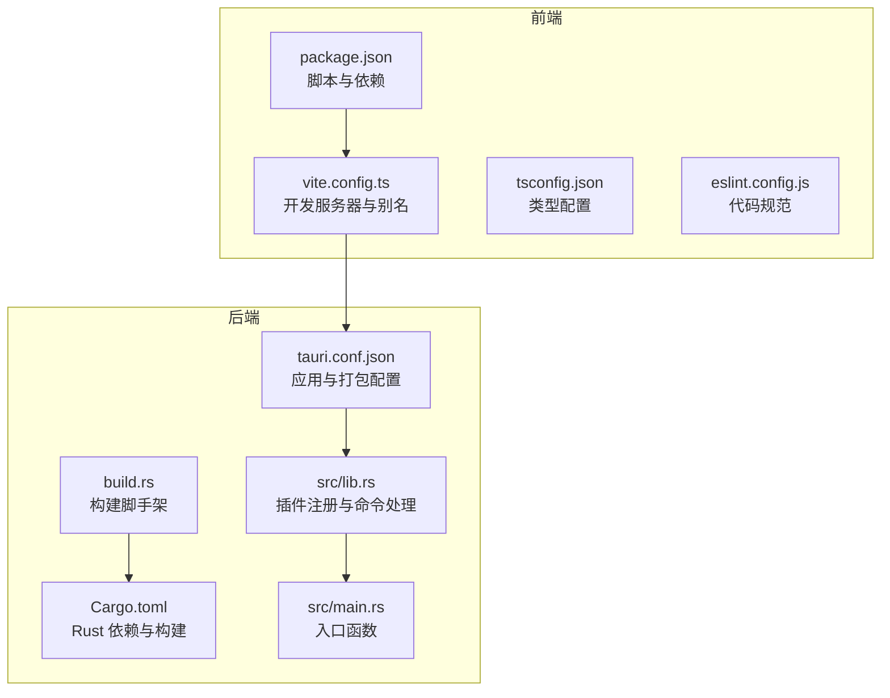
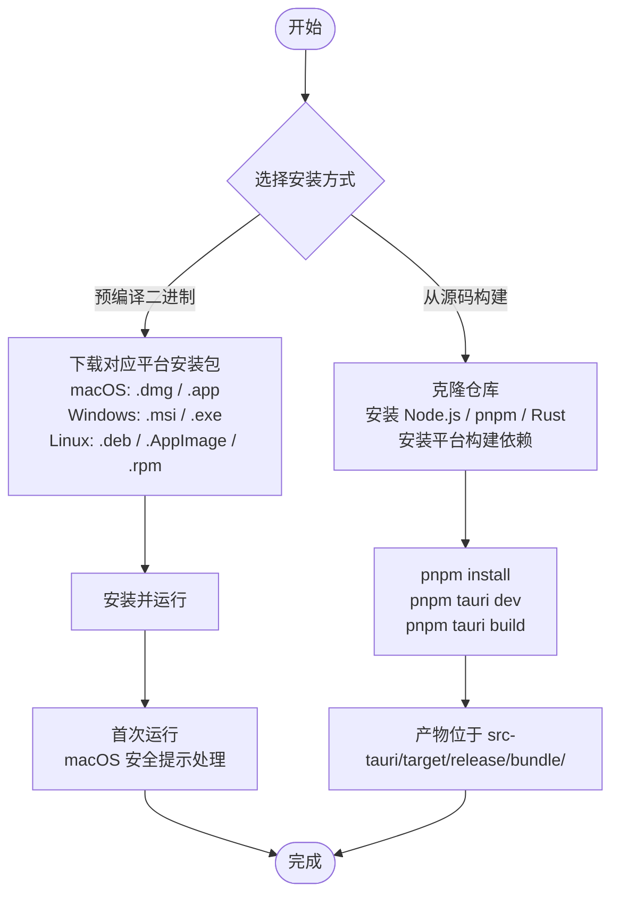
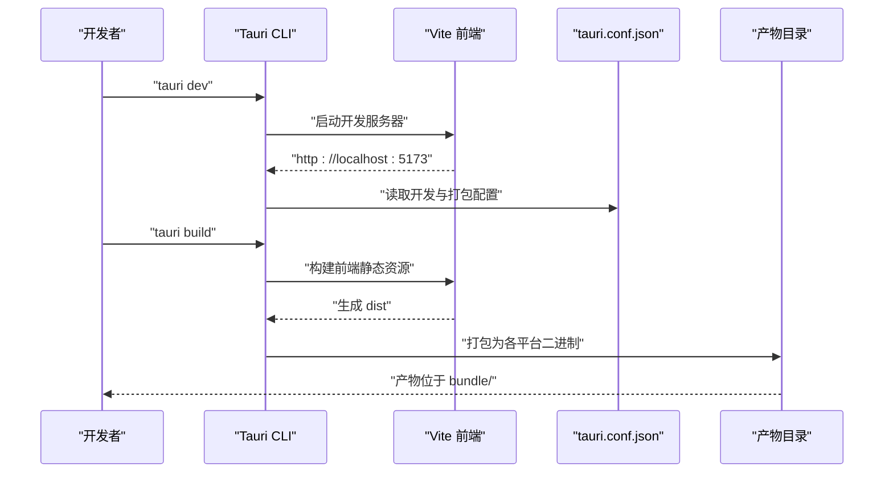
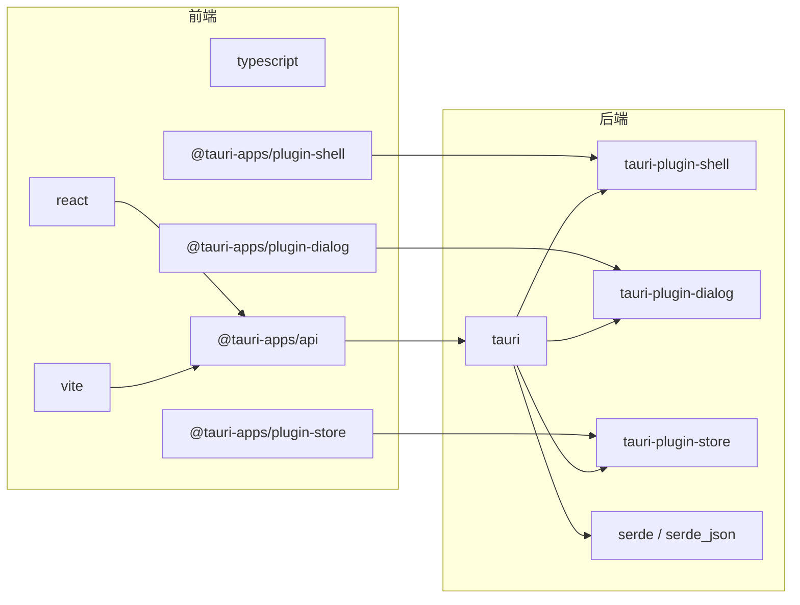

# 安装指南

<cite>
**本文档引用的文件**
- [README.md](file://README.md)
- [package.json](file://package.json)
- [src-tauri/Cargo.toml](file://src-tauri/Cargo.toml)
- [src-tauri/tauri.conf.json](file://src-tauri/tauri.conf.json)
- [vite.config.ts](file://vite.config.ts)
- [.github/workflows/release.yml](file://.github/workflows/release.yml)
- [src-tauri/src/lib.rs](file://src-tauri/src/lib.rs)
- [src-tauri/src/main.rs](file://src-tauri/src/main.rs)
- [src-tauri/build.rs](file://src-tauri/build.rs)
- [tsconfig.json](file://tsconfig.json)
- [eslint.config.js](file://eslint.config.js)
</cite>

## 目录
1. [简介](#简介)
2. [项目结构](#项目结构)
3. [核心组件](#核心组件)
4. [架构总览](#架构总览)
5. [详细组件分析](#详细组件分析)
6. [依赖关系分析](#依赖关系分析)
7. [性能考虑](#性能考虑)
8. [故障排除指南](#故障排除指南)
9. [结论](#结论)
10. [附录](#附录)

## 简介
本指南面向希望在本地安装和使用 LaunchPro 的用户与开发者。LaunchPro 是一个基于 Tauri v2 的跨平台桌面应用，支持 macOS、Windows 和 Linux。它提供项目管理、一键打开、工具管理、主题切换、系统托盘等特性，并采用本地存储保障隐私。

本指南涵盖两种安装方式：
- 预编译二进制文件下载安装（推荐）
- 从源码构建安装（适合开发者）

同时提供各平台安装要求、系统兼容性、前置条件、安装步骤、开发环境搭建、常见问题排查以及安全注意事项与首次运行配置建议。

## 项目结构
LaunchPro 采用前后端分离架构：
- 前端：React 19 + TypeScript + Vite 8，使用 Tailwind CSS 4 进行样式设计
- 后端：Rust（Tauri 2），通过插件实现 Shell、Dialog、Store 等能力
- 构建与打包：Tauri CLI 负责前端资源注入与多平台打包

图表来源
- [package.json:1-48](file://package.json#L1-L48)
- [vite.config.ts:1-32](file://vite.config.ts#L1-L32)
- [tsconfig.json:1-8](file://tsconfig.json#L1-L8)
- [eslint.config.js:1-24](file://eslint.config.js#L1-L24)
- [src-tauri/Cargo.toml:1-22](file://src-tauri/Cargo.toml#L1-L22)
- [src-tauri/tauri.conf.json:1-44](file://src-tauri/tauri.conf.json#L1-L44)
- [src-tauri/src/lib.rs:1-28](file://src-tauri/src/lib.rs#L1-L28)
- [src-tauri/src/main.rs:1-7](file://src-tauri/src/main.rs#L1-L7)
- [src-tauri/build.rs:1-4](file://src-tauri/build.rs#L1-L4)

章节来源
- [README.md:115-135](file://README.md#L115-L135)
- [package.json:1-48](file://package.json#L1-L48)
- [src-tauri/Cargo.toml:1-22](file://src-tauri/Cargo.toml#L1-L22)
- [src-tauri/tauri.conf.json:1-44](file://src-tauri/tauri.conf.json#L1-L44)

## 核心组件
- 应用配置与打包
  - Tauri 应用名称、版本、标识符、窗口尺寸与最小尺寸、托盘图标路径等
  - 打包目标为“全部平台”，并设置 macOS 最低系统版本
- 前端开发与构建
  - Vite 开发服务器端口与热重载配置，React 插件与 Tailwind CSS 插件
  - TypeScript 多配置引用，ESLint 规则
- Rust 后端
  - 注册 Shell、Dialog、Store 插件，定义命令处理器，托盘逻辑初始化
  - 入口函数调用库模块运行应用

章节来源
- [src-tauri/tauri.conf.json:1-44](file://src-tauri/tauri.conf.json#L1-L44)
- [vite.config.ts:1-32](file://vite.config.ts#L1-L32)
- [tsconfig.json:1-8](file://tsconfig.json#L1-L8)
- [eslint.config.js:1-24](file://eslint.config.js#L1-L24)
- [src-tauri/src/lib.rs:1-28](file://src-tauri/src/lib.rs#L1-L28)
- [src-tauri/src/main.rs:1-7](file://src-tauri/src/main.rs#L1-L7)

## 架构总览
下图展示从用户安装到应用运行的关键流程，包括预编译安装与源码构建两条路径。

图表来源
- [README.md:44-84](file://README.md#L44-L84)
- [.github/workflows/release.yml:65-108](file://.github/workflows/release.yml#L65-L108)

章节来源
- [README.md:44-84](file://README.md#L44-L84)
- [.github/workflows/release.yml:65-108](file://.github/workflows/release.yml#L65-L108)

## 详细组件分析

### 预编译二进制文件下载安装
适用场景
- 普通用户快速体验与使用
- 不需要修改源码或自定义构建

安装步骤
1. 访问发布页面，根据平台选择合适的安装包：
   - macOS：Apple Silicon 或 Intel 版本的 .dmg
   - Windows：x64 的 .msi 或 .exe
   - Linux：amd64 的 .deb、.AppImage 或 .rpm
2. 下载完成后执行安装程序并启动应用

macOS 首次运行安全提示
- 若出现安全警告，请前往“系统设置 → 隐私与安全性”，点击“仍要打开”

章节来源
- [README.md:46-56](file://README.md#L46-L56)

### 从源码构建安装
前置条件
- Node.js：版本要求 ≥ 18
- pnpm：版本要求 ≥ 8
- Rust：最新稳定版
- 平台构建依赖（详见 Tauri 前置条件）

安装步骤
1. 克隆仓库并进入目录
2. 安装前端依赖
3. 启动开发模式（热重载）
4. 构建生产二进制文件

产物位置
- 生产构建产物位于 src-tauri/target/release/bundle/

章节来源
- [README.md:57-84](file://README.md#L57-L84)
- [package.json:6-12](file://package.json#L6-L12)

### 平台与系统兼容性
- macOS：最低系统版本 10.15，支持 .dmg 与 .app 包格式
- Windows：最低系统版本 10，支持 .msi 与 .exe 包格式
- Linux：支持 .deb、.AppImage、.rpm 包格式

章节来源
- [README.md:34-43](file://README.md#L34-L43)
- [src-tauri/tauri.conf.json:39-41](file://src-tauri/tauri.conf.json#L39-L41)

### 开发环境搭建
- Node.js 与 pnpm
  - 使用 Node.js ≥ 18 与 pnpm ≥ 8
  - 在项目根目录执行安装依赖命令
- Rust 工具链
  - 安装最新稳定版 Rust
  - 根据 CI 配置，Linux 平台需安装额外依赖（如 GTK、Webkit、AppIndicator 等）
- Tauri CLI
  - 通过开发依赖安装 Tauri CLI，用于开发与构建

章节来源
- [README.md:59-64](file://README.md#L59-L64)
- [.github/workflows/release.yml:75-90](file://.github/workflows/release.yml#L75-L90)
- [package.json:30-46](file://package.json#L30-L46)

### 构建与打包流程
- 开发模式
  - 前端开发服务器地址 http://localhost:5173
  - 通过 beforeDevCommand 自动启动前端开发
- 生产构建
  - 通过 beforeBuildCommand 自动构建前端静态资源
  - 将 dist 目录作为前端资源注入
  - 打包目标为“全部平台”
- CI/CD 流水线
  - 使用 GitHub Actions 自动化构建与发布
  - macOS 分别针对 aarch64 与 x86_64 目标进行构建
  - Linux 平台安装必要依赖后构建
  - Windows 平台直接构建

图表来源
- [src-tauri/tauri.conf.json:5-10](file://src-tauri/tauri.conf.json#L5-L10)
- [vite.config.ts:16-30](file://vite.config.ts#L16-L30)
- [.github/workflows/release.yml:95-108](file://.github/workflows/release.yml#L95-L108)

章节来源
- [src-tauri/tauri.conf.json:5-10](file://src-tauri/tauri.conf.json#L5-L10)
- [vite.config.ts:16-30](file://vite.config.ts#L16-L30)
- [.github/workflows/release.yml:95-108](file://.github/workflows/release.yml#L95-L108)

## 依赖关系分析
- 前端依赖
  - React 19、TypeScript、Tailwind CSS 4、Vite 8
  - Tauri 插件：@tauri-apps/api、@tauri-apps/plugin-shell、@tauri-apps/plugin-dialog、@tauri-apps/plugin-store
- Rust 依赖
  - tauri、tauri-plugin-shell、tauri-plugin-dialog、tauri-plugin-store、serde、serde_json
- 构建与开发
  - @tauri-apps/cli 作为开发依赖，提供 tauri 命令
  - ESLint、TypeScript Eslint、React Hooks/Refresh 规则

图表来源
- [package.json:13-29](file://package.json#L13-L29)
- [package.json:30-46](file://package.json#L30-L46)
- [src-tauri/Cargo.toml:15-22](file://src-tauri/Cargo.toml#L15-L22)

章节来源
- [package.json:13-29](file://package.json#L13-L29)
- [package.json:30-46](file://package.json#L30-L46)
- [src-tauri/Cargo.toml:15-22](file://src-tauri/Cargo.toml#L15-L22)

## 性能考虑
- 开发模式下启用热重载，提高迭代效率
- 生产构建前先进行前端资源构建，确保静态资源完整注入
- Linux 平台在 CI 中提前安装构建依赖，减少构建失败概率
- 托盘图标与窗口配置优化用户体验

[本节为通用指导，不涉及具体文件分析]

## 故障排除指南
常见问题与解决思路
- macOS 首次运行安全提示
  - 现象：首次启动弹出安全警告
  - 解决：前往“系统设置 → 隐私与安全性”，点击“仍要打开”
- Linux 构建失败（缺少依赖）
  - 现象：构建过程中报错，提示缺失 GTK/Webkit/AppIndicator 等依赖
  - 解决：参考 CI 配置，在 Ubuntu 上安装相应依赖后再构建
- Windows 构建失败（缺少平台依赖）
  - 现象：构建报错，提示缺少 Windows 平台构建组件
  - 解决：安装 Tauri 所需的 Windows 构建依赖后重试
- 开发服务器无法访问
  - 现象：浏览器无法访问 http://localhost:5173
  - 解决：检查 Vite 配置中的端口与严格端口设置；确认未被防火墙拦截
- 产物为空或缺失
  - 现象：构建后无任何可执行文件
  - 解决：确认 beforeBuildCommand 已正确构建前端资源；检查打包配置 targets 是否为“all”

章节来源
- [README.md:55](file://README.md#L55)
- [.github/workflows/release.yml:80-90](file://.github/workflows/release.yml#L80-L90)
- [vite.config.ts:16-30](file://vite.config.ts#L16-L30)
- [src-tauri/tauri.conf.json:29-31](file://src-tauri/tauri.conf.json#L29-L31)

## 结论
- 预编译二进制安装适合大多数用户，简单快捷
- 源码构建适合开发者与需要定制化的用户
- 遵循平台与系统兼容性要求，提前准备 Node.js、pnpm、Rust 与平台构建依赖
- 首次运行遇到 macOS 安全提示时按指引处理
- 如遇构建问题，优先检查 Linux 依赖与开发服务器端口

[本节为总结性内容，不涉及具体文件分析]

## 附录

### 安装方式对比与适用场景
- 预编译二进制
  - 优点：安装简单、即装即用、无需编译等待
  - 缺点：无法自定义构建参数、无法参与贡献
  - 适用：普通用户、快速体验
- 源码构建
  - 优点：可定制、便于调试与贡献
  - 缺点：需要准备开发环境、编译时间较长
  - 适用：开发者、需要深度定制

章节来源
- [README.md:44-84](file://README.md#L44-L84)

### 首次运行配置建议
- macOS：允许来自“App Store 和已验证开发者”的应用
- Linux：确保已安装系统托盘相关依赖，以便托盘正常显示
- Windows：以管理员权限运行安装器可避免部分权限问题

章节来源
- [README.md:55](file://README.md#L55)
- [.github/workflows/release.yml:80-90](file://.github/workflows/release.yml#L80-L90)