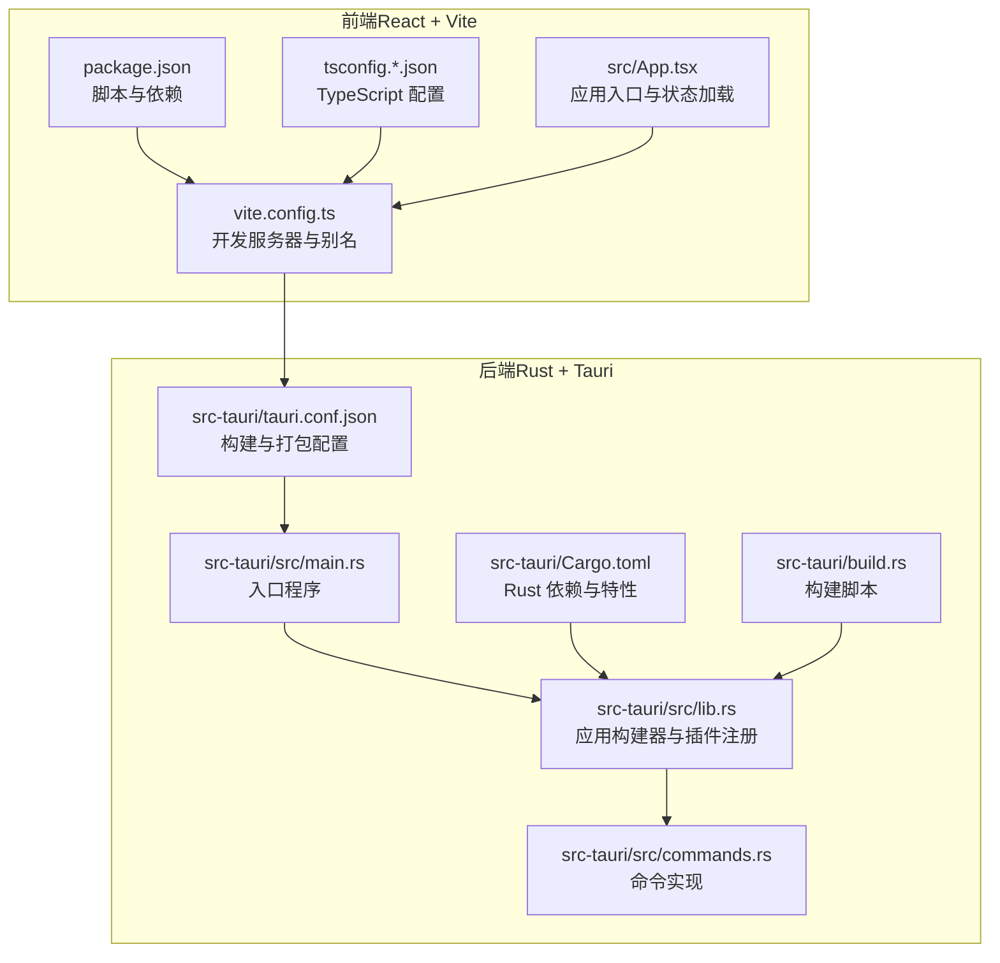
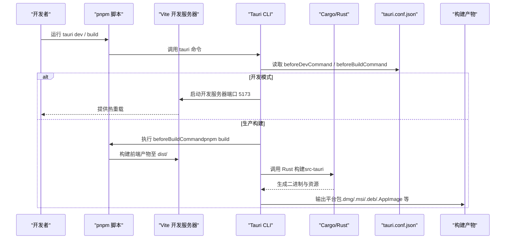
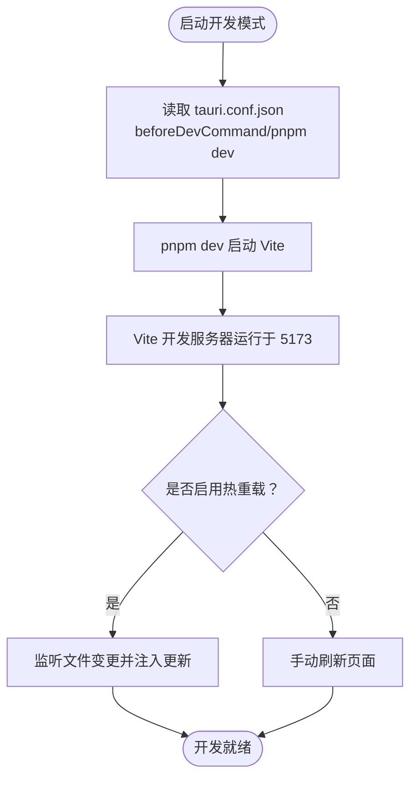
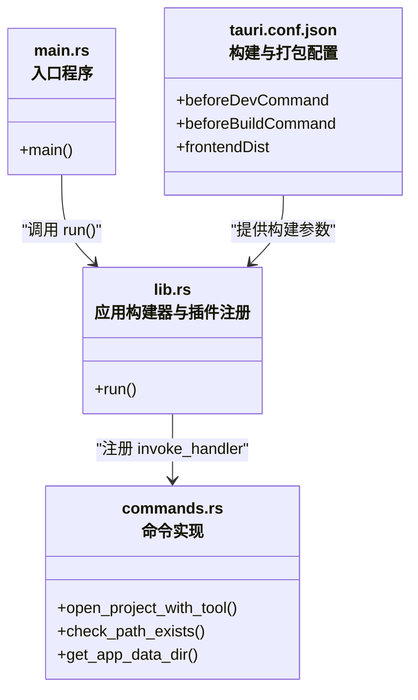
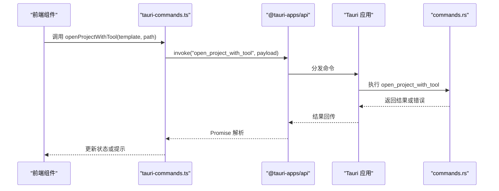

# 源码构建安装

<cite>
**本文引用的文件**
- [README.md](file://README.md)
- [package.json](file://package.json)
- [vite.config.ts](file://vite.config.ts)
- [tsconfig.json](file://tsconfig.json)
- [tsconfig.app.json](file://tsconfig.app.json)
- [src-tauri/tauri.conf.json](file://src-tauri/tauri.conf.json)
- [src-tauri/Cargo.toml](file://src-tauri/Cargo.toml)
- [src-tauri/src/main.rs](file://src-tauri/src/main.rs)
- [src-tauri/src/lib.rs](file://src-tauri/src/lib.rs)
- [src-tauri/src/commands.rs](file://src-tauri/src/commands.rs)
- [src-tauri/build.rs](file://src-tauri/build.rs)
- [.github/workflows/release.yml](file://.github/workflows/release.yml)
- [src/App.tsx](file://src/App.tsx)
- [src/lib/tauri-commands.ts](file://src/lib/tauri-commands.ts)
</cite>

## 目录
1. [简介](#简介)
2. [项目结构](#项目结构)
3. [核心组件](#核心组件)
4. [架构总览](#架构总览)
5. [详细组件分析](#详细组件分析)
6. [依赖分析](#依赖分析)
7. [性能考虑](#性能考虑)
8. [故障排查指南](#故障排查指南)
9. [结论](#结论)
10. [附录](#附录)

## 简介
本指南面向希望从源码构建 LaunchPro 的开发者，提供完整的开发环境准备与构建流程，涵盖以下内容：
- 开发工具链：Node.js（>=18）、pnpm（>=8）、Rust（最新稳定版）
- 平台 Tauri 前置依赖（参考官方前置条件）
- 从克隆仓库到完成构建的命令行步骤：前端依赖安装、开发模式启动、生产构建
- 构建产物位置与用途说明
- 开发调试与热重载使用方法
- 常见问题与解决方案

## 项目结构
LaunchPro 采用前后端分离的 Tauri v2 应用结构：
- 前端：React 19 + TypeScript + Vite 8，位于 src/ 目录
- 后端：Rust + Tauri 2，位于 src-tauri/ 目录
- 构建与打包：通过 Tauri CLI 驱动，Vite 负责前端构建，Cargo 负责 Rust 构建

图表来源
- [package.json:1-48](file://package.json#L1-L48)
- [vite.config.ts:1-32](file://vite.config.ts#L1-L32)
- [tsconfig.json:1-8](file://tsconfig.json#L1-L8)
- [tsconfig.app.json:1-33](file://tsconfig.app.json#L1-L33)
- [src-tauri/tauri.conf.json:1-40](file://src-tauri/tauri.conf.json#L1-L40)
- [src-tauri/Cargo.toml:1-22](file://src-tauri/Cargo.toml#L1-L22)
- [src-tauri/src/main.rs:1-7](file://src-tauri/src/main.rs#L1-L7)
- [src-tauri/src/lib.rs:1-28](file://src-tauri/src/lib.rs#L1-L28)
- [src-tauri/src/commands.rs:1-95](file://src-tauri/src/commands.rs#L1-L95)
- [src-tauri/build.rs:1-4](file://src-tauri/build.rs#L1-L4)

章节来源
- [README.md:57-84](file://README.md#L57-L84)
- [src-tauri/tauri.conf.json:1-40](file://src-tauri/tauri.conf.json#L1-L40)
- [package.json:1-48](file://package.json#L1-L48)

## 核心组件
- 前端构建与开发
  - Vite 作为开发服务器与打包工具，支持热重载与 TypeScript 编译
  - 别名 @ 指向 src/，便于模块导入
- 后端构建与打包
  - Cargo 管理 Rust 依赖与构建，Tauri CLI 驱动打包
  - tauri.conf.json 配置开发/生产构建前钩子、前端产物目录、窗口与打包参数
- 命令系统
  - Rust 侧定义 Tauri 命令，前端通过 @tauri-apps/api 的 invoke 调用
  - 示例命令：打开项目、检查路径存在性、获取应用数据目录

章节来源
- [vite.config.ts:1-32](file://vite.config.ts#L1-L32)
- [tsconfig.app.json:1-33](file://tsconfig.app.json#L1-L33)
- [src-tauri/tauri.conf.json:1-40](file://src-tauri/tauri.conf.json#L1-L40)
- [src-tauri/Cargo.toml:1-22](file://src-tauri/Cargo.toml#L1-L22)
- [src-tauri/src/lib.rs:1-28](file://src-tauri/src/lib.rs#L1-L28)
- [src-tauri/src/commands.rs:1-95](file://src-tauri/src/commands.rs#L1-L95)
- [src/lib/tauri-commands.ts:1-17](file://src/lib/tauri-commands.ts#L1-L17)

## 架构总览
下图展示从源码到可执行程序的关键流程：前端构建、后端构建、Tauri 打包与平台目标生成。

图表来源
- [README.md:66-81](file://README.md#L66-L81)
- [src-tauri/tauri.conf.json:5-10](file://src-tauri/tauri.conf.json#L5-L10)
- [package.json:6-12](file://package.json#L6-L12)
- [vite.config.ts:16-31](file://vite.config.ts#L16-L31)

章节来源
- [README.md:57-84](file://README.md#L57-L84)
- [src-tauri/tauri.conf.json:1-40](file://src-tauri/tauri.conf.json#L1-L40)
- [package.json:1-48](file://package.json#L1-L48)

## 详细组件分析

### 前端开发与热重载
- 开发服务器
  - Vite 在本地 5173 端口启动，严格端口绑定，支持热重载
  - 支持通过环境变量配置跨主机访问与自定义 HMR 参数
- TypeScript 配置
  - 分离 app 与 node 两套 tsconfig，启用 bundler 模式与严格模式
- 别名与模块解析
  - @ 指向 src/，提升导入便捷性
- 应用入口
  - App.tsx 初始化主题、通知与全局状态加载

图表来源
- [src-tauri/tauri.conf.json:6-7](file://src-tauri/tauri.conf.json#L6-L7)
- [vite.config.ts:16-31](file://vite.config.ts#L16-L31)
- [tsconfig.app.json:11-29](file://tsconfig.app.json#L11-L29)

章节来源
- [vite.config.ts:1-32](file://vite.config.ts#L1-L32)
- [tsconfig.app.json:1-33](file://tsconfig.app.json#L1-L33)
- [src/App.tsx:1-40](file://src/App.tsx#L1-L40)

### Rust 后端与 Tauri 插件
- 应用入口与运行
  - main.rs 调用 pro_manager_lib::run，进入 Tauri 应用生命周期
- 插件与命令
  - 注册 shell/dialog/store 插件，注册 invoke_handler 对应的命令函数
  - 窗口事件处理：关闭时隐藏而非退出，保持托盘运行
- 命令实现
  - open_project_with_tool：拼接命令模板与项目路径，设置 PATH 并执行
  - check_path_exists：校验路径是否存在且为目录
  - get_app_data_dir：获取应用数据目录

图表来源
- [src-tauri/src/main.rs:1-7](file://src-tauri/src/main.rs#L1-L7)
- [src-tauri/src/lib.rs:1-28](file://src-tauri/src/lib.rs#L1-L28)
- [src-tauri/src/commands.rs:1-95](file://src-tauri/src/commands.rs#L1-L95)
- [src-tauri/tauri.conf.json:5-10](file://src-tauri/tauri.conf.json#L5-L10)

章节来源
- [src-tauri/src/main.rs:1-7](file://src-tauri/src/main.rs#L1-L7)
- [src-tauri/src/lib.rs:1-28](file://src-tauri/src/lib.rs#L1-L28)
- [src-tauri/src/commands.rs:1-95](file://src-tauri/src/commands.rs#L1-L95)

### 前端调用后端命令
- 前端封装
  - tauri-commands.ts 将 Rust 命令包装为 Promise 接口
- 典型调用
  - 打开项目：传入命令模板与项目路径，触发系统命令执行
  - 路径校验：在打开前检查路径有效性
  - 获取数据目录：用于存储用户数据

图表来源
- [src/lib/tauri-commands.ts:1-17](file://src/lib/tauri-commands.ts#L1-L17)
- [src-tauri/src/commands.rs:48-79](file://src-tauri/src/commands.rs#L48-L79)

章节来源
- [src/lib/tauri-commands.ts:1-17](file://src/lib/tauri-commands.ts#L1-L17)
- [src-tauri/src/commands.rs:1-95](file://src-tauri/src/commands.rs#L1-L95)

## 依赖分析
- 前端依赖
  - React 19、TypeScript、Vite 8、Tailwind CSS 4、Zustand 5、Sonner、Radix UI 等
- 开发依赖
  - @tauri-apps/cli、@vitejs/plugin-react、eslint、tailwindcss 等
- 后端依赖
  - tauri（含 tray-icon、image-png 特性）、tauri-plugin-shell、tauri-plugin-dialog、tauri-plugin-store、serde、serde_json
- 构建脚本
  - package.json 中定义 dev/build/preview/tauri/lint 等脚本
  - tauri.conf.json 中定义 beforeDevCommand、beforeBuildCommand、frontendDist

章节来源
- [package.json:13-46](file://package.json#L13-L46)
- [src-tauri/Cargo.toml:15-22](file://src-tauri/Cargo.toml#L15-L22)
- [src-tauri/tauri.conf.json:5-10](file://src-tauri/tauri.conf.json#L5-L10)

## 性能考虑
- 开发阶段
  - 使用 Vite 的快速冷启动与热重载，避免不必要的全量重建
  - 通过 vite.config.ts 的 watch.ignore 忽略 src-tauri 目录，减少无关文件监听
- 生产构建
  - 前端产物输出至 dist/，由 tauri.conf.json 指定；确保 beforeBuildCommand 正确执行
  - Rust 侧启用优化构建（release），配合 Tauri 打包生成最终二进制

章节来源
- [vite.config.ts:27-29](file://vite.config.ts#L27-L29)
- [src-tauri/tauri.conf.json:8-9](file://src-tauri/tauri.conf.json#L8-L9)

## 故障排查指南
- Node.js 版本过低
  - 现象：pnpm 安装失败或构建报错
  - 处理：升级 Node.js 至 18+，重新安装 pnpm
- pnpm 版本过低
  - 现象：安装依赖时报版本不兼容
  - 处理：升级 pnpm 至 8+
- Rust 环境未正确安装
  - 现象：cargo 构建失败、找不到工具链
  - 处理：安装最新稳定版 Rust（rustup），确保已添加到 PATH
- 平台 Tauri 前置依赖缺失
  - 现象：构建时报缺少系统库或头文件
  - 处理：根据平台安装 Tauri 官方前置依赖（参考 README 的“Prerequisites”链接）
- 开发服务器端口冲突
  - 现象：Vite 启动失败，端口被占用
  - 处理：修改 vite.config.ts 中的 port 或释放 5173 端口
- 热重载不生效
  - 现象：保存文件后页面未自动刷新
  - 处理：确认 host 与 HMR 配置；必要时禁用 host 仅本地访问
- 跨主机访问受限
  - 现象：通过 TAURI_DEV_HOST 访问受限
  - 处理：确保网络策略允许访问指定主机与端口
- 打包产物位置不符预期
  - 现象：找不到 release 包
  - 处理：确认 tauri.conf.json 的 frontendDist 与 beforeBuildCommand；产物默认位于 src-tauri/target/release/bundle/

章节来源
- [README.md:59-64](file://README.md#L59-L64)
- [vite.config.ts:6-26](file://vite.config.ts#L6-L26)
- [src-tauri/tauri.conf.json:83](file://src-tauri/tauri.conf.json#L83)

## 结论
按照本指南完成环境准备与构建步骤，即可在本地成功启动开发模式并产出多平台安装包。建议在开发过程中充分利用热重载与类型检查，结合 Rust 的严格编译期检查，提升开发效率与稳定性。

## 附录

### 开发环境搭建与构建步骤
- 克隆仓库
  - git clone 仓库地址
  - 进入项目目录
- 安装前端依赖
  - pnpm install
- 启动开发模式（热重载）
  - pnpm tauri dev
- 类型检查
  - pnpm tsc --noEmit
- 代码规范
  - pnpm lint
- 仅构建前端
  - pnpm build
- 生产构建
  - pnpm tauri build
- 构建产物位置
  - 默认位于 src-tauri/target/release/bundle/，包含各平台包

章节来源
- [README.md:66-81](file://README.md#L66-L81)
- [README.md:85-99](file://README.md#L85-L99)
- [src-tauri/tauri.conf.json:83](file://src-tauri/tauri.conf.json#L83)

### 平台 Tauri 前置依赖参考
- 参考链接：README 的“Prerequisites”部分，指向 Tauri 官方前置条件文档
- 注意：不同平台（macOS、Windows、Linux）需要安装不同的系统依赖库

章节来源
- [README.md:64](file://README.md#L64)