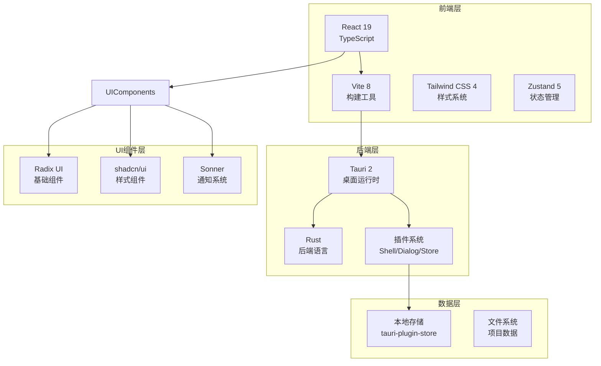
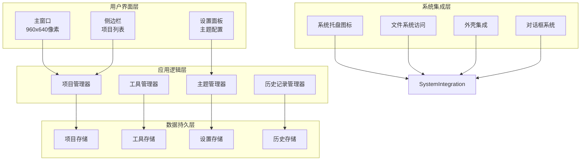
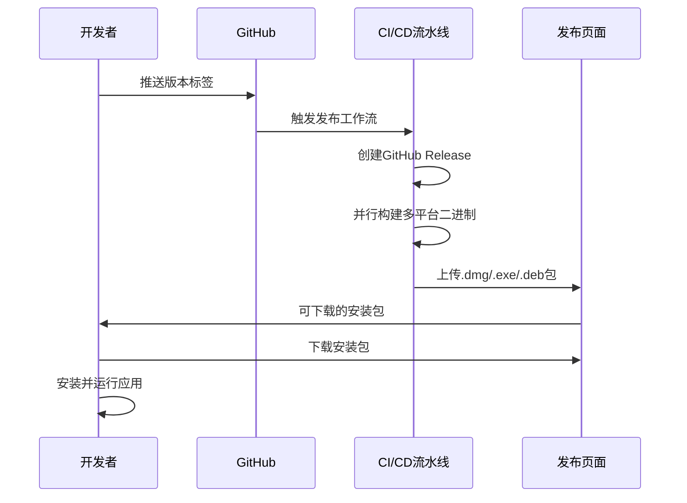
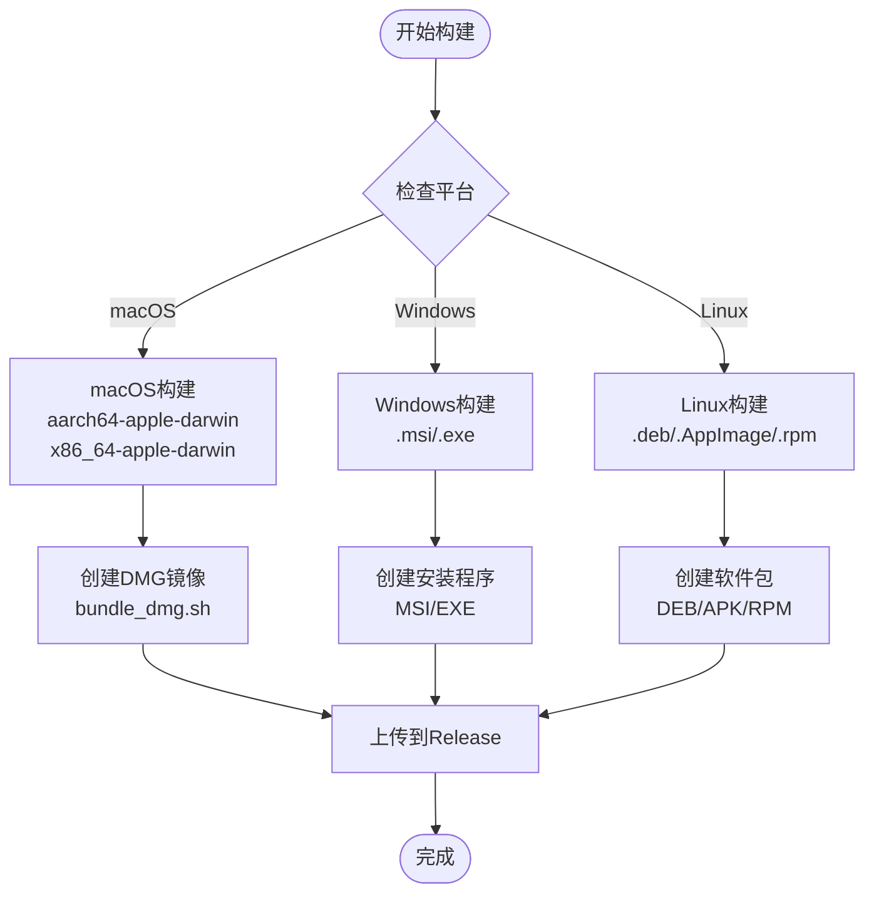
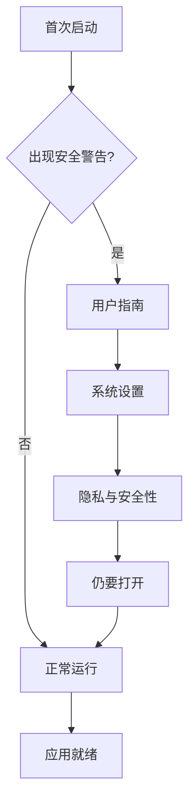
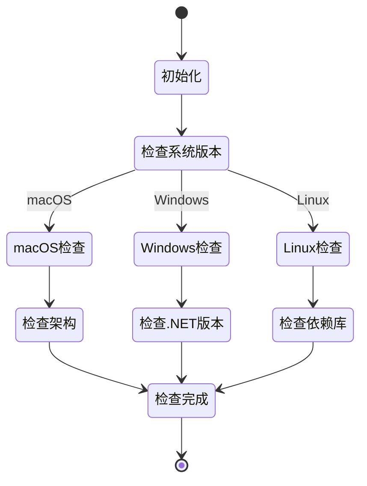
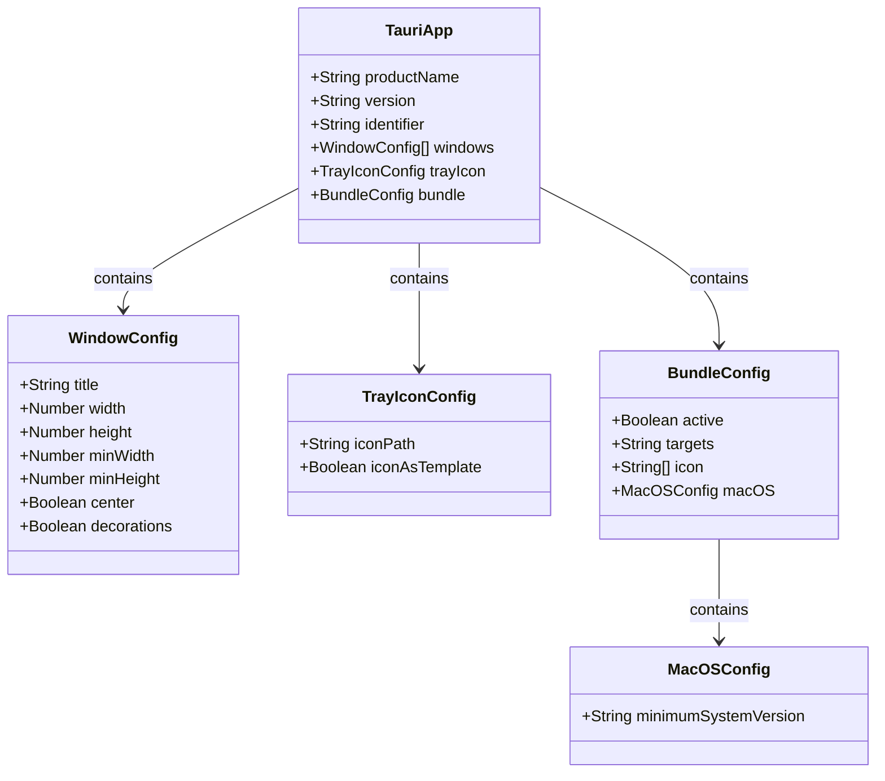

# 预编译二进制安装

<cite>
**本文档引用的文件**
- [README.md](file://README.md)
- [.github/workflows/release.yml](file://.github/workflows/release.yml)
- [src-tauri/tauri.conf.json](file://src-tauri/tauri.conf.json)
- [src-tauri/Cargo.toml](file://src-tauri/Cargo.toml)
- [package.json](file://package.json)
- [src-tauri/target/release/bundle/dmg/bundle_dmg.sh](file://src-tauri/target/release/bundle/dmg/bundle_dmg.sh)
</cite>

## 目录
1. [简介](#简介)
2. [项目结构概览](#项目结构概览)
3. [核心组件](#核心组件)
4. [架构总览](#架构总览)
5. [详细组件分析](#详细组件分析)
6. [依赖关系分析](#依赖关系分析)
7. [性能考虑](#性能考虑)
8. [故障排除指南](#故障排除指南)
9. [结论](#结论)

## 简介

LaunchPro 是一个基于 Tauri v2 构建的跨平台项目管理器，专为开发者设计，提供轻量级的桌面应用程序体验。该应用程序支持 macOS、Windows 和 Linux 三大主流操作系统，采用原生二进制分发方式，确保最佳的性能和用户体验。

LaunchPro 的核心功能包括项目管理、一键打开、自定义工具、最近历史记录、工具管理、主题支持、系统托盘以及本地存储等特性。所有数据都存储在本地，无需云端同步，保障用户隐私安全。

## 项目结构概览

LaunchPro 采用现代化的双层架构设计，前端使用 React 19 + TypeScript + Vite 8 构建，后端使用 Rust + Tauri 2 实现，形成了一个高效、可维护的桌面应用程序框架。



**图表来源**
- [package.json:13-46](file://package.json#L13-L46)
- [src-tauri/Cargo.toml:15-22](file://src-tauri/Cargo.toml#L15-L22)
- [src-tauri/tauri.conf.json:10-28](file://src-tauri/tauri.conf.json#L10-L28)

**章节来源**
- [README.md:101-114](file://README.md#L101-L114)
- [package.json:13-46](file://package.json#L13-L46)
- [src-tauri/Cargo.toml:15-22](file://src-tauri/Cargo.toml#L15-L22)

## 核心组件

### 跨平台支持矩阵

LaunchPro 提供了完整的跨平台支持，针对不同操作系统提供了优化的安装包格式：

| 平台 | 支持状态 | 最低系统版本 | 包格式 |
|------|----------|-------------|--------|
| macOS | ✅ | 10.15+ | `.dmg`、`.app` |
| Windows | ✅ | 10+ | `.msi`、`.exe` |
| Linux | ✅ | - | `.deb`、`.AppImage`、`.rpm` |

### 安装包架构支持

针对 macOS 平台，LaunchPro 提供了两种架构版本以满足不同硬件需求：

- **Apple Silicon (ARM64)**: `LaunchPro_x.x.x_aarch64.dmg`
- **Intel (x64)**: `LaunchPro_x.x.x_x64.dmg`

### 技术栈详情

应用程序采用现代化的技术组合，确保高性能和良好的开发体验：

- **UI框架**: React 19 + TypeScript 提供类型安全的组件开发
- **构建工具**: Vite 8 实现快速的热重载和构建优化
- **桌面运行时**: Tauri 2 提供原生桌面应用体验
- **后端**: Rust 实现高性能和内存安全的系统级编程
- **样式**: Tailwind CSS 4 提供实用优先的样式解决方案
- **状态管理**: Zustand 5 实现轻量级的状态管理
- **数据持久化**: tauri-plugin-store 提供本地存储能力

**章节来源**
- [README.md:34-43](file://README.md#L34-L43)
- [README.md:48-55](file://README.md#L48-L55)
- [README.md:101-114](file://README.md#L101-L114)

## 架构总览

LaunchPro 的整体架构采用了分层设计，从前端界面到后端服务再到系统集成，形成了清晰的职责分离。



**图表来源**
- [src-tauri/tauri.conf.json:13-27](file://src-tauri/tauri.conf.json#L13-L27)
- [src-tauri/Cargo.toml:15-22](file://src-tauri/Cargo.toml#L15-L22)

## 详细组件分析

### 安装流程组件

#### GitHub Releases 页面集成

LaunchPro 的发布流程完全自动化，通过 GitHub Actions 实现多平台构建和分发：



**图表来源**
- [.github/workflows/release.yml:3-38](file://.github/workflows/release.yml#L3-L38)
- [.github/workflows/release.yml:96-109](file://.github/workflows/release.yml#L96-L109)

#### 多平台安装包构建

构建系统针对不同平台进行了专门优化，确保每个平台都能获得最佳的用户体验：



**图表来源**
- [.github/workflows/release.yml:47-58](file://.github/workflows/release.yml#L47-L58)
- [src-tauri/target/release/bundle/dmg/bundle_dmg.sh:70-140](file://src-tauri/target/release/bundle/dmg/bundle_dmg.sh#L70-L140)

**章节来源**
- [.github/workflows/release.yml:39-93](file://.github/workflows/release.yml#L39-L93)
- [src-tauri/target/release/bundle/dmg/bundle_dmg.sh:1-200](file://src-tauri/target/release/bundle/dmg/bundle_dmg.sh#L1-L200)

### 安装验证组件

#### 首次运行安全检查

macOS 平台的安全机制需要用户手动确认信任新应用程序：



**图表来源**
- [README.md:55](file://README.md#L55)

#### 系统兼容性检查

应用程序在启动时会进行系统兼容性验证：



**图表来源**
- [src-tauri/tauri.conf.json:39-41](file://src-tauri/tauri.conf.json#L39-L41)

**章节来源**
- [README.md:55](file://README.md#L55)
- [src-tauri/tauri.conf.json:39-41](file://src-tauri/tauri.conf.json#L39-L41)

## 依赖关系分析

### 外部依赖管理

LaunchPro 的依赖关系清晰明确，主要依赖于 Tauri 生态系统和现代前端技术栈：

```mermaid
graph LR
subgraph "核心依赖"
TauriAPI[@tauri-apps/api]
ShellPlugin[@tauri-apps/plugin-shell]
DialogPlugin[@tauri-apps/plugin-dialog]
StorePlugin[@tauri-apps/plugin-store]
end
subgraph "UI框架"
React[react]
ReactDOM[react-dom]
ReactHooks[react hooks]
end
subgraph "工具链"
Vite[vite]
TypeScript[typescript]
ESLint[eslint]
TailwindCSS[tailwindcss]
end
subgraph "开发工具"
TauriCLI[@tauri-apps/cli]
ReactDevTools[react dev tools]
TypeScriptCompiler[ts compiler]
end
TauriAPI --> ShellPlugin
TauriAPI --> DialogPlugin
TauriAPI --> StorePlugin
React --> ReactDOM
React --> ReactHooks
Vite --> TypeScript
Vite --> ESLint
Vite --> TailwindCSS
TauriCLI --> Vite
TauriCLI --> TypeScriptCompiler
```

**图表来源**
- [package.json:13-46](file://package.json#L13-L46)

### Rust 后端依赖

后端使用 Rust 实现，依赖于 Tauri 2 的核心功能和插件系统：



**图表来源**
- [src-tauri/tauri.conf.json:1-44](file://src-tauri/tauri.conf.json#L1-L44)

**章节来源**
- [package.json:13-46](file://package.json#L13-L46)
- [src-tauri/Cargo.toml:15-22](file://src-tauri/Cargo.toml#L15-L22)
- [src-tauri/tauri.conf.json:1-44](file://src-tauri/tauri.conf.json#L1-L44)

## 性能考虑

### 架构优化策略

LaunchPro 在设计时充分考虑了性能优化，采用多种策略确保应用程序的响应性和效率：

- **原生二进制执行**: 使用 Rust 编写后端逻辑，提供接近 C/C++ 的性能
- **最小化前端包**: 通过 Tree Shaking 和按需加载减少初始包大小
- **高效的内存管理**: 利用 Rust 的所有权系统避免内存泄漏
- **异步操作**: 所有耗时操作都采用异步模式，保持 UI 流畅
- **缓存策略**: 关键数据采用本地缓存，减少重复计算

### 跨平台性能差异

不同平台的性能特点和优化策略：

| 平台 | 性能特点 | 优化策略 |
|------|----------|----------|
| macOS | Metal GPU 加速、沙盒环境 | 利用系统原生 API、优化磁盘访问 |
| Windows | DirectX 支持、文件系统优化 | 减少文件 I/O 操作、优化注册表访问 |
| Linux | 多种桌面环境兼容 | 优化 GTK/Qt 兼容性、减少系统调用 |

## 故障排除指南

### 常见安装问题及解决方案

#### macOS 安全警告问题

**问题描述**: 首次启动时出现"无法验证开发者"的安全警告

**解决方案**:
1. 打开系统设置 → 隐私与安全性
2. 查找"已允许的应用程序"部分
3. 点击"仍要打开"按钮
4. 重新启动应用程序

#### 权限相关问题

**问题描述**: 应用程序无法访问某些文件或目录

**解决方案**:
1. 检查应用程序是否具有必要的文件访问权限
2. 在系统偏好设置中授予相应的权限
3. 重启应用程序以应用权限更改

#### 系统兼容性问题

**问题描述**: 应用程序在特定版本的操作系统上无法运行

**解决方案**:
1. 检查目标操作系统的最低版本要求
2. 更新操作系统到支持的版本
3. 下载对应架构的正确版本

### 安装验证方法

#### 基本功能测试

1. **启动测试**: 确认应用程序能够正常启动
2. **界面测试**: 验证所有界面元素显示正常
3. **功能测试**: 测试核心功能如项目添加、编辑、删除
4. **退出测试**: 确认应用程序能够正常退出

#### 性能基准测试

1. **启动时间**: 测量从点击图标到界面完全加载的时间
2. **内存使用**: 监控应用程序的内存占用情况
3. **CPU 使用率**: 检查应用程序在空闲和操作时的 CPU 占用
4. **磁盘 I/O**: 验证文件读写操作的效率

**章节来源**
- [README.md:55](file://README.md#L55)

## 结论

LaunchPro 作为一个现代化的跨平台项目管理器，展现了优秀的软件工程实践。其基于 Tauri v2 的架构设计、清晰的分层结构、完善的跨平台支持以及自动化的发布流程，共同构成了一个高质量的桌面应用程序。

通过本文档提供的详细安装指南，用户可以在各个平台上顺利完成 LaunchPro 的安装和配置。无论是初次使用者还是有经验的开发者，都能从这个应用程序中获得高效、便捷的项目管理体验。

应用程序的持续发展得益于其开源社区的支持和活跃的开发团队，未来将继续扩展功能、优化性能，并保持对新技术的支持。