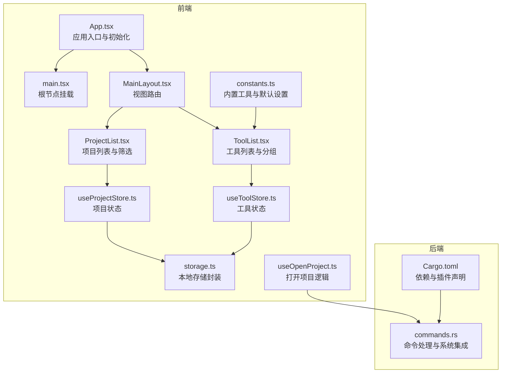
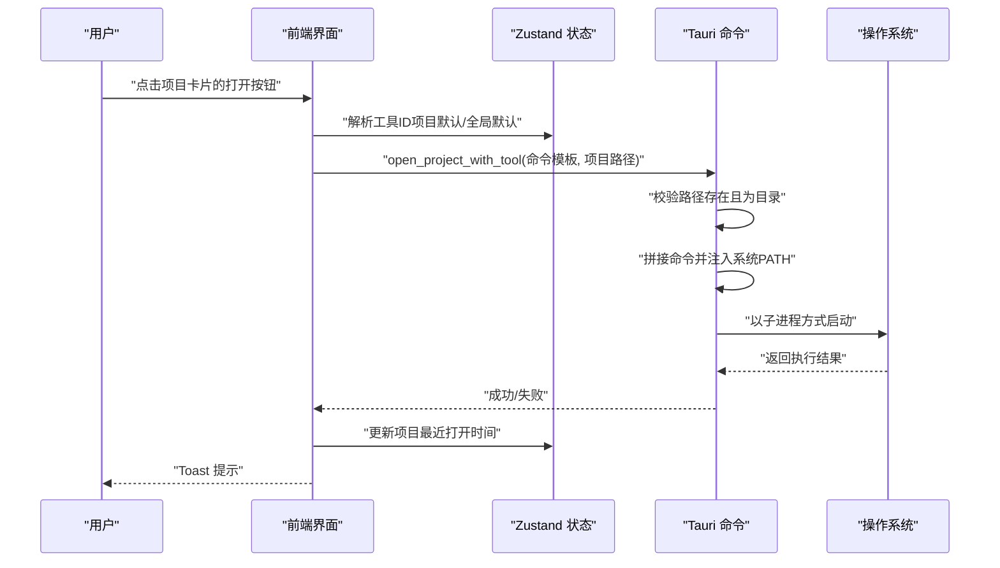
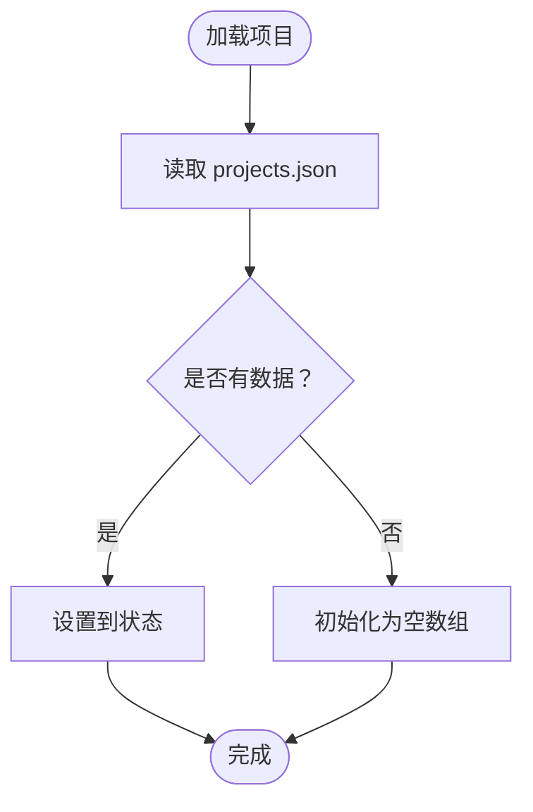
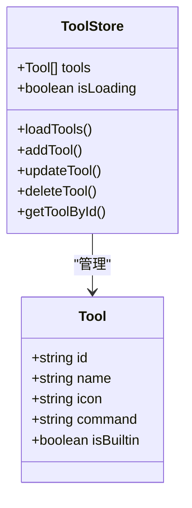
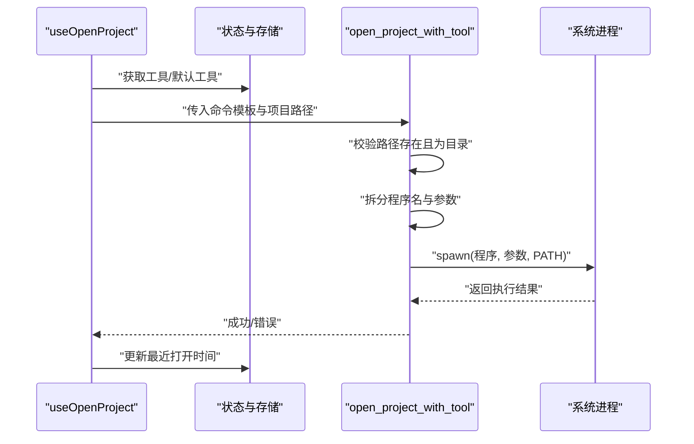
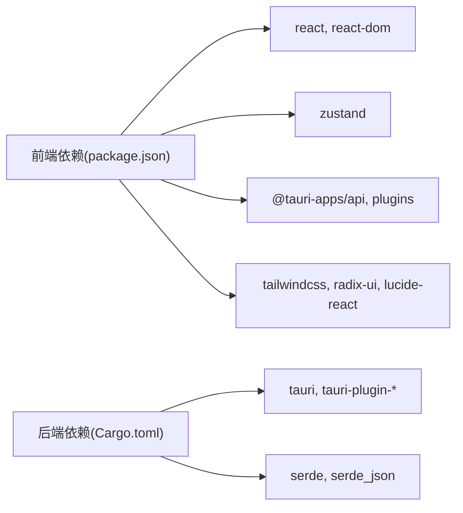

# 应用介绍

<cite>
**本文引用的文件**
- [README.md](file://README.md)
- [package.json](file://package.json)
- [Cargo.toml](file://src-tauri/Cargo.toml)
- [App.tsx](file://src/App.tsx)
- [main.tsx](file://src/main.tsx)
- [useProjectStore.ts](file://src/stores/useProjectStore.ts)
- [useToolStore.ts](file://src/stores/useToolStore.ts)
- [ProjectList.tsx](file://src/components/project/ProjectList.tsx)
- [ToolList.tsx](file://src/components/tool/ToolList.tsx)
- [constants.ts](file://src/lib/constants.ts)
- [storage.ts](file://src/lib/storage.ts)
- [commands.rs](file://src-tauri/src/commands.rs)
- [MainLayout.tsx](file://src/components/layout/MainLayout.tsx)
- [useOpenProject.ts](file://src/hooks/useOpenProject.ts)
- [index.ts](file://src/types/index.ts)
</cite>

## 目录
1. [引言](#引言)
2. [项目结构](#项目结构)
3. [核心组件](#核心组件)
4. [架构总览](#架构总览)
5. [详细组件分析](#详细组件分析)
6. [依赖分析](#依赖分析)
7. [性能考虑](#性能考虑)
8. [故障排除指南](#故障排除指南)
9. [结论](#结论)
10. [附录](#附录)

## 引言
LaunchPro 是一款面向开发者的轻量级跨平台桌面项目管理器。它的核心价值在于：将开发者本地的多个项目统一收纳、快速浏览与组织，并通过“一键打开”能力直接调用任意 IDE 或编辑器，从而显著减少上下文切换成本、提升日常开发效率。

- 面向用户：个人开发者、独立开发者、小型团队
- 解决痛点：多项目分散、工具链切换繁琐、历史记录缺失、配置漂移
- 差异化优势：零云端依赖、系统托盘常驻、内置工具预设、可扩展自定义工具、主题随系统、原生体验

对初学者而言，LaunchPro 帮你把“项目清单”和“启动工具”集中在一个界面，告别在 Finder/资源管理器里翻找项目、再手动打开 IDE 的重复动作；对有经验的开发者而言，它提供了稳定的本地持久化、灵活的命令模板与系统 PATH 管理，确保跨平台一致且可靠的项目启动体验。

## 项目结构
该仓库采用前后端分离的桌面应用结构：
- 前端层：React 19 + TypeScript，使用 Zustand 进行状态管理，Tailwind CSS + shadcn/ui 构建 UI，Vite 8 打包
- 后端层：Rust + Tauri v2，负责系统集成、命令执行、系统托盘等
- 数据层：基于 tauri-plugin-store 的本地 JSON 存储，三类数据分离（项目、工具、设置）

**图表来源**
- [App.tsx:1-40](file://src/App.tsx#L1-L40)
- [main.tsx:1-11](file://src/main.tsx#L1-L11)
- [MainLayout.tsx:1-21](file://src/components/layout/MainLayout.tsx#L1-L21)
- [ProjectList.tsx:1-168](file://src/components/project/ProjectList.tsx#L1-L168)
- [ToolList.tsx:1-129](file://src/components/tool/ToolList.tsx#L1-L129)
- [useProjectStore.ts:1-67](file://src/stores/useProjectStore.ts#L1-L67)
- [useToolStore.ts:1-75](file://src/stores/useToolStore.ts#L1-L75)
- [constants.ts:1-23](file://src/lib/constants.ts#L1-L23)
- [storage.ts:1-30](file://src/lib/storage.ts#L1-L30)
- [useOpenProject.ts:1-44](file://src/hooks/useOpenProject.ts#L1-L44)
- [commands.rs:1-95](file://src-tauri/src/commands.rs#L1-L95)
- [Cargo.toml:1-22](file://src-tauri/Cargo.toml#L1-L22)

**章节来源**
- [README.md:115-135](file://README.md#L115-L135)
- [package.json:1-48](file://package.json#L1-L48)
- [Cargo.toml:1-22](file://src-tauri/Cargo.toml#L1-L22)

## 核心组件
- 项目管理（Project）
  - 支持增删改查、标签分类、备注、最近打开时间排序
  - 本地持久化，首次加载即可用
- 工具管理（Tool）
  - 内置常用 IDE/编辑器命令模板，支持自定义工具
  - 可为每个项目单独绑定默认工具，或全局默认工具
- 视图与布局（UI）
  - 侧边栏导航，三视图切换（项目/工具/设置）
  - 搜索与标签过滤，按活跃度排序
- 打开流程（Open）
  - 统一命令模板与系统 PATH 处理，安全校验路径存在性
  - 成功/失败通知，自动更新最近打开时间

**章节来源**
- [ProjectList.tsx:12-159](file://src/components/project/ProjectList.tsx#L12-L159)
- [ToolList.tsx:12-81](file://src/components/tool/ToolList.tsx#L12-L81)
- [useProjectStore.ts:16-67](file://src/stores/useProjectStore.ts#L16-L67)
- [useToolStore.ts:17-75](file://src/stores/useToolStore.ts#L17-L75)
- [MainLayout.tsx:7-20](file://src/components/layout/MainLayout.tsx#L7-L20)
- [useOpenProject.ts:9-44](file://src/hooks/useOpenProject.ts#L9-L44)

## 架构总览
应用采用“前端状态 + 本地存储 + 后端命令”的分层设计：
- 前端负责 UI、状态与交互
- 本地存储负责数据持久化（项目/工具/设置）
- 后端负责系统命令执行、PATH 注入、系统托盘等

**图表来源**
- [useOpenProject.ts:15-42](file://src/hooks/useOpenProject.ts#L15-L42)
- [commands.rs:48-79](file://src-tauri/src/commands.rs#L48-L79)
- [useProjectStore.ts:58-65](file://src/stores/useProjectStore.ts#L58-L65)

## 详细组件分析

### 项目管理模块
- 数据模型：项目包含唯一 ID、名称、路径、默认工具、标签、备注、最近打开时间、创建时间
- 状态管理：Zustand store 负责加载/新增/更新/删除/记录最近打开
- 列表展示：支持搜索（名称/路径/标签）、标签过滤、按活跃度排序
- 本地存储：LazyStore 分别维护 projects.json

**图表来源**
- [useProjectStore.ts:20-28](file://src/stores/useProjectStore.ts#L20-L28)
- [storage.ts:4-7](file://src/lib/storage.ts#L4-L7)

**章节来源**
- [index.ts:1-10](file://src/types/index.ts#L1-L10)
- [useProjectStore.ts:16-67](file://src/stores/useProjectStore.ts#L16-L67)
- [ProjectList.tsx:22-55](file://src/components/project/ProjectList.tsx#L22-L55)
- [storage.ts:19-21](file://src/lib/storage.ts#L19-L21)

### 工具管理模块
- 内置工具：预置多款常用 IDE/编辑器命令模板，首次启动自动写入
- 自定义工具：允许添加/编辑/删除（内置不可删除），与内置合并策略保证体验一致性
- 工具卡片：显示名称、图标占位符、命令片段、内置标识与操作按钮

**图表来源**
- [index.ts:12-18](file://src/types/index.ts#L12-L18)
- [useToolStore.ts:17-75](file://src/stores/useToolStore.ts#L17-L75)
- [constants.ts:3-18](file://src/lib/constants.ts#L3-L18)

**章节来源**
- [ToolList.tsx:12-81](file://src/components/tool/ToolList.tsx#L12-L81)
- [useToolStore.ts:21-39](file://src/stores/useToolStore.ts#L21-L39)
- [constants.ts:20-23](file://src/lib/constants.ts#L20-L23)

### 打开项目流程
- 工具解析：优先使用项目默认工具，其次全局默认工具，最后回退到第一个可用工具
- 命令执行：后端将模板中的路径占位符替换为实际路径，注入系统 PATH 并以子进程启动
- 错误处理：路径不存在、非目录、命令为空、执行失败均给出明确提示
- 结果反馈：成功/失败 Toast，同时更新项目最近打开时间

**图表来源**
- [useOpenProject.ts:15-42](file://src/hooks/useOpenProject.ts#L15-L42)
- [commands.rs:48-79](file://src-tauri/src/commands.rs#L48-L79)
- [useProjectStore.ts:58-65](file://src/stores/useProjectStore.ts#L58-L65)

**章节来源**
- [useOpenProject.ts:9-44](file://src/hooks/useOpenProject.ts#L9-L44)
- [commands.rs:5-46](file://src-tauri/src/commands.rs#L5-L46)

### 设置与主题
- 默认设置：当前包含主题选择（浅色/深色/系统）
- 主题同步：通过前端主题库实现系统跟随与即时切换
- 全局默认工具：作为“兜底”工具参与打开流程

**章节来源**
- [constants.ts:20-23](file://src/lib/constants.ts#L20-L23)
- [App.tsx:10-19](file://src/App.tsx#L10-L19)

## 依赖分析
- 前端依赖
  - React 19 + TypeScript：构建用户界面与类型安全
  - Zustand 5：轻量状态管理
  - Tailwind CSS 4 + shadcn/ui：样式与组件库
  - @tauri-apps/*：Shell、Dialog、Store 插件
- 后端依赖
  - Tauri 2：桌面运行时与系统集成
  - tauri-plugin-*：Shell、Dialog、Store
  - serde：序列化与反序列化

**图表来源**
- [package.json:13-29](file://package.json#L13-L29)
- [package.json:30-46](file://package.json#L30-L46)
- [Cargo.toml:15-22](file://src-tauri/Cargo.toml#L15-L22)

**章节来源**
- [package.json:1-48](file://package.json#L1-L48)
- [Cargo.toml:1-22](file://src-tauri/Cargo.toml#L1-L22)

## 性能考虑
- 前端渲染
  - 列表过滤与排序在内存中进行，建议控制单次项目数量规模，避免超大列表导致卡顿
  - 使用 useMemo 缓存标签集合与过滤结果，减少重复计算
- 本地存储
  - LazyStore 自动保存，频繁变更会触发磁盘 IO；建议批量更新或节流
- 命令执行
  - 后端注入 PATH 会读取系统文件与环境变量，首次可能有轻微延迟；后续复用系统缓存
  - 子进程启动为异步，避免阻塞 UI

[本节为通用指导，不直接分析具体文件]

## 故障排除指南
- 无法打开项目
  - 检查项目路径是否存在且为目录
  - 确认所选工具命令模板正确（含路径占位符）
  - 查看系统 PATH 是否包含所需 CLI 工具所在目录
- 工具未出现在列表
  - 首次启动会初始化内置工具；若被意外删除，可重新添加或恢复默认
- 打开失败或无响应
  - 查看系统托盘区域的通知或应用内 Toast
  - 尝试更换其他工具或检查对应 IDE/编辑器是否安装完整

**章节来源**
- [commands.rs:50-56](file://src-tauri/src/commands.rs#L50-L56)
- [useOpenProject.ts:31-37](file://src/hooks/useOpenProject.ts#L31-L37)
- [useToolStore.ts:62-69](file://src/stores/useToolStore.ts#L62-L69)

## 结论
LaunchPro 通过“统一项目管理 + 一键启动工具”的组合拳，有效降低开发者在本地多项目场景下的认知负担与操作成本。其跨平台原生体验、零云端依赖、可扩展的工具体系与完善的本地存储，使其既能满足初学者的入门需求，也能为有经验的开发者提供稳定高效的日常工具链支撑。

[本节为总结性内容，不直接分析具体文件]

## 附录
- 安装与运行
  - 支持从发行版下载二进制安装，或从源码构建
  - 开发模式下可热重载调试
- 技术栈概览
  - 前端：React 19 + TypeScript + Zustand + Tailwind CSS + shadcn/ui
  - 后端：Rust + Tauri 2 + tauri-plugin-store
  - 构建：Vite 8

**章节来源**
- [README.md:44-99](file://README.md#L44-L99)
- [README.md:101-114](file://README.md#L101-L114)