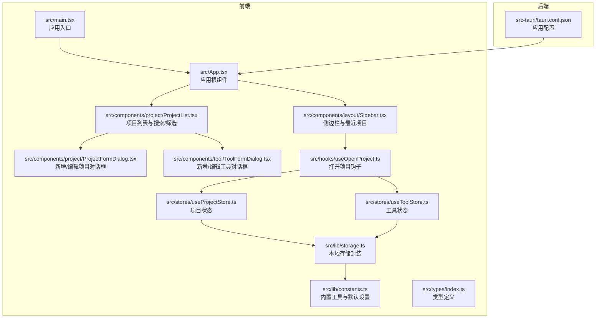
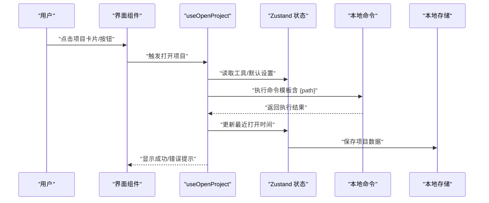
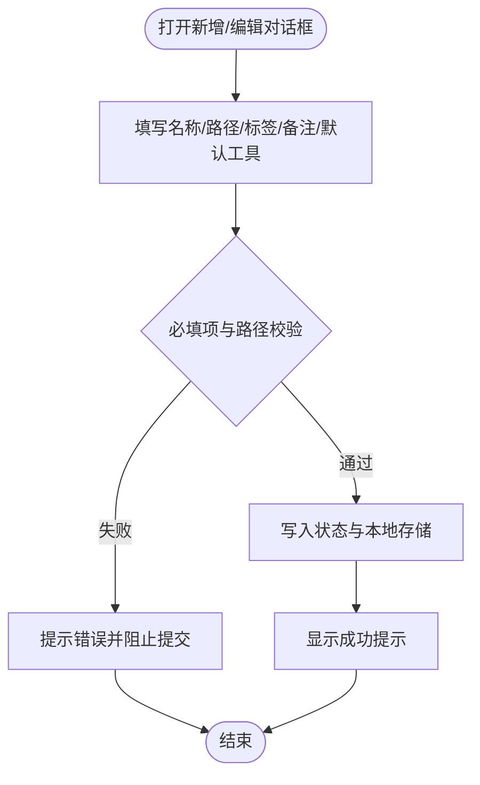
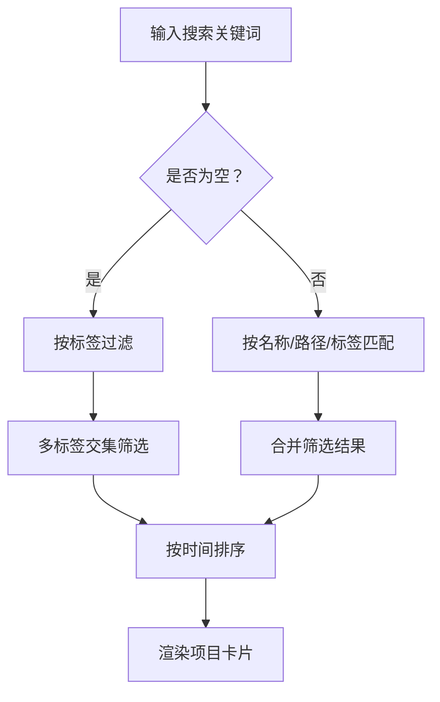
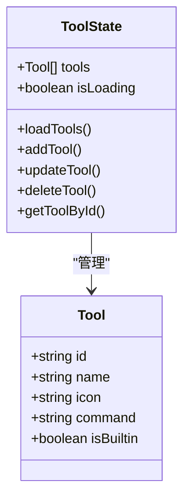
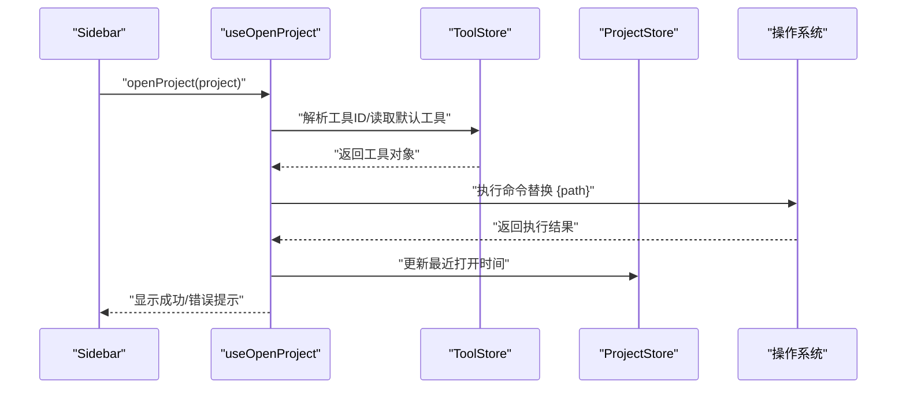
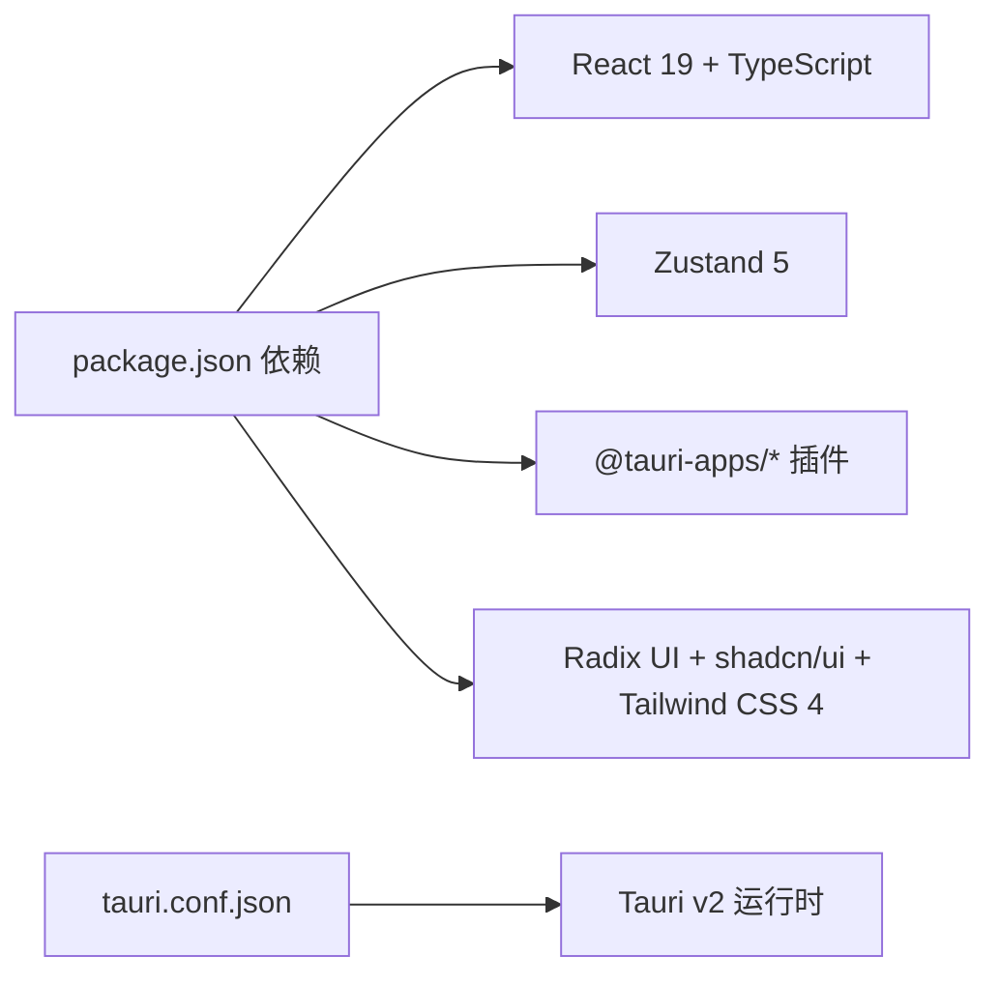

# 快速开始

<cite>
**本文引用的文件**
- [README.md](file://README.md)
- [package.json](file://package.json)
- [src-tauri/tauri.conf.json](file://src-tauri/tauri.conf.json)
- [src/main.tsx](file://src/main.tsx)
- [src/App.tsx](file://src/App.tsx)
- [src/components/layout/Sidebar.tsx](file://src/components/layout/Sidebar.tsx)
- [src/components/project/ProjectList.tsx](file://src/components/project/ProjectList.tsx)
- [src/components/project/ProjectFormDialog.tsx](file://src/components/project/ProjectFormDialog.tsx)
- [src/components/tool/ToolFormDialog.tsx](file://src/components/tool/ToolFormDialog.tsx)
- [src/hooks/useOpenProject.ts](file://src/hooks/useOpenProject.ts)
- [src/stores/useProjectStore.ts](file://src/stores/useProjectStore.ts)
- [src/stores/useToolStore.ts](file://src/stores/useToolStore.ts)
- [src/lib/storage.ts](file://src/lib/storage.ts)
- [src/lib/constants.ts](file://src/lib/constants.ts)
- [src/types/index.ts](file://src/types/index.ts)
</cite>

## 目录
1. [简介](#简介)
2. [项目结构](#项目结构)
3. [核心组件](#核心组件)
4. [架构总览](#架构总览)
5. [详细组件分析](#详细组件分析)
6. [依赖关系分析](#依赖关系分析)
7. [性能考虑](#性能考虑)
8. [故障排除指南](#故障排除指南)
9. [结论](#结论)
10. [附录](#附录)

## 简介
本指南面向首次使用 LaunchPro 的开发者，帮助你在几分钟内完成安装、添加第一个项目、配置开发工具、设置默认工具，并一键打开项目。文档还涵盖基本的项目管理操作（创建、编辑、添加标签、删除项目）以及最佳实践与使用技巧，让你快速上手并高效使用。

## 项目结构
LaunchPro 采用前端 React + 后端 Rust 的桌面应用架构，数据持久化基于本地存储插件，界面通过 Zustand 状态管理，主题支持明暗切换与系统跟随。

图表来源
- [src/main.tsx:1-11](file://src/main.tsx#L1-L11)
- [src/App.tsx:1-40](file://src/App.tsx#L1-L40)
- [src/components/layout/Sidebar.tsx:1-80](file://src/components/layout/Sidebar.tsx#L1-L80)
- [src/components/project/ProjectList.tsx:1-168](file://src/components/project/ProjectList.tsx#L1-L168)
- [src/components/project/ProjectFormDialog.tsx:1-229](file://src/components/project/ProjectFormDialog.tsx#L1-L229)
- [src/components/tool/ToolFormDialog.tsx:1-134](file://src/components/tool/ToolFormDialog.tsx#L1-L134)
- [src/hooks/useOpenProject.ts:1-44](file://src/hooks/useOpenProject.ts#L1-L44)
- [src/stores/useProjectStore.ts:1-67](file://src/stores/useProjectStore.ts#L1-L67)
- [src/stores/useToolStore.ts:1-75](file://src/stores/useToolStore.ts#L1-L75)
- [src/lib/storage.ts:1-30](file://src/lib/storage.ts#L1-L30)
- [src/lib/constants.ts:1-23](file://src/lib/constants.ts#L1-L23)
- [src/types/index.ts:1-26](file://src/types/index.ts#L1-L26)
- [src-tauri/tauri.conf.json:1-44](file://src-tauri/tauri.conf.json#L1-L44)

章节来源
- [README.md:115-135](file://README.md#L115-L135)
- [package.json:1-48](file://package.json#L1-L48)
- [src-tauri/tauri.conf.json:1-44](file://src-tauri/tauri.conf.json#L1-L44)

## 核心组件
- 应用入口与初始化：应用在入口文件中渲染根组件，并在根组件中加载项目、工具与设置，确保启动时数据可用。
- 侧边栏与导航：侧边栏包含“项目”“工具”“设置”三个主视图入口，并展示最近打开的项目，便于快速访问。
- 项目管理：项目列表支持搜索、按标签筛选、排序；通过表单对话框新增或编辑项目；支持为项目设置默认工具。
- 工具管理：内置常用开发工具，支持自定义命令模板；可新增/编辑/删除用户自定义工具（不可删除内置工具）。
- 打开项目：根据项目默认工具或全局默认工具，结合用户选择，调用系统命令打开项目目录。

章节来源
- [src/main.tsx:1-11](file://src/main.tsx#L1-L11)
- [src/App.tsx:1-40](file://src/App.tsx#L1-L40)
- [src/components/layout/Sidebar.tsx:1-80](file://src/components/layout/Sidebar.tsx#L1-L80)
- [src/components/project/ProjectList.tsx:1-168](file://src/components/project/ProjectList.tsx#L1-L168)
- [src/components/project/ProjectFormDialog.tsx:1-229](file://src/components/project/ProjectFormDialog.tsx#L1-L229)
- [src/components/tool/ToolFormDialog.tsx:1-134](file://src/components/tool/ToolFormDialog.tsx#L1-L134)
- [src/hooks/useOpenProject.ts:1-44](file://src/hooks/useOpenProject.ts#L1-L44)

## 架构总览
下图展示了从用户操作到数据持久化的整体流程：用户在界面进行操作，状态由 Zustand 管理，数据通过本地存储插件写入磁盘，系统托盘与窗口配置由 Tauri 配置文件控制。

图表来源
- [src/hooks/useOpenProject.ts:15-40](file://src/hooks/useOpenProject.ts#L15-L40)
- [src/stores/useProjectStore.ts:58-65](file://src/stores/useProjectStore.ts#L58-L65)
- [src/lib/storage.ts:19-29](file://src/lib/storage.ts#L19-L29)

## 详细组件分析

### 新增/编辑项目对话框
- 功能要点
  - 支持输入项目名称、路径、标签、备注与默认工具。
  - 路径选择器用于浏览目录，可自动填充项目名。
  - 提交前进行必填项与路径存在性校验。
  - 成功后通过状态管理更新本地存储。
- 使用场景
  - 添加第一个项目：填写名称与路径，必要时添加标签，选择默认工具。
  - 编辑项目：修改名称、路径、标签或默认工具。
- 最佳实践
  - 标签建议统一风格，便于后续筛选。
  - 默认工具建议与项目类型匹配（如前端/后端/移动端）。

图表来源
- [src/components/project/ProjectFormDialog.tsx:84-134](file://src/components/project/ProjectFormDialog.tsx#L84-L134)
- [src/stores/useProjectStore.ts:30-40](file://src/stores/useProjectStore.ts#L30-L40)

章节来源
- [src/components/project/ProjectFormDialog.tsx:1-229](file://src/components/project/ProjectFormDialog.tsx#L1-L229)
- [src/stores/useProjectStore.ts:1-67](file://src/stores/useProjectStore.ts#L1-L67)

### 项目列表与筛选
- 功能要点
  - 搜索框支持按名称、路径、标签模糊匹配。
  - 标签云支持多选过滤。
  - 排序规则：优先按最近打开时间，其次按创建时间。
- 基本操作示例
  - 创建项目：点击“添加”，填写表单。
  - 编辑项目：在卡片右上角触发编辑。
  - 删除项目：在卡片右上角触发删除。
  - 添加标签：在表单中以逗号分隔输入多个标签。
  - 清除筛选：点击“清除”按钮。

图表来源
- [src/components/project/ProjectList.tsx:29-55](file://src/components/project/ProjectList.tsx#L29-L55)

章节来源
- [src/components/project/ProjectList.tsx:1-168](file://src/components/project/ProjectList.tsx#L1-L168)

### 工具管理与默认工具设置
- 内置工具
  - 应用启动时自动初始化内置工具集合，覆盖常见 IDE 与终端。
- 自定义工具
  - 命令模板必须包含占位符 {path}，用于替换为项目路径。
  - 可设置图标（1-2 字符），未设置时默认取名称首字母。
- 设置默认工具
  - 在设置中选择全局默认工具，也可在项目详情中单独设置默认工具。
- 最佳实践
  - 为不同语言/框架设置专用工具，提高打开效率。
  - 命令模板尽量简洁，避免复杂参数。

图表来源
- [src/lib/constants.ts:3-18](file://src/lib/constants.ts#L3-L18)
- [src/stores/useToolStore.ts:17-74](file://src/stores/useToolStore.ts#L17-L74)
- [src/types/index.ts:12-18](file://src/types/index.ts#L12-L18)

章节来源
- [src/components/tool/ToolFormDialog.tsx:1-134](file://src/components/tool/ToolFormDialog.tsx#L1-L134)
- [src/stores/useToolStore.ts:1-75](file://src/stores/useToolStore.ts#L1-L75)
- [src/lib/constants.ts:1-23](file://src/lib/constants.ts#L1-L23)

### 一键打开项目
- 解析顺序
  - 若显式传入工具 ID，则使用该工具。
  - 否则优先使用项目默认工具，再回退到全局默认工具。
- 安全与容错
  - 若未选择工具或工具不存在，会提示错误并终止。
  - 打开成功后更新该项目的最近打开时间。
- 实际操作步骤
  - 在侧边栏“最近”区域直接点击项目卡片。
  - 或在项目列表中点击卡片右侧“打开”按钮。
  - 如需切换工具，可在项目详情中设置默认工具，或在打开时临时选择。

图表来源
- [src/hooks/useOpenProject.ts:15-40](file://src/hooks/useOpenProject.ts#L15-L40)
- [src/components/layout/Sidebar.tsx:56-70](file://src/components/layout/Sidebar.tsx#L56-L70)
- [src/stores/useProjectStore.ts:58-65](file://src/stores/useProjectStore.ts#L58-L65)

章节来源
- [src/hooks/useOpenProject.ts:1-44](file://src/hooks/useOpenProject.ts#L1-L44)
- [src/components/layout/Sidebar.tsx:1-80](file://src/components/layout/Sidebar.tsx#L1-L80)

## 依赖关系分析
- 前端依赖
  - React 19 + TypeScript：构建用户界面与类型安全。
  - Zustand 5：轻量状态管理，集中管理项目、工具与 UI 状态。
  - Tauri 插件：Shell 与 Store，用于执行系统命令与本地持久化。
  - UI 组件库：Radix UI + shadcn/ui，Tailwind CSS 4，提供一致的视觉与交互体验。
- 后端依赖
  - Tauri v2：桌面运行时，负责窗口、托盘与打包。
- 开发工具
  - Vite 8：热重载与构建。
  - ESLint + TypeScript Eslint：代码质量保障。

图表来源
- [package.json:13-28](file://package.json#L13-L28)
- [package.json:30-45](file://package.json#L30-L45)
- [src-tauri/tauri.conf.json:1-44](file://src-tauri/tauri.conf.json#L1-L44)

章节来源
- [package.json:1-48](file://package.json#L1-L48)
- [src-tauri/tauri.conf.json:1-44](file://src-tauri/tauri.conf.json#L1-L44)

## 性能考虑
- 列表渲染优化
  - 使用记忆化（useMemo）计算标签集合与筛选结果，减少重复计算。
  - 列表滚动区域仅对内容区域启用滚动，避免布局抖动。
- 数据持久化
  - 本地存储采用延迟加载与自动保存，降低频繁 IO 带来的开销。
- 打开项目
  - 优先使用最近打开时间排序，提升常用项目的可见性与访问速度。
- 主题与通知
  - 主题切换即时生效，通知使用轻量级组件，避免阻塞主线程。

章节来源
- [src/components/project/ProjectList.tsx:22-55](file://src/components/project/ProjectList.tsx#L22-L55)
- [src/lib/storage.ts:4-17](file://src/lib/storage.ts#L4-L17)
- [src/hooks/useOpenProject.ts:15-40](file://src/hooks/useOpenProject.ts#L15-L40)

## 故障排除指南
- 无法打开项目
  - 检查项目路径是否存在且为目录。
  - 确认已配置有效工具命令模板（必须包含 {path} 占位符）。
  - 查看错误提示，若工具不存在，尝试重新设置默认工具。
- 项目未出现在列表中
  - 使用搜索框或标签筛选确认是否被过滤。
  - 清除筛选条件或清空搜索关键词。
- 工具无法删除
  - 内置工具不可删除，请通过编辑修改其名称或命令。
- 首次启动安全警告（macOS）
  - 根据提示前往系统设置允许应用运行。

章节来源
- [src/components/project/ProjectFormDialog.tsx:84-134](file://src/components/project/ProjectFormDialog.tsx#L84-L134)
- [src/components/tool/ToolFormDialog.tsx:44-78](file://src/components/tool/ToolFormDialog.tsx#L44-L78)
- [src/stores/useToolStore.ts:62-69](file://src/stores/useToolStore.ts#L62-L69)
- [README.md:55-55](file://README.md#L55-L55)

## 结论
通过本快速开始指南，你已经完成了 LaunchPro 的安装与基础配置，成功添加了第一个项目并设置了默认工具，掌握了“一键打开项目”的核心能力。配合项目列表的搜索与标签筛选，你可以高效组织与定位本地项目。建议逐步建立团队/个人的工具模板库，并为不同类型项目设置默认工具，进一步提升日常开发效率。

## 附录

### 从零开始的完整流程（步骤说明）
- 步骤一：安装与启动
  - 下载对应平台的安装包并安装。
  - 首次启动可能需要授权（macOS）。
- 步骤二：添加第一个项目
  - 在项目列表点击“添加”，填写项目名称与路径，必要时添加标签。
  - 选择“默认工具”以便一键打开。
- 步骤三：配置开发工具
  - 打开“工具”页面，查看内置工具是否满足需求。
  - 如需自定义，点击“新增工具”，填写名称、命令模板（必须包含 {path}）与图标。
- 步骤四：设置默认工具
  - 在“设置”中选择全局默认工具。
  - 或在项目详情中为特定项目设置默认工具。
- 步骤五：一键启动项目
  - 在侧边栏“最近”区域或项目列表中点击项目卡片即可打开。
  - 也可在打开时临时选择其他工具。

章节来源
- [README.md:44-81](file://README.md#L44-L81)
- [src/components/project/ProjectList.tsx:89-92](file://src/components/project/ProjectList.tsx#L89-L92)
- [src/components/tool/ToolFormDialog.tsx:88-108](file://src/components/tool/ToolFormDialog.tsx#L88-L108)
- [src/components/layout/Sidebar.tsx:56-70](file://src/components/layout/Sidebar.tsx#L56-L70)