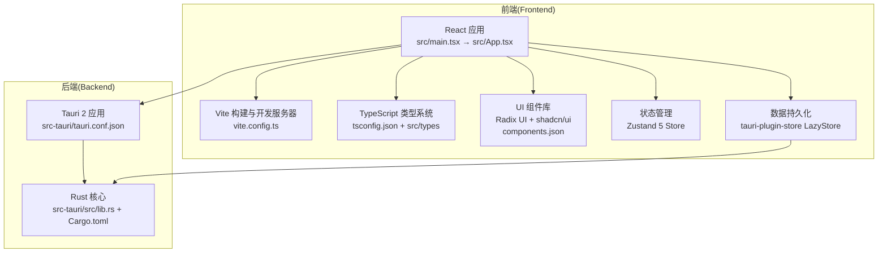
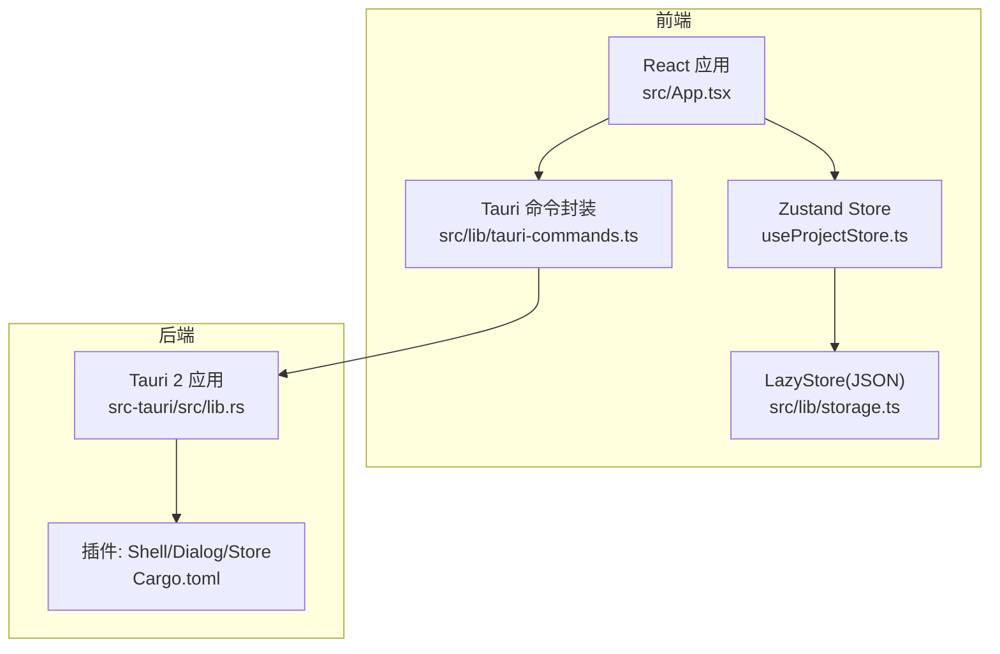
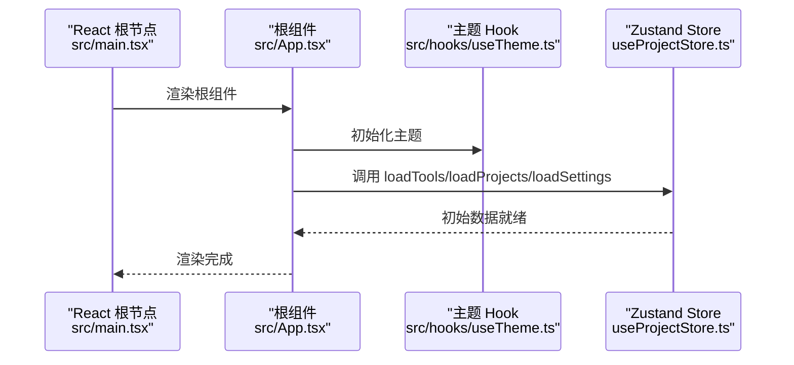
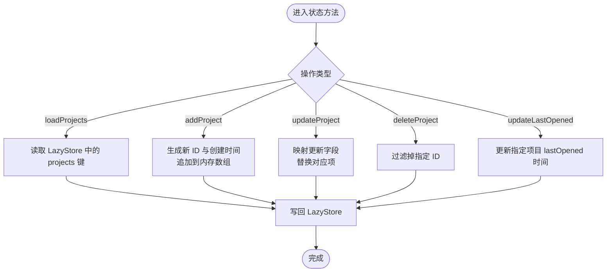
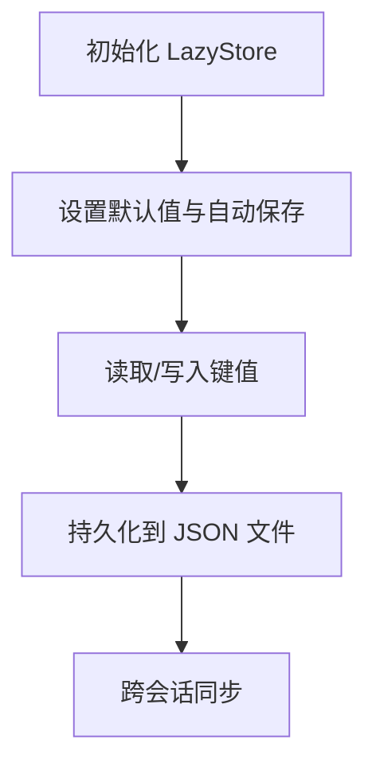
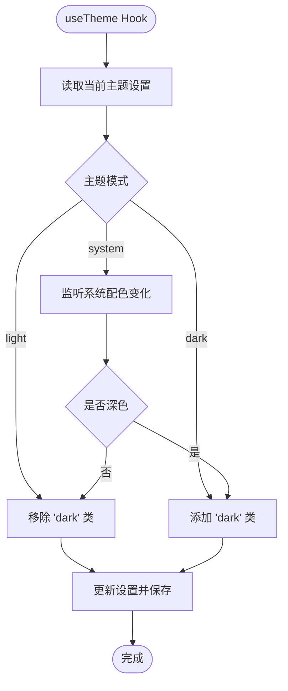
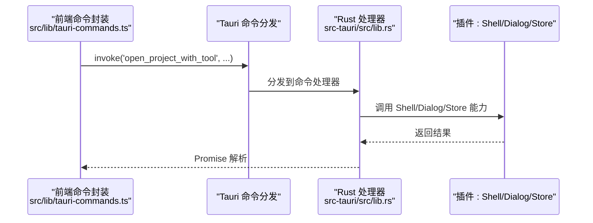
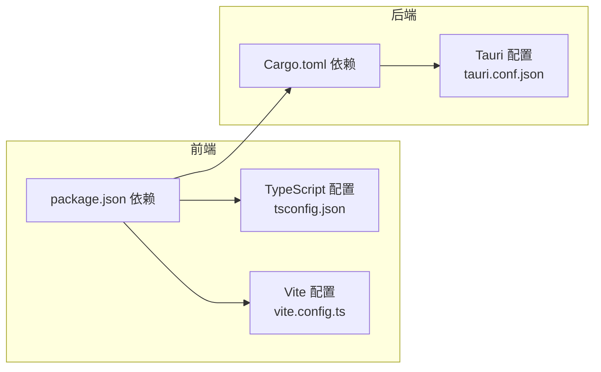

# 技术栈

<cite>
**本文引用的文件**
- [package.json](file://package.json)
- [vite.config.ts](file://vite.config.ts)
- [tsconfig.json](file://tsconfig.json)
- [src-tauri/Cargo.toml](file://src-tauri/Cargo.toml)
- [src-tauri/tauri.conf.json](file://src-tauri/tauri.conf.json)
- [components.json](file://components.json)
- [src/main.tsx](file://src/main.tsx)
- [src/App.tsx](file://src/App.tsx)
- [src/lib/storage.ts](file://src/lib/storage.ts)
- [src/lib/constants.ts](file://src/lib/constants.ts)
- [src/lib/tauri-commands.ts](file://src/lib/tauri-commands.ts)
- [src/hooks/useTheme.ts](file://src/hooks/useTheme.ts)
- [src/stores/useProjectStore.ts](file://src/stores/useProjectStore.ts)
- [src-tauri/src/lib.rs](file://src-tauri/src/lib.rs)
- [src/types/index.ts](file://src/types/index.ts)
</cite>

## 目录
1. [简介](#简介)
2. [项目结构](#项目结构)
3. [核心组件](#核心组件)
4. [架构总览](#架构总览)
5. [详细组件分析](#详细组件分析)
6. [依赖分析](#依赖分析)
7. [性能考量](#性能考量)
8. [故障排查指南](#故障排查指南)
9. [结论](#结论)
10. [附录](#附录)

## 简介
本文件为 LaunchPro 的技术栈概览与学习路径指南，覆盖前端技术栈（React 19 + TypeScript + Vite 8 + Tailwind CSS 4 + Radix UI + shadcn/ui）、后端技术栈（Rust + Tauri 2）、状态管理（Zustand 5）、数据持久化（tauri-plugin-store）以及构建工具链。我们将从技术选型动机、架构设计、数据流、依赖关系、版本兼容性与最佳实践等维度进行系统阐述，并提供循序渐进的学习路径，帮助开发者快速理解并参与开发。

## 项目结构
该项目采用“前后端一体化”的桌面应用架构：前端使用 React 19 + TypeScript + Vite 8 构建，UI 组件库基于 Radix UI 并通过 shadcn/ui 进行风格定制；后端以 Rust 实现，借助 Tauri 2 将前端页面打包为原生应用，同时提供系统级能力（文件系统、对话框、托盘图标等）。状态管理采用 Zustand 5，数据持久化通过 tauri-plugin-store 的 LazyStore 实现本地 JSON 文件存储。

图表来源
- [src/main.tsx:1-11](file://src/main.tsx#L1-L11)
- [src/App.tsx:1-40](file://src/App.tsx#L1-L40)
- [vite.config.ts:1-32](file://vite.config.ts#L1-L32)
- [tsconfig.json:1-8](file://tsconfig.json#L1-L8)
- [components.json:1-22](file://components.json#L1-L22)
- [src-tauri/tauri.conf.json:1-44](file://src-tauri/tauri.conf.json#L1-L44)
- [src-tauri/src/lib.rs:1-28](file://src-tauri/src/lib.rs#L1-L28)
- [src-tauri/Cargo.toml:1-22](file://src-tauri/Cargo.toml#L1-L22)

章节来源
- [src/main.tsx:1-11](file://src/main.tsx#L1-L11)
- [src/App.tsx:1-40](file://src/App.tsx#L1-L40)
- [vite.config.ts:1-32](file://vite.config.ts#L1-L32)
- [tsconfig.json:1-8](file://tsconfig.json#L1-L8)
- [components.json:1-22](file://components.json#L1-L22)
- [src-tauri/tauri.conf.json:1-44](file://src-tauri/tauri.conf.json#L1-L44)
- [src-tauri/src/lib.rs:1-28](file://src-tauri/src/lib.rs#L1-L28)
- [src-tauri/Cargo.toml:1-22](file://src-tauri/Cargo.toml#L1-L22)

## 核心组件
- 前端框架与类型系统
  - React 19：现代函数式组件与并发特性，提供高性能渲染与更好的用户体验。
  - TypeScript：强类型保障，提升开发效率与可维护性。
  - Vite 8：极速开发服务器与构建工具，支持热更新与模块联邦。
- UI 体系
  - Radix UI：语义化、无障碍、可组合的基础 UI 组件库。
  - shadcn/ui：在 Radix UI 基础上提供风格化组件与主题变量，统一视觉与交互。
  - Tailwind CSS 4：实用优先的原子化样式框架，配合 tailwind-merge 提升样式合并性能。
- 状态管理
  - Zustand 5：轻量级状态管理，支持异步逻辑与中间件扩展，适合中小型应用。
- 数据持久化
  - tauri-plugin-store：基于 LazyStore 的 JSON 文件存储，自动保存、默认值与键空间隔离。
- 后端与系统集成
  - Rust + Tauri 2：安全、高性能、跨平台打包，提供系统级能力（Shell、Dialog、托盘等）。
- 开发与构建
  - ESLint + TypeScript ESLint：静态检查与规范约束。
  - Tailwind Vite 插件：在 Vite 中无缝启用 Tailwind CSS。

章节来源
- [package.json:13-46](file://package.json#L13-L46)
- [vite.config.ts:1-32](file://vite.config.ts#L1-L32)
- [components.json:1-22](file://components.json#L1-L22)
- [src-tauri/Cargo.toml:15-22](file://src-tauri/Cargo.toml#L15-L22)
- [src/stores/useProjectStore.ts:1-67](file://src/stores/useProjectStore.ts#L1-L67)
- [src/lib/storage.ts:1-30](file://src/lib/storage.ts#L1-L30)

## 架构总览
下图展示了前端与后端的交互关系：前端通过 Tauri 暴露的命令调用后端能力，后端以 Rust 实现，通过插件提供 Shell、Dialog、Store 等功能；前端状态通过 Zustand 管理，数据持久化通过 tauri-plugin-store 的 LazyStore 写入本地 JSON 文件。

图表来源
- [src/App.tsx:1-40](file://src/App.tsx#L1-L40)
- [src/stores/useProjectStore.ts:1-67](file://src/stores/useProjectStore.ts#L1-L67)
- [src/lib/storage.ts:1-30](file://src/lib/storage.ts#L1-L30)
- [src/lib/tauri-commands.ts:1-17](file://src/lib/tauri-commands.ts#L1-L17)
- [src-tauri/src/lib.rs:1-28](file://src-tauri/src/lib.rs#L1-L28)
- [src-tauri/Cargo.toml:15-22](file://src-tauri/Cargo.toml#L15-L22)

## 详细组件分析

### 前端应用入口与初始化
- 入口文件负责挂载 React 根节点，引入全局样式与根组件。
- 根组件负责初始化主题、加载初始数据（项目、工具、设置），并提供 UI 上下文（如 TooltipProvider）。

图表来源
- [src/main.tsx:1-11](file://src/main.tsx#L1-L11)
- [src/App.tsx:1-40](file://src/App.tsx#L1-L40)
- [src/hooks/useTheme.ts:1-37](file://src/hooks/useTheme.ts#L1-L37)
- [src/stores/useProjectStore.ts:1-67](file://src/stores/useProjectStore.ts#L1-L67)

章节来源
- [src/main.tsx:1-11](file://src/main.tsx#L1-L11)
- [src/App.tsx:1-40](file://src/App.tsx#L1-L40)
- [src/hooks/useTheme.ts:1-37](file://src/hooks/useTheme.ts#L1-L37)
- [src/stores/useProjectStore.ts:1-67](file://src/stores/useProjectStore.ts#L1-L67)

### 状态管理（Zustand 5）
- 使用 create 创建项目状态容器，包含加载、新增、更新、删除与最近打开时间更新等操作。
- 异步操作中先更新内存状态，再写入 LazyStore，确保一致性与即时反馈。

图表来源
- [src/stores/useProjectStore.ts:16-66](file://src/stores/useProjectStore.ts#L16-L66)
- [src/lib/storage.ts:4-17](file://src/lib/storage.ts#L4-L17)

章节来源
- [src/stores/useProjectStore.ts:1-67](file://src/stores/useProjectStore.ts#L1-L67)
- [src/lib/storage.ts:1-30](file://src/lib/storage.ts#L1-L30)

### 数据持久化（tauri-plugin-store LazyStore）
- 通过 LazyStore 对 projects.json、tools.json、settings.json 进行键空间隔离的默认值管理与自动保存。
- 默认值来源于常量与内置工具列表，保证首次运行时的良好体验。

图表来源
- [src/lib/storage.ts:4-17](file://src/lib/storage.ts#L4-L17)
- [src/lib/constants.ts:3-22](file://src/lib/constants.ts#L3-L22)

章节来源
- [src/lib/storage.ts:1-30](file://src/lib/storage.ts#L1-L30)
- [src/lib/constants.ts:1-23](file://src/lib/constants.ts#L1-L23)

### 主题与系统偏好
- 主题支持 light/dark/system 三种模式，system 模式监听系统配色变化并动态切换。
- 设置变更通过 Zustand Store 更新，LazyStore 自动保存。

图表来源
- [src/hooks/useTheme.ts:4-36](file://src/hooks/useTheme.ts#L4-L36)
- [src/stores/useProjectStore.ts:16-66](file://src/stores/useProjectStore.ts#L16-L66)

章节来源
- [src/hooks/useTheme.ts:1-37](file://src/hooks/useTheme.ts#L1-L37)
- [src/stores/useProjectStore.ts:1-67](file://src/stores/useProjectStore.ts#L1-L67)

### Tauri 命令与系统能力
- 前端通过封装的命令调用后端能力，如打开项目、检查路径存在、获取应用数据目录。
- 后端在 lib.rs 中注册命令处理函数，并启用 Shell、Dialog、Store 插件。

图表来源
- [src/lib/tauri-commands.ts:1-17](file://src/lib/tauri-commands.ts#L1-L17)
- [src-tauri/src/lib.rs:10-14](file://src-tauri/src/lib.rs#L10-L14)
- [src-tauri/Cargo.toml:17-19](file://src-tauri/Cargo.toml#L17-L19)

章节来源
- [src/lib/tauri-commands.ts:1-17](file://src/lib/tauri-commands.ts#L1-L17)
- [src-tauri/src/lib.rs:1-28](file://src-tauri/src/lib.rs#L1-L28)
- [src-tauri/Cargo.toml:15-22](file://src-tauri/Cargo.toml#L15-L22)

### 类型模型与视图状态
- 定义了 Project、Tool、Settings 与 ActiveView 等核心类型，支撑 UI 与业务逻辑的数据契约。
- 在应用中作为 Zustand Store 与 UI 组件之间的桥梁。

章节来源
- [src/types/index.ts:1-26](file://src/types/index.ts#L1-L26)

## 依赖分析
- 前端依赖
  - React 19、TypeScript、Vite 8：提供现代开发体验与高性能构建。
  - Radix UI + shadcn/ui + Tailwind CSS 4：组件与样式的统一方案。
  - Zustand 5：轻量状态管理。
  - @tauri-apps/*：与后端通信与系统能力访问。
- 后端依赖
  - Tauri 2：应用框架与打包。
  - tauri-plugin-*：Shell、Dialog、Store 等系统能力插件。
  - serde/serde_json：结构化数据序列化与反序列化。
- 构建与开发工具
  - Tailwind Vite 插件、ESLint、TypeScript ESLint、TS 配置分层。

图表来源
- [package.json:13-46](file://package.json#L13-L46)
- [tsconfig.json:1-8](file://tsconfig.json#L1-L8)
- [vite.config.ts:1-32](file://vite.config.ts#L1-L32)
- [src-tauri/Cargo.toml:15-22](file://src-tauri/Cargo.toml#L15-L22)
- [src-tauri/tauri.conf.json:1-44](file://src-tauri/tauri.conf.json#L1-44)

章节来源
- [package.json:1-48](file://package.json#L1-L48)
- [src-tauri/Cargo.toml:1-22](file://src-tauri/Cargo.toml#L1-L22)
- [vite.config.ts:1-32](file://vite.config.ts#L1-L32)
- [tsconfig.json:1-8](file://tsconfig.json#L1-L8)
- [src-tauri/tauri.conf.json:1-44](file://src-tauri/tauri.conf.json#L1-L44)

## 性能考量
- 前端
  - React 19 的并发特性有助于提升复杂界面的响应速度。
  - Vite 8 的快速冷启动与热更新显著缩短开发迭代周期。
  - Tailwind CSS 4 与 shadcn/ui 的组合减少自定义样式开销，提升一致性与复用率。
- 状态与存储
  - Zustand 5 的极简 API 降低心智负担，避免过度拆分导致的性能损耗。
  - LazyStore 自动保存与默认值机制减少空值判断与初始化成本。
- 后端
  - Rust 的零成本抽象与内存安全特性，结合 Tauri 2 的轻量打包，带来更优的启动与运行时性能。
  - 插件化能力按需启用，避免不必要的资源占用。

## 故障排查指南
- 开发服务器无法热更新或端口冲突
  - 检查 Vite 配置中的端口与严格端口设置，确认 host 与 HMR 配置。
  - 参考：[vite.config.ts:16-30](file://vite.config.ts#L16-L30)
- 打包后窗口尺寸或最小尺寸异常
  - 检查 Tauri 配置中的窗口属性与最小宽高限制。
  - 参考：[src-tauri/tauri.conf.json:13-23](file://src-tauri/tauri.conf.json#L13-L23)
- 主题切换未生效
  - 确认 useTheme Hook 是否正确添加/移除 'dark' 类，以及系统配色监听是否正常。
  - 参考：[src/hooks/useTheme.ts:8-29](file://src/hooks/useTheme.ts#L8-L29)
- 数据未持久化
  - 确认 LazyStore 的键名与默认值是否正确，以及自动保存是否开启。
  - 参考：[src/lib/storage.ts:4-17](file://src/lib/storage.ts#L4-L17)
- Tauri 命令调用失败
  - 检查命令名称是否与后端注册一致，以及插件是否正确初始化。
  - 参考：[src/lib/tauri-commands.ts:3-8](file://src/lib/tauri-commands.ts#L3-L8)，[src-tauri/src/lib.rs:10-14](file://src-tauri/src/lib.rs#L10-L14)

章节来源
- [vite.config.ts:16-30](file://vite.config.ts#L16-L30)
- [src-tauri/tauri.conf.json:13-23](file://src-tauri/tauri.conf.json#L13-L23)
- [src/hooks/useTheme.ts:8-29](file://src/hooks/useTheme.ts#L8-L29)
- [src/lib/storage.ts:4-17](file://src/lib/storage.ts#L4-L17)
- [src/lib/tauri-commands.ts:3-8](file://src/lib/tauri-commands.ts#L3-L8)
- [src-tauri/src/lib.rs:10-14](file://src-tauri/src/lib.rs#L10-L14)

## 结论
LaunchPro 的技术栈围绕“现代前端 + Rust 后端 + 轻量状态与存储”展开，兼顾性能、安全性与跨平台能力。通过 React 19 + TypeScript + Vite 8 提供高效开发体验，借助 Radix UI + shadcn/ui 与 Tailwind CSS 4 实现一致的 UI 体验；Zustand 5 与 tauri-plugin-store 的组合满足中小型应用的状态与持久化需求；Tauri 2 则将前端页面无缝打包为原生应用，提供系统级能力与良好的用户体验。

## 附录

### 版本兼容性与依赖关系
- 前端
  - React 19、TypeScript ~5.9、Vite 8、Tailwind CSS 4、Radix UI、shadcn/ui、Zustand 5、@tauri-apps/*。
- 后端
  - Tauri 2、tauri-plugin-shell/dialog/store 2、serde/serde_json。
- 构建与开发
  - Tailwind Vite 插件、ESLint、TypeScript ESLint、TS 分层配置。

章节来源
- [package.json:13-46](file://package.json#L13-L46)
- [src-tauri/Cargo.toml:15-22](file://src-tauri/Cargo.toml#L15-L22)
- [tsconfig.json:1-8](file://tsconfig.json#L1-L8)

### 学习路径建议
- 前端
  - React 19 基础与 Hooks、TypeScript 基础语法与高级类型、Vite 快速上手、Tailwind CSS 原子化样式、Radix UI 与 shadcn/ui 组件使用、Zustand 5 状态管理。
- 后端
  - Rust 基础语法与所有权、Tauri 2 应用开发、插件系统（Shell/Dialog/Store）、命令注册与调用。
- 工程化
  - ESLint + TypeScript ESLint 规范、Vite 插件与配置、多 tsconfig 分层组织。