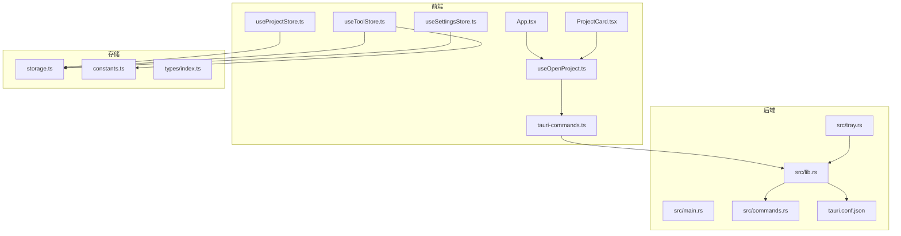
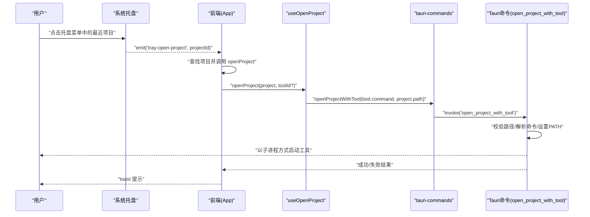
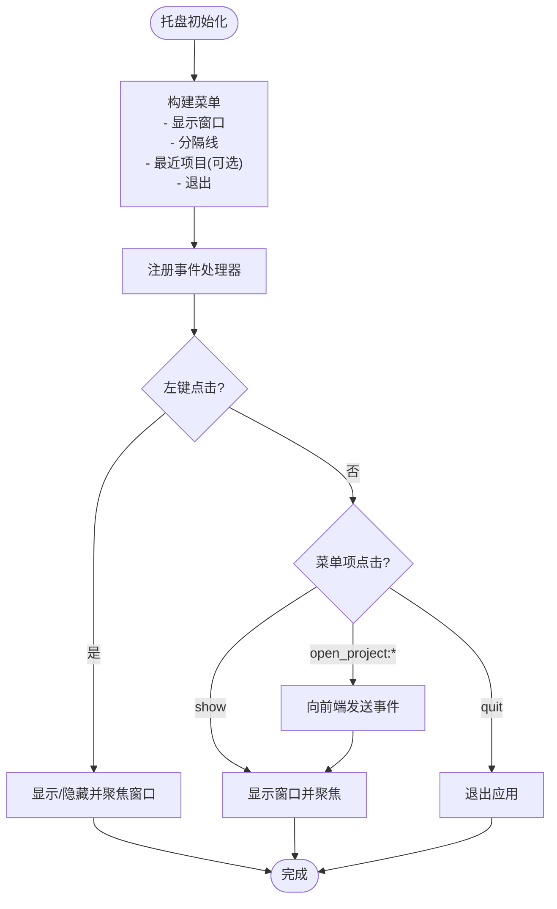
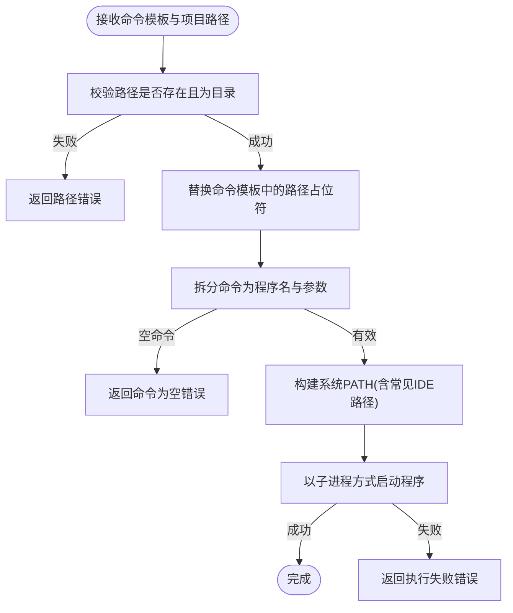
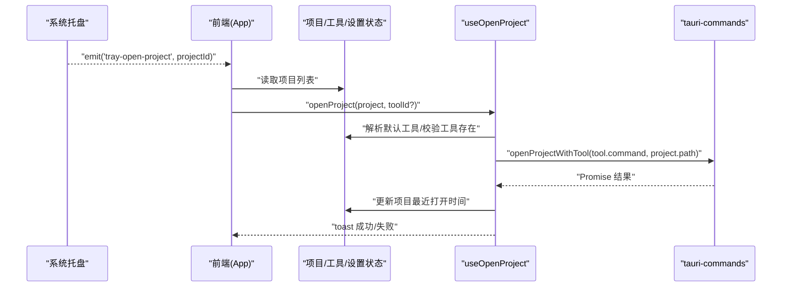
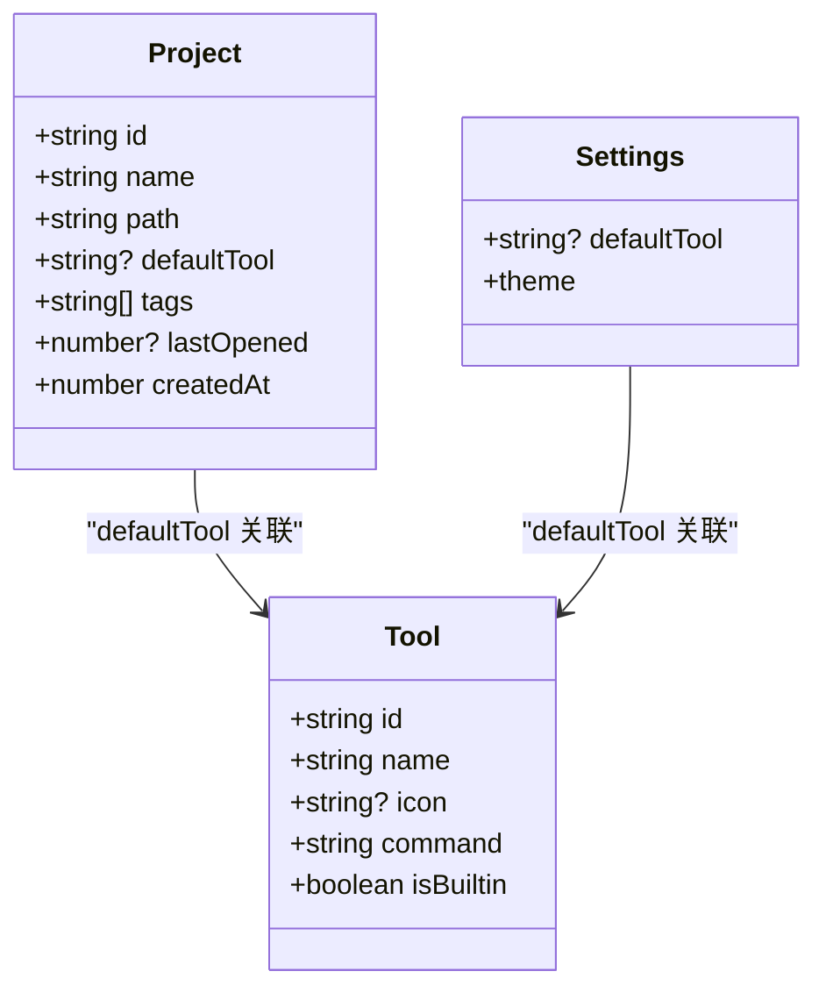
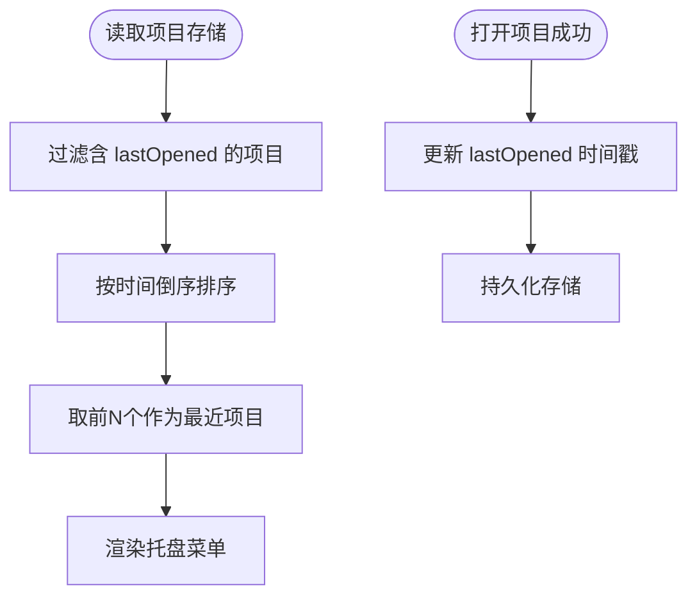
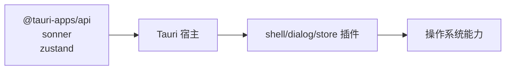

# 一键启动

<cite>
**本文引用的文件**
- [src-tauri/src/main.rs](file://src-tauri/src/main.rs)
- [src-tauri/src/lib.rs](file://src-tauri/src/lib.rs)
- [src-tauri/src/tray.rs](file://src-tauri/src/tray.rs)
- [src-tauri/src/commands.rs](file://src-tauri/src/commands.rs)
- [src-tauri/Cargo.toml](file://src-tauri/Cargo.toml)
- [src-tauri/tauri.conf.json](file://src-tauri/tauri.conf.json)
- [src/App.tsx](file://src/App.tsx)
- [src/hooks/useOpenProject.ts](file://src/hooks/useOpenProject.ts)
- [src/components/project/ProjectCard.tsx](file://src/components/project/ProjectCard.tsx)
- [src/lib/tauri-commands.ts](file://src/lib/tauri-commands.ts)
- [src/lib/storage.ts](file://src/lib/storage.ts)
- [src/lib/constants.ts](file://src/lib/constants.ts)
- [src/stores/useProjectStore.ts](file://src/stores/useProjectStore.ts)
- [src/stores/useToolStore.ts](file://src/stores/useToolStore.ts)
- [src/stores/useSettingsStore.ts](file://src/stores/useSettingsStore.ts)
- [src/types/index.ts](file://src/types/index.ts)
- [package.json](file://package.json)
</cite>

## 目录
1. [简介](#简介)
2. [项目结构](#项目结构)
3. [核心组件](#核心组件)
4. [架构总览](#架构总览)
5. [详细组件分析](#详细组件分析)
6. [依赖分析](#依赖分析)
7. [性能考虑](#性能考虑)
8. [故障排除指南](#故障排除指南)
9. [结论](#结论)
10. [附录](#附录)

## 简介
本功能文档围绕“一键启动”展开，目标是帮助开发者通过系统托盘菜单、右键菜单与快捷键等入口，快速启动项目所绑定的工具（如 VS Code、Cursor 等），从而显著减少重复操作步骤，提升项目切换效率。文档将从系统架构、组件关系、数据流、处理逻辑、错误处理与性能优化等方面进行深入解析，并提供可操作的使用场景示例。

## 项目结构
该应用采用 Tauri v2 + React 前后端分离架构：
- 前端：React 应用，负责 UI 展示、用户交互与状态管理。
- 后端：Rust 托管的 Tauri 宿主，负责系统托盘、命令执行、存储与跨平台能力。
- 存储：基于 @tauri-apps/plugin-store 的本地 JSON 存储，持久化项目、工具与设置。
- 命令通道：通过 Tauri 的 invoke 与命令注册机制在前后端之间传递数据与触发动作。

图表来源
- [src/App.tsx:1-62](file://src/App.tsx#L1-L62)
- [src/hooks/useOpenProject.ts:1-44](file://src/hooks/useOpenProject.ts#L1-L44)
- [src/components/project/ProjectCard.tsx:1-177](file://src/components/project/ProjectCard.tsx#L1-L177)
- [src/lib/tauri-commands.ts:1-17](file://src/lib/tauri-commands.ts#L1-L17)
- [src-tauri/src/main.rs:1-7](file://src-tauri/src/main.rs#L1-L7)
- [src-tauri/src/lib.rs:1-29](file://src-tauri/src/lib.rs#L1-L29)
- [src-tauri/src/tray.rs:1-105](file://src-tauri/src/tray.rs#L1-L105)
- [src-tauri/src/commands.rs:1-157](file://src-tauri/src/commands.rs#L1-L157)
- [src-tauri/tauri.conf.json:1-40](file://src-tauri/tauri.conf.json#L1-L40)
- [src/lib/storage.ts:1-30](file://src/lib/storage.ts#L1-L30)
- [src/lib/constants.ts:1-23](file://src/lib/constants.ts#L1-L23)
- [src/types/index.ts:1-26](file://src/types/index.ts#L1-L26)

章节来源
- [src-tauri/src/main.rs:1-7](file://src-tauri/src/main.rs#L1-L7)
- [src-tauri/src/lib.rs:1-29](file://src-tauri/src/lib.rs#L1-L29)
- [src-tauri/tauri.conf.json:1-40](file://src-tauri/tauri.conf.json#L1-L40)
- [package.json:1-48](file://package.json#L1-L48)

## 核心组件
- 系统托盘与菜单
  - 负责构建托盘图标、菜单项与事件响应，动态加载“最近打开的项目”列表，支持左键切换窗口、右键菜单操作与托盘点击显示/隐藏窗口。
- 命令执行引擎
  - 在后端安全地解析命令模板、替换路径占位符、拼接系统 PATH 并以子进程方式启动外部工具。
- 前端事件桥接
  - 监听托盘事件，定位项目并调用统一的“打开项目”流程，同时更新最近使用时间与用户提示。
- 状态与存储
  - 使用 Zustand 管理项目、工具与设置；通过 @tauri-apps/plugin-store 持久化数据，确保跨会话可用。

章节来源
- [src-tauri/src/tray.rs:9-105](file://src-tauri/src/tray.rs#L9-L105)
- [src-tauri/src/commands.rs:57-88](file://src-tauri/src/commands.rs#L57-L88)
- [src/App.tsx:37-52](file://src/App.tsx#L37-L52)
- [src/hooks/useOpenProject.ts:9-44](file://src/hooks/useOpenProject.ts#L9-L44)
- [src/lib/storage.ts:1-30](file://src/lib/storage.ts#L1-L30)

## 架构总览
一键启动的端到端流程如下：
- 用户通过托盘菜单选择“最近项目”，后端将事件转发给前端。
- 前端根据项目 ID 查找项目并调用“打开项目”钩子。
- 钩子解析默认工具或用户指定工具，调用命令封装函数。
- 命令封装函数通过 Tauri invoke 触发后端命令。
- 后端校验路径、解析命令模板、设置 PATH 并以子进程方式启动外部工具。
- 成功或失败均通过前端通知组件反馈给用户。

图表来源
- [src-tauri/src/tray.rs:54-79](file://src-tauri/src/tray.rs#L54-L79)
- [src/App.tsx:37-52](file://src/App.tsx#L37-L52)
- [src/hooks/useOpenProject.ts:15-40](file://src/hooks/useOpenProject.ts#L15-L40)
- [src/lib/tauri-commands.ts:3-8](file://src/lib/tauri-commands.ts#L3-L8)
- [src-tauri/src/commands.rs:57-88](file://src-tauri/src/commands.rs#L57-L88)

## 详细组件分析

### 系统托盘与菜单
- 动态构建菜单
  - 读取最近打开的项目列表，生成对应菜单项；若无项目则不显示分隔线。
  - 支持“显示窗口/退出”等基础菜单项。
- 事件处理
  - 左键点击托盘图标：显示/隐藏主窗口并聚焦。
  - 菜单项点击：根据 ID 判断是否为“打开项目”，若是则向前端发送事件并显示窗口。
- 图标与状态
  - 避免重复创建托盘图标，将实例托管于应用状态，防止被 Rust 引擎回收。

图表来源
- [src-tauri/src/tray.rs:9-37](file://src-tauri/src/tray.rs#L9-L37)
- [src-tauri/src/tray.rs:45-98](file://src-tauri/src/tray.rs#L45-L98)

章节来源
- [src-tauri/src/tray.rs:9-105](file://src-tauri/src/tray.rs#L9-L105)

### 命令执行与进程启动管理
- 命令模板解析
  - 将工具命令中的路径占位符替换为实际项目路径。
  - 将命令拆分为程序名与参数数组，确保首个非空片段为可执行程序。
- 路径环境修复
  - 读取系统 PATH 文件与常见 IDE 安装目录，合并当前 PATH，避免 CLI 工具不可用问题。
- 子进程启动
  - 以新进程方式启动外部工具，设置修复后的 PATH，捕获启动失败并返回错误信息。
- 错误处理
  - 对不存在路径、非目录路径、命令为空、启动失败等场景进行明确报错。

图表来源
- [src-tauri/src/commands.rs:57-88](file://src-tauri/src/commands.rs#L57-L88)
- [src-tauri/src/commands.rs:14-55](file://src-tauri/src/commands.rs#L14-L55)

章节来源
- [src-tauri/src/commands.rs:57-88](file://src-tauri/src/commands.rs#L57-L88)
- [src-tauri/src/commands.rs:14-55](file://src-tauri/src/commands.rs#L14-L55)

### 前端事件桥接与项目打开流程
- 事件监听
  - 前端监听来自托盘的“tray-open-project”事件，根据 payload 中的项目 ID 查找项目并调用统一打开方法。
- 打开流程
  - 解析工具：优先使用项目默认工具，否则回退到全局默认工具；若仍无则提示未选择工具。
  - 调用命令封装：传入工具命令模板与项目路径，触发后端命令。
  - 更新最近使用：成功后更新项目最近打开时间戳。
  - 用户反馈：成功/失败均通过 toast 提示。

图表来源
- [src/App.tsx:37-52](file://src/App.tsx#L37-L52)
- [src/hooks/useOpenProject.ts:15-40](file://src/hooks/useOpenProject.ts#L15-L40)
- [src/lib/tauri-commands.ts:3-8](file://src/lib/tauri-commands.ts#L3-L8)
- [src/stores/useProjectStore.ts:58-65](file://src/stores/useProjectStore.ts#L58-L65)

章节来源
- [src/App.tsx:37-52](file://src/App.tsx#L37-L52)
- [src/hooks/useOpenProject.ts:9-44](file://src/hooks/useOpenProject.ts#L9-L44)

### 项目与工具的关联关系
- 数据模型
  - 项目包含默认工具 ID、路径、标签、备注、最近打开时间等字段。
  - 工具包含 ID、名称、图标、命令模板与是否内置标志。
- 默认工具解析
  - 项目默认工具优先级高于全局默认工具；若两者都缺失，则无法一键启动。
- 内置工具集合
  - 应用启动时自动注入常用开发工具命令模板，覆盖多种主流编辑器与终端。

图表来源
- [src/types/index.ts:1-26](file://src/types/index.ts#L1-L26)
- [src/lib/constants.ts:3-18](file://src/lib/constants.ts#L3-L18)
- [src/stores/useSettingsStore.ts:1-34](file://src/stores/useSettingsStore.ts#L1-L34)

章节来源
- [src/types/index.ts:1-26](file://src/types/index.ts#L1-L26)
- [src/lib/constants.ts:1-23](file://src/lib/constants.ts#L1-L23)
- [src/stores/useSettingsStore.ts:1-34](file://src/stores/useSettingsStore.ts#L1-L34)

### 最近使用记录与存储
- 最近项目读取
  - 从应用数据目录的 JSON 存储中读取项目列表，过滤具有最近打开时间戳的项目，按时间倒序取前 N 个。
- 最近打开时间更新
  - 每次成功打开项目后，更新该项目的最近打开时间戳并持久化。
- 存储策略
  - 使用 LazyStore 自动保存，避免频繁写入；首次启动时初始化内置工具与默认设置。

图表来源
- [src-tauri/src/commands.rs:105-156](file://src-tauri/src/commands.rs#L105-L156)
- [src/stores/useProjectStore.ts:58-65](file://src/stores/useProjectStore.ts#L58-L65)
- [src/lib/storage.ts:1-30](file://src/lib/storage.ts#L1-L30)

章节来源
- [src-tauri/src/commands.rs:105-156](file://src-tauri/src/commands.rs#L105-L156)
- [src/stores/useProjectStore.ts:1-67](file://src/stores/useProjectStore.ts#L1-L67)
- [src/lib/storage.ts:1-30](file://src/lib/storage.ts#L1-L30)

### 快捷键支持
- 当前实现
  - 一键启动主要通过系统托盘菜单与双击卡片触发；未在当前代码中发现显式的全局快捷键绑定。
- 建议扩展
  - 可在前端引入热键库，结合 Tauri 的全局快捷键插件，在应用激活状态下绑定常用快捷键（如 Ctrl+Shift+P）以快速打开项目或工具。

[本节为概念性建议，不直接分析具体文件，故无章节来源]

## 依赖分析
- 前端依赖
  - @tauri-apps/api：事件监听、命令调用、对话框与存储插件。
  - sonner：轻量级通知组件，用于成功/失败提示。
  - zustand：轻量状态管理，替代 Redux。
- 后端依赖
  - tauri、tauri-plugin-shell、tauri-plugin-dialog、tauri-plugin-store：系统托盘、Shell 执行、对话框与存储能力。
  - serde/serde_json：JSON 序列化与反序列化，用于存储与命令参数。
- 构建与打包
  - Tauri CLI 与 Vite 协同，前端开发与构建流程由 package.json scripts 驱动。

图表来源
- [package.json:13-29](file://package.json#L13-L29)
- [src-tauri/Cargo.toml:15-22](file://src-tauri/Cargo.toml#L15-L22)

章节来源
- [package.json:1-48](file://package.json#L1-L48)
- [src-tauri/Cargo.toml:1-22](file://src-tauri/Cargo.toml#L1-L22)

## 性能考虑
- 子进程启动
  - 采用异步子进程启动，避免阻塞主线程；建议在高频启动场景下避免重复启动相同工具。
- PATH 修复
  - 仅在启动前一次性构建 PATH，避免每次启动重复 IO。
- 托盘菜单
  - 最近项目列表限制为固定数量，降低菜单渲染与事件处理成本。
- 存储
  - LazyStore 自动保存，减少频繁写入；项目列表读取与过滤在后端完成，前端仅做展示。

[本节提供通用指导，不直接分析具体文件，故无章节来源]

## 故障排除指南
- 打开失败：命令执行失败
  - 现象：toast 提示失败。
  - 排查：确认工具命令模板正确、路径存在且为目录、系统 PATH 包含工具可执行文件所在目录。
  - 参考路径：[命令执行实现:57-88](file://src-tauri/src/commands.rs#L57-L88)
- 项目未找到
  - 现象：toast 提示项目不存在。
  - 排查：确认项目 ID 正确，项目列表已加载。
  - 参考路径：[前端事件桥接:37-52](file://src/App.tsx#L37-L52)
- 工具未选择
  - 现象：toast 提示未选择工具。
  - 排查：为项目设置默认工具或在打开时手动选择工具。
  - 参考路径：[打开流程:15-40](file://src/hooks/useOpenProject.ts#L15-L40)
- 托盘菜单无最近项目
  - 现象：托盘菜单缺少“最近项目”分组。
  - 排查：确认最近打开时间戳已写入存储，且后端读取正常。
  - 参考路径：[最近项目读取:105-156](file://src-tauri/src/commands.rs#L105-L156)

章节来源
- [src-tauri/src/commands.rs:57-88](file://src-tauri/src/commands.rs#L57-L88)
- [src/App.tsx:37-52](file://src/App.tsx#L37-L52)
- [src/hooks/useOpenProject.ts:15-40](file://src/hooks/useOpenProject.ts#L15-L40)
- [src-tauri/src/commands.rs:105-156](file://src-tauri/src/commands.rs#L105-L156)

## 结论
一键启动通过“系统托盘菜单 + 命令模板 + 子进程启动”的组合，实现了从“选择项目 → 选择工具 → 启动工具”的极简路径。配合最近使用记录与状态持久化，开发者可以快速在不同项目间切换，显著减少重复操作步骤。未来可在现有基础上扩展全局快捷键与更多上下文菜单，进一步提升效率与易用性。

## 附录

### 使用场景示例
- 场景一：通过托盘菜单快速启动项目
  - 步骤：点击系统托盘图标，选择“最近项目”下的某个项目，应用自动以默认工具打开。
  - 参考路径：[托盘事件处理:66-76](file://src-tauri/src/tray.rs#L66-L76)，[前端事件桥接:37-52](file://src/App.tsx#L37-L52)
- 场景二：配置启动参数与工具
  - 步骤：在项目卡片中选择“打开方式...”，从工具列表中选择目标工具；或在项目详情中设置默认工具。
  - 参考路径：[项目卡片工具选择:121-138](file://src/components/project/ProjectCard.tsx#L121-L138)，[默认工具解析:15-22](file://src/hooks/useOpenProject.ts#L15-L22)
- 场景三：处理启动失败
  - 步骤：toast 提示失败后，检查工具命令模板、路径与系统 PATH；必要时在设置中调整默认工具。
  - 参考路径：[命令执行错误处理:57-88](file://src-tauri/src/commands.rs#L57-L88)，[打开流程错误处理:31-37](file://src/hooks/useOpenProject.ts#L31-L37)

章节来源
- [src-tauri/src/tray.rs:66-76](file://src-tauri/src/tray.rs#L66-L76)
- [src/App.tsx:37-52](file://src/App.tsx#L37-L52)
- [src/components/project/ProjectCard.tsx:121-138](file://src/components/project/ProjectCard.tsx#L121-L138)
- [src/hooks/useOpenProject.ts:15-40](file://src/hooks/useOpenProject.ts#L15-L40)
- [src-tauri/src/commands.rs:57-88](file://src-tauri/src/commands.rs#L57-L88)