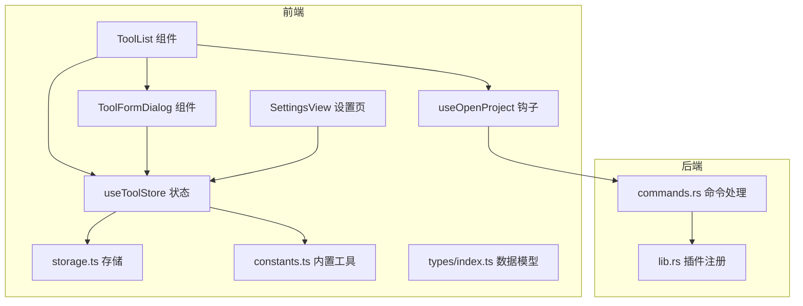
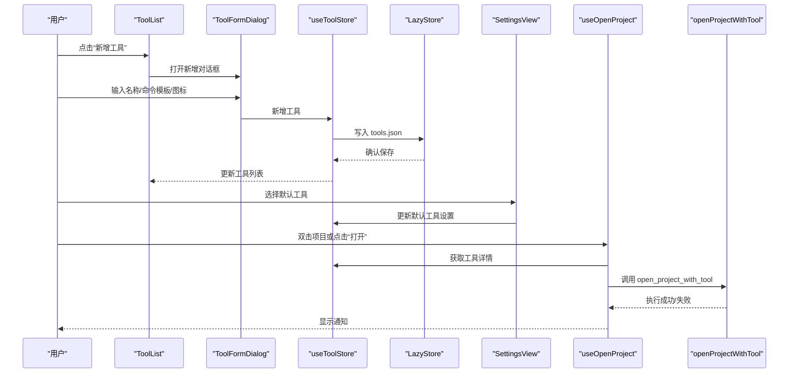
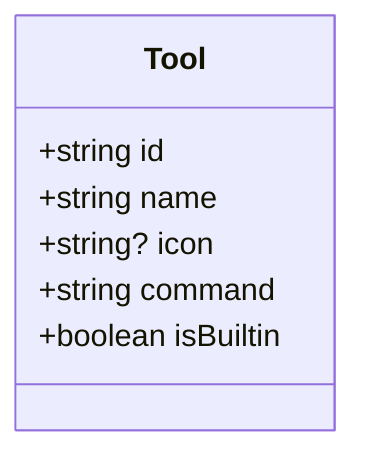
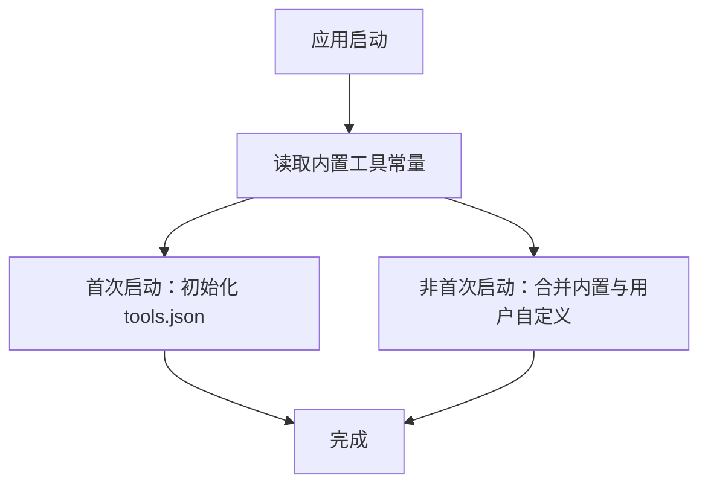
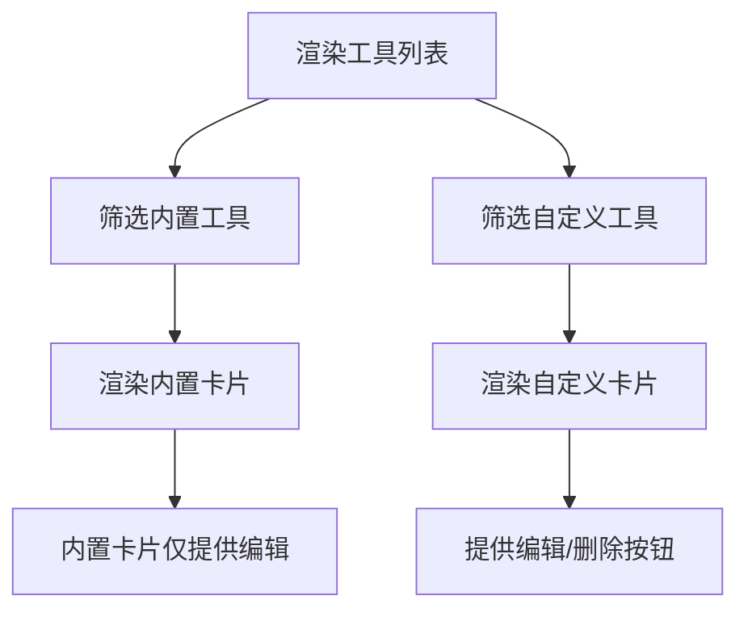
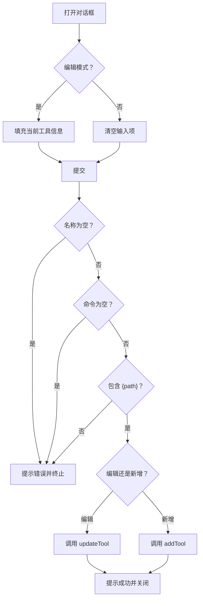
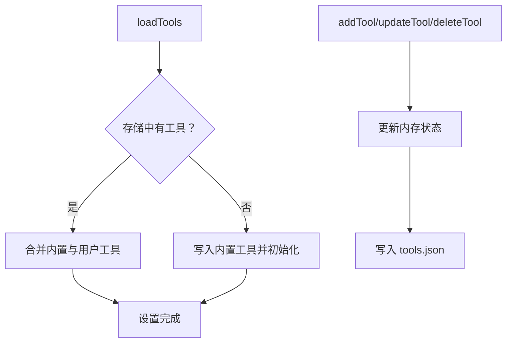
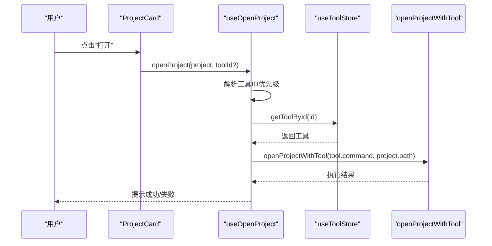
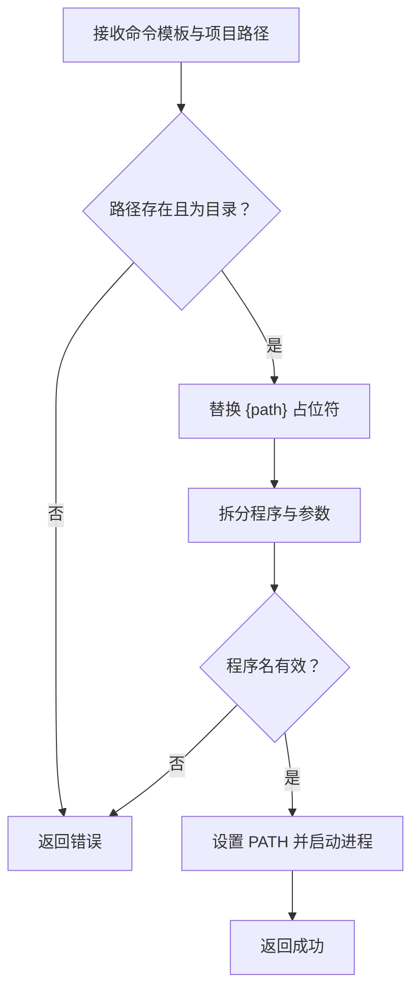
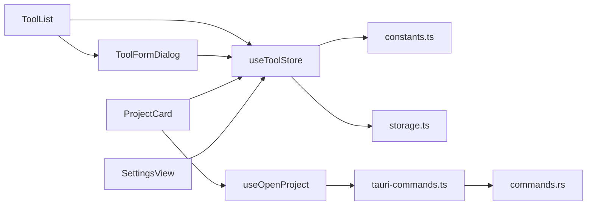

# 工具管理

<cite>
**本文引用的文件**
- [ToolFormDialog.tsx](file://src/components/tool/ToolFormDialog.tsx)
- [ToolList.tsx](file://src/components/tool/ToolList.tsx)
- [useToolStore.ts](file://src/stores/useToolStore.ts)
- [constants.ts](file://src/lib/constants.ts)
- [storage.ts](file://src/lib/storage.ts)
- [index.ts](file://src/types/index.ts)
- [SettingsView.tsx](file://src/components/settings/SettingsView.tsx)
- [tauri-commands.ts](file://src/lib/tauri-commands.ts)
- [commands.rs](file://src-tauri/src/commands.rs)
- [lib.rs](file://src-tauri/src/lib.rs)
- [useOpenProject.ts](file://src/hooks/useOpenProject.ts)
- [Sidebar.tsx](file://src/components/layout/Sidebar.tsx)
- [ProjectCard.tsx](file://src/components/project/ProjectCard.tsx)
- [dialog.tsx](file://src/components/ui/dialog.tsx)
- [button.tsx](file://src/components/ui/button.tsx)
- [README.md](file://README.md)
</cite>

## 目录
1. [简介](#简介)
2. [项目结构](#项目结构)
3. [核心组件](#核心组件)
4. [架构总览](#架构总览)
5. [详细组件分析](#详细组件分析)
6. [依赖关系分析](#依赖关系分析)
7. [性能考虑](#性能考虑)
8. [故障排除指南](#故障排除指南)
9. [结论](#结论)
10. [附录](#附录)

## 简介
本功能文档围绕“工具管理”模块展开，系统性介绍工具管理的完整能力与使用方式，包括：
- 内置工具集：覆盖 VS Code、Cursor、WebStorm、Vim、终端等常用开发工具
- 自定义工具配置：支持用户新增、编辑、删除自定义工具
- 工具列表展示：按内置与自定义分组显示，并提供操作入口
- 工具表单对话框：用于新增或编辑工具的交互界面
- 工具数据模型：包含名称、命令模板、图标、是否内置等字段
- 工具命令模板：通过占位符将项目路径注入到命令中
- 图标管理：支持 1-2 字符的图标输入，未提供时自动回退为首字母
- 分类系统：内置与自定义工具的区分与持久化存储
- 集成与效率提升：通过默认工具与快捷打开，简化项目启动流程，提升开发效率

## 项目结构
工具管理功能位于前端组件与状态层，配合后端命令桥接，形成完整的工具生命周期闭环。

图表来源
- [ToolList.tsx:12-81](file://src/components/tool/ToolList.tsx#L12-L81)
- [ToolFormDialog.tsx:21-134](file://src/components/tool/ToolFormDialog.tsx#L21-L134)
- [useToolStore.ts:17-75](file://src/stores/useToolStore.ts#L17-L75)
- [storage.ts:9-12](file://src/lib/storage.ts#L9-L12)
- [constants.ts:3-18](file://src/lib/constants.ts#L3-L18)
- [index.ts:12-18](file://src/types/index.ts#L12-L18)
- [useOpenProject.ts:9-43](file://src/hooks/useOpenProject.ts#L9-L43)
- [tauri-commands.ts:3-8](file://src/lib/tauri-commands.ts#L3-L8)
- [commands.rs:49-79](file://src-tauri/src/commands.rs#L49-L79)
- [lib.rs:10-14](file://src-tauri/src/lib.rs#L10-L14)

章节来源
- [README.md:19-29](file://README.md#L19-L29)
- [ToolList.tsx:12-81](file://src/components/tool/ToolList.tsx#L12-L81)
- [ToolFormDialog.tsx:21-134](file://src/components/tool/ToolFormDialog.tsx#L21-L134)
- [useToolStore.ts:17-75](file://src/stores/useToolStore.ts#L17-L75)
- [storage.ts:9-12](file://src/lib/storage.ts#L9-L12)
- [constants.ts:3-18](file://src/lib/constants.ts#L3-L18)
- [index.ts:12-18](file://src/types/index.ts#L12-L18)
- [useOpenProject.ts:9-43](file://src/hooks/useOpenProject.ts#L9-L43)
- [tauri-commands.ts:3-8](file://src/lib/tauri-commands.ts#L3-L8)
- [commands.rs:49-79](file://src-tauri/src/commands.rs#L49-L79)
- [lib.rs:10-14](file://src-tauri/src/lib.rs#L10-L14)

## 核心组件
- 工具列表组件：负责渲染内置与自定义工具，提供新增、编辑、删除入口，并在设置页中作为默认工具选择来源
- 工具表单对话框：提供名称、命令模板、图标的输入与校验，支持新增与编辑两种模式
- 工具状态管理：封装加载、新增、更新、删除工具的逻辑，合并内置与用户自定义工具，持久化存储
- 数据模型：定义工具的字段结构，确保前后端一致
- 默认工具设置：在设置页中选择全局默认工具，用于无指定工具时的项目打开行为
- 打开项目钩子：解析工具 ID，调用后端命令执行工具打开项目

章节来源
- [ToolList.tsx:12-81](file://src/components/tool/ToolList.tsx#L12-L81)
- [ToolFormDialog.tsx:21-134](file://src/components/tool/ToolFormDialog.tsx#L21-L134)
- [useToolStore.ts:17-75](file://src/stores/useToolStore.ts#L17-L75)
- [index.ts:12-18](file://src/types/index.ts#L12-L18)
- [SettingsView.tsx:65-89](file://src/components/settings/SettingsView.tsx#L65-L89)
- [useOpenProject.ts:9-43](file://src/hooks/useOpenProject.ts#L9-L43)

## 架构总览
工具管理采用“前端组件 + 状态管理 + 持久化存储 + 后端命令”的分层设计。前端通过状态管理器读取与写入工具列表，内置工具在首次启动时初始化；用户可通过表单对话框新增或编辑自定义工具；设置页提供默认工具选择；打开项目时由钩子解析工具并调用后端命令执行。

图表来源
- [ToolList.tsx:30-34](file://src/components/tool/ToolList.tsx#L30-L34)
- [ToolFormDialog.tsx:44-78](file://src/components/tool/ToolFormDialog.tsx#L44-L78)
- [useToolStore.ts:41-51](file://src/stores/useToolStore.ts#L41-L51)
- [storage.ts:9-12](file://src/lib/storage.ts#L9-L12)
- [SettingsView.tsx:71-88](file://src/components/settings/SettingsView.tsx#L71-L88)
- [useOpenProject.ts:15-42](file://src/hooks/useOpenProject.ts#L15-L42)
- [tauri-commands.ts:3-8](file://src/lib/tauri-commands.ts#L3-L8)
- [commands.rs:49-79](file://src-tauri/src/commands.rs#L49-L79)

## 详细组件分析

### 工具数据模型
工具对象包含以下字段：
- id：唯一标识
- name：工具名称
- icon：图标（1-2 字符），未提供时可回退为名称首字母
- command：命令模板，必须包含占位符 {path}
- isBuiltin：是否为内置工具

图表来源
- [index.ts:12-18](file://src/types/index.ts#L12-L18)

章节来源
- [index.ts:12-18](file://src/types/index.ts#L12-L18)

### 内置工具集
内置工具集合在应用启动时加载，包含多种常见开发工具与系统工具，确保新用户开箱即用。

图表来源
- [constants.ts:3-18](file://src/lib/constants.ts#L3-L18)
- [storage.ts:9-12](file://src/lib/storage.ts#L9-L12)
- [useToolStore.ts:21-39](file://src/stores/useToolStore.ts#L21-L39)

章节来源
- [constants.ts:3-18](file://src/lib/constants.ts#L3-L18)
- [storage.ts:9-12](file://src/lib/storage.ts#L9-L12)
- [useToolStore.ts:21-39](file://src/stores/useToolStore.ts#L21-L39)

### 工具列表展示
工具列表组件将工具分为“内置”和“自定义”两部分展示，并提供新增、编辑、删除入口。自定义工具支持删除，内置工具不可删除。

图表来源
- [ToolList.tsx:18-69](file://src/components/tool/ToolList.tsx#L18-L69)

章节来源
- [ToolList.tsx:12-81](file://src/components/tool/ToolList.tsx#L12-L81)

### 工具表单对话框
表单对话框支持新增与编辑两种模式，包含名称、命令模板、图标的输入与校验：
- 名称必填
- 命令模板必填且必须包含 {path} 占位符
- 图标长度限制为 1-2 字符，未提供时回退为名称首字母大写
- 提交成功后关闭对话框并提示结果

图表来源
- [ToolFormDialog.tsx:21-78](file://src/components/tool/ToolFormDialog.tsx#L21-L78)

章节来源
- [ToolFormDialog.tsx:21-134](file://src/components/tool/ToolFormDialog.tsx#L21-L134)
- [dialog.tsx:48-80](file://src/components/ui/dialog.tsx#L48-L80)
- [button.tsx:41-65](file://src/components/ui/button.tsx#L41-L65)

### 工具状态管理（Zustand）
状态管理器提供以下能力：
- 初始化与加载：首次启动写入内置工具，后续从持久化存储读取
- 合并策略：确保所有内置工具存在，同时保留用户自定义配置
- 新增/更新/删除：同步更新内存与持久化存储
- 查询：按 ID 获取工具详情

图表来源
- [useToolStore.ts:21-69](file://src/stores/useToolStore.ts#L21-L69)
- [storage.ts:9-12](file://src/lib/storage.ts#L9-L12)

章节来源
- [useToolStore.ts:17-75](file://src/stores/useToolStore.ts#L17-L75)
- [storage.ts:9-12](file://src/lib/storage.ts#L9-L12)

### 默认工具与打开流程
- 设置页提供默认工具选择，支持空值（始终询问）
- 打开项目时优先级：显式传入 toolId > 项目默认工具 > 全局默认工具
- 若未选择工具或工具不存在，给出错误提示
- 成功后更新项目的最近打开时间并提示成功

图表来源
- [ProjectCard.tsx:121-138](file://src/components/project/ProjectCard.tsx#L121-L138)
- [useOpenProject.ts:15-42](file://src/hooks/useOpenProject.ts#L15-L42)
- [tauri-commands.ts:3-8](file://src/lib/tauri-commands.ts#L3-L8)
- [commands.rs:49-79](file://src-tauri/src/commands.rs#L49-L79)

章节来源
- [SettingsView.tsx:65-89](file://src/components/settings/SettingsView.tsx#L65-L89)
- [useOpenProject.ts:9-43](file://src/hooks/useOpenProject.ts#L9-L43)
- [ProjectCard.tsx:121-138](file://src/components/project/ProjectCard.tsx#L121-L138)

### 后端命令执行
后端命令负责安全校验与命令执行：
- 校验项目路径存在且为目录
- 替换命令模板中的 {path} 占位符
- 解析程序名与参数，设置 PATH 环境变量
- 异步启动外部进程并返回结果

图表来源
- [commands.rs:49-79](file://src-tauri/src/commands.rs#L49-L79)
- [lib.rs:10-14](file://src-tauri/src/lib.rs#L10-L14)

章节来源
- [tauri-commands.ts:3-8](file://src/lib/tauri-commands.ts#L3-L8)
- [commands.rs:49-79](file://src-tauri/src/commands.rs#L49-L79)
- [lib.rs:10-14](file://src-tauri/src/lib.rs#L10-L14)

## 依赖关系分析
- 组件依赖：ToolList 依赖 ToolFormDialog 与 useToolStore；SettingsView 依赖 useToolStore 与 useSettingsStore；ProjectCard 依赖 useToolStore 与 useOpenProject
- 状态依赖：useToolStore 依赖 constants.ts 的内置工具与 storage.ts 的持久化存储
- 命令依赖：前端通过 tauri-commands.ts 调用后端命令，后端在 lib.rs 中注册命令处理器

图表来源
- [ToolList.tsx:8-9](file://src/components/tool/ToolList.tsx#L8-L9)
- [ToolFormDialog.tsx:11-13](file://src/components/tool/ToolFormDialog.tsx#L11-L13)
- [useToolStore.ts:1-6](file://src/stores/useToolStore.ts#L1-L6)
- [constants.ts:1-2](file://src/lib/constants.ts#L1-L2)
- [storage.ts:1-30](file://src/lib/storage.ts#L1-L30)
- [ProjectCard.tsx:17-19](file://src/components/project/ProjectCard.tsx#L17-L19)
- [useOpenProject.ts:1-8](file://src/hooks/useOpenProject.ts#L1-L8)
- [tauri-commands.ts:1-16](file://src/lib/tauri-commands.ts#L1-L16)
- [commands.rs:1-94](file://src-tauri/src/commands.rs#L1-L94)
- [SettingsView.tsx:14-23](file://src/components/settings/SettingsView.tsx#L14-L23)

章节来源
- [ToolList.tsx:8-9](file://src/components/tool/ToolList.tsx#L8-L9)
- [ToolFormDialog.tsx:11-13](file://src/components/tool/ToolFormDialog.tsx#L11-L13)
- [useToolStore.ts:1-6](file://src/stores/useToolStore.ts#L1-L6)
- [constants.ts:1-2](file://src/lib/constants.ts#L1-L2)
- [storage.ts:1-30](file://src/lib/storage.ts#L1-L30)
- [ProjectCard.tsx:17-19](file://src/components/project/ProjectCard.tsx#L17-L19)
- [useOpenProject.ts:1-8](file://src/hooks/useOpenProject.ts#L1-L8)
- [tauri-commands.ts:1-16](file://src/lib/tauri-commands.ts#L1-L16)
- [commands.rs:1-94](file://src-tauri/src/commands.rs#L1-L94)
- [SettingsView.tsx:14-23](file://src/components/settings/SettingsView.tsx#L14-L23)

## 性能考虑
- 状态与存储分离：使用轻量的状态管理与本地存储，避免频繁重渲染
- 合并策略：首次启动仅写入内置工具，后续合并内置与用户自定义，减少初始化成本
- 前端校验：在表单层进行基础校验，降低无效请求与后端处理压力
- 异步执行：命令执行采用异步启动，不阻塞 UI 线程

## 故障排除指南
- 新增工具报错：检查命令模板是否包含 {path} 占位符；确认名称非空
- 打开项目失败：确认项目路径存在且为目录；检查工具命令是否正确
- 默认工具未生效：确认设置页已保存默认工具；检查项目是否设置了默认工具
- 删除内置工具无效：内置工具不可删除，属于预期行为

章节来源
- [ToolFormDialog.tsx:44-56](file://src/components/tool/ToolFormDialog.tsx#L44-L56)
- [useOpenProject.ts:15-42](file://src/hooks/useOpenProject.ts#L15-L42)
- [commands.rs:50-56](file://src-tauri/src/commands.rs#L50-L56)
- [useToolStore.ts:62-69](file://src/stores/useToolStore.ts#L62-L69)

## 结论
工具管理功能通过“内置工具 + 自定义工具 + 默认工具 + 快捷打开”的组合，显著简化了开发者启动项目的流程。前端以组件化的方式提供直观的配置入口，后端以安全可控的方式执行外部命令，整体架构清晰、扩展性强，能够满足不同开发场景下的工具管理需求。

## 附录

### 配置示例与最佳实践
- 添加自定义工具
  - 在工具列表中点击“新增工具”，填写名称、命令模板（必须包含 {path}）与图标
  - 提交后工具将出现在“自定义”分组中，可随时编辑或删除
- 配置启动命令
  - 命令模板示例：对于 VS Code，模板为 code {path}；对于终端，模板为 open -a Terminal {path}
  - 注意：命令模板中的 {path} 是必需占位符，用于注入项目路径
- 设置工具参数
  - 可在命令模板中追加参数，例如带工作区参数的 IDE 启动命令
- 管理工具优先级
  - 在项目卡片的“打开方式”下拉菜单中选择特定工具
  - 或在设置页中设置全局默认工具，用于未指定工具时的项目打开行为
- 图标管理
  - 图标建议使用 1-2 个字符，便于识别；未提供时将自动回退为名称首字母大写

章节来源
- [ToolFormDialog.tsx:44-78](file://src/components/tool/ToolFormDialog.tsx#L44-L78)
- [ToolList.tsx:30-34](file://src/components/tool/ToolList.tsx#L30-L34)
- [SettingsView.tsx:65-89](file://src/components/settings/SettingsView.tsx#L65-L89)
- [ProjectCard.tsx:121-138](file://src/components/project/ProjectCard.tsx#L121-L138)