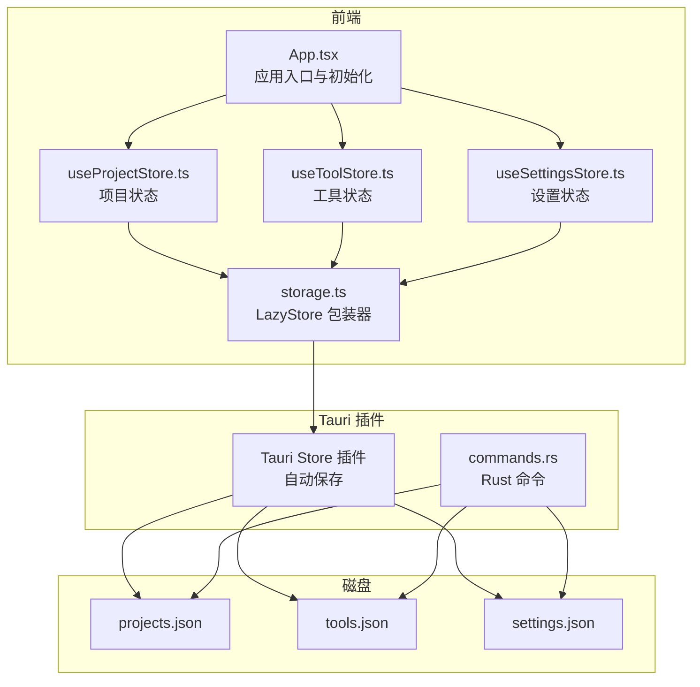
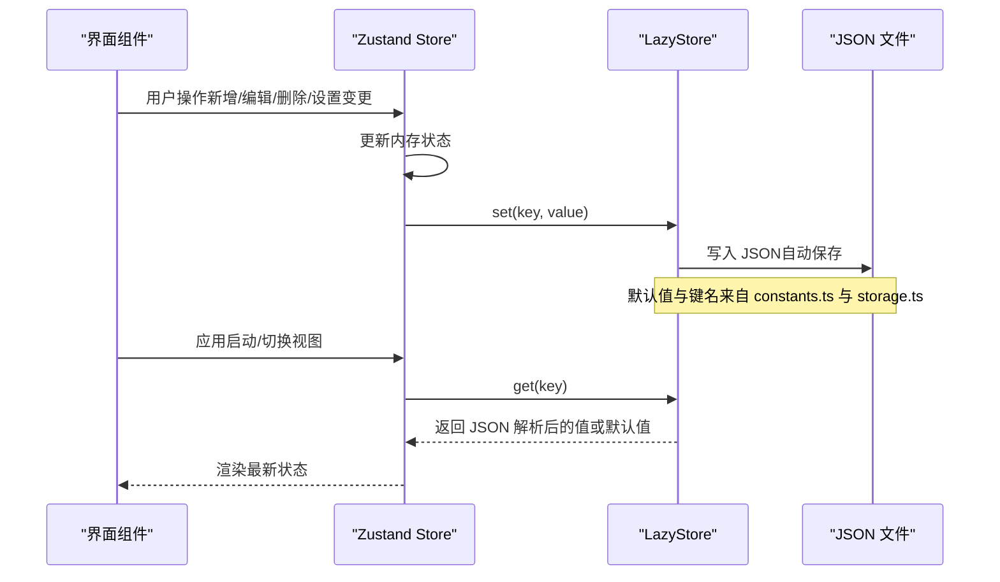
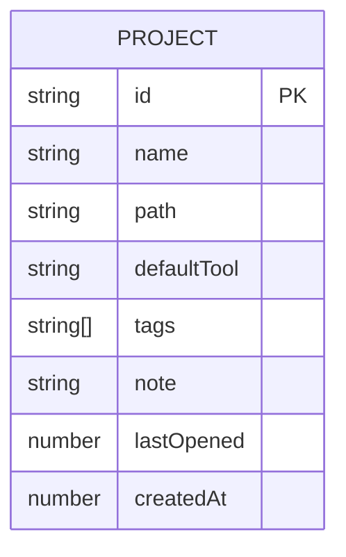
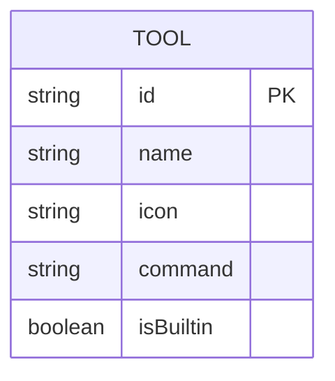
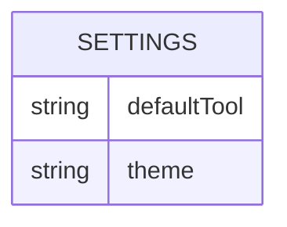
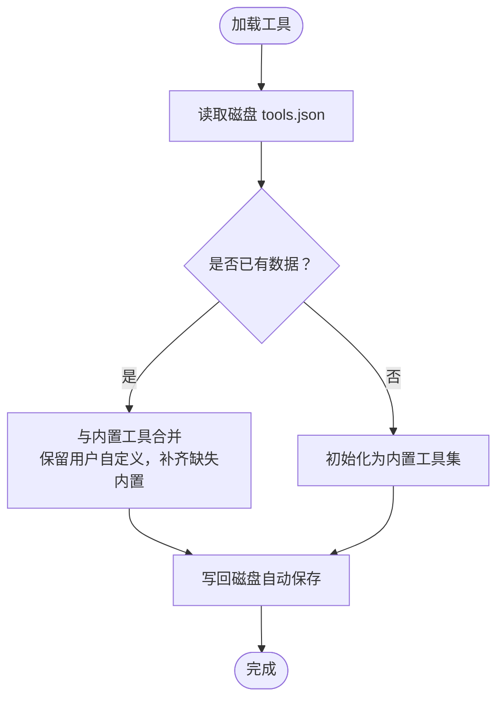
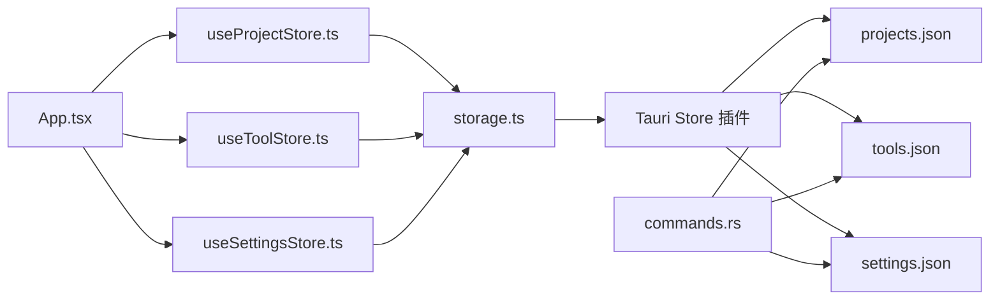
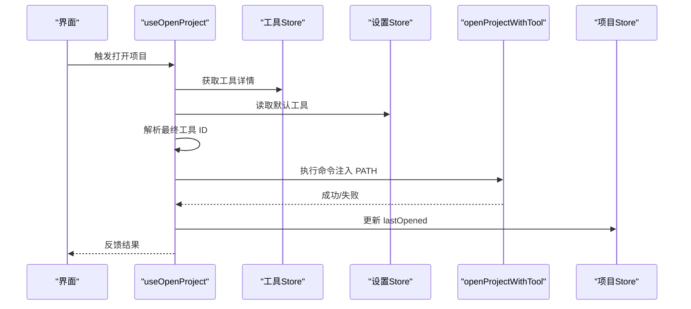
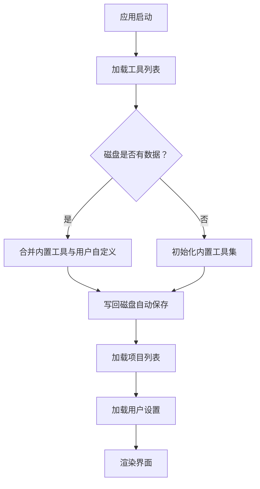

# 数据持久化

<cite>
**本文引用的文件**
- [storage.ts](file://src/lib/storage.ts)
- [useProjectStore.ts](file://src/stores/useProjectStore.ts)
- [useToolStore.ts](file://src/stores/useToolStore.ts)
- [useSettingsStore.ts](file://src/stores/useSettingsStore.ts)
- [constants.ts](file://src/lib/constants.ts)
- [index.ts](file://src/types/index.ts)
- [commands.rs](file://src-tauri/src/commands.rs)
- [lib.rs](file://src-tauri/src/lib.rs)
- [App.tsx](file://src/App.tsx)
- [ProjectFormDialog.tsx](file://src/components/project/ProjectFormDialog.tsx)
- [SettingsView.tsx](file://src/components/settings/SettingsView.tsx)
- [useOpenProject.ts](file://src/hooks/useOpenProject.ts)
- [desktop-schema.json](file://src-tauri/gen/schemas/desktop-schema.json)
- [macOS-schema.json](file://src-tauri/gen/schemas/macOS-schema.json)
</cite>

## 目录
1. [简介](#简介)
2. [项目结构](#项目结构)
3. [核心组件](#核心组件)
4. [架构总览](#架构总览)
5. [详细组件分析](#详细组件分析)
6. [依赖关系分析](#依赖关系分析)
7. [性能考量](#性能考量)
8. [故障排查指南](#故障排查指南)
9. [结论](#结论)
10. [附录](#附录)

## 简介
本文件系统性阐述 LaunchPro 的数据持久化机制，涵盖本地存储实现、JSON 文件格式、数据同步与合并策略、数据迁移与兼容性保障、以及安全性与可靠性措施。重点说明项目数据、工具配置、用户设置与应用状态的存储方式与读写流程，并提供数据结构示例与可视化图示，帮助开发者与使用者全面理解数据层的设计与实现。

## 项目结构
LaunchPro 的数据持久化由前端 Zustand 状态管理、Tauri Store 插件与 Rust 后端命令三部分协同完成：
- 前端通过 Zustand store 管理内存态与触发持久化写入
- 使用 @tauri-apps/plugin-store 将数据序列化为 JSON 并保存到应用数据目录
- Rust 命令用于读取 JSON 文件（如最近项目列表）与系统 PATH 等环境信息
- 应用启动时加载各 store，确保状态与磁盘数据一致

图表来源
- [App.tsx:24-35](file://src/App.tsx#L24-L35)
- [useProjectStore.ts:16-28](file://src/stores/useProjectStore.ts#L16-L28)
- [useToolStore.ts:17-39](file://src/stores/useToolStore.ts#L17-L39)
- [useSettingsStore.ts:13-25](file://src/stores/useSettingsStore.ts#L13-L25)
- [storage.ts:4-17](file://src/lib/storage.ts#L4-L17)
- [lib.rs:9](file://src-tauri/src/lib.rs#L9)
- [commands.rs:107-156](file://src-tauri/src/commands.rs#L107-L156)

章节来源
- [App.tsx:24-35](file://src/App.tsx#L24-L35)
- [storage.ts:4-17](file://src/lib/storage.ts#L4-L17)
- [lib.rs:9](file://src-tauri/src/lib.rs#L9)

## 核心组件
- LazyStore 包装器：统一创建 projects.json、tools.json、settings.json 三个存储实例，启用默认值与自动保存
- 项目状态管理：负责项目列表的增删改查与最后打开时间更新
- 工具状态管理：负责工具列表的加载、合并内置工具、新增/更新/删除（内置不可删）
- 设置状态管理：负责主题与默认工具等用户设置的读取与更新
- Rust 命令：提供最近项目读取、路径存在性检查、应用数据目录查询等能力

章节来源
- [storage.ts:1-30](file://src/lib/storage.ts#L1-L30)
- [useProjectStore.ts:1-67](file://src/stores/useProjectStore.ts#L1-L67)
- [useToolStore.ts:1-75](file://src/stores/useToolStore.ts#L1-L75)
- [useSettingsStore.ts:1-34](file://src/stores/useSettingsStore.ts#L1-L34)
- [commands.rs:57-88](file://src-tauri/src/commands.rs#L57-L88)
- [commands.rs:90-94](file://src-tauri/src/commands.rs#L90-L94)
- [commands.rs:96-103](file://src-tauri/src/commands.rs#L96-L103)
- [commands.rs:105-156](file://src-tauri/src/commands.rs#L105-L156)

## 架构总览
下图展示了从 UI 到磁盘的完整数据流，包括初始化加载、交互式写入与后台读取：

图表来源
- [useProjectStore.ts:20-40](file://src/stores/useProjectStore.ts#L20-L40)
- [useToolStore.ts:21-39](file://src/stores/useToolStore.ts#L21-L39)
- [useSettingsStore.ts:17-32](file://src/stores/useSettingsStore.ts#L17-L32)
- [storage.ts:4-17](file://src/lib/storage.ts#L4-L17)
- [constants.ts:20-22](file://src/lib/constants.ts#L20-L22)

## 详细组件分析

### 项目数据持久化（projects.json）
- 存储键：projects
- 默认值：空数组
- 自动保存：开启
- 数据结构要点：
  - id：UUID
  - name：字符串
  - path：字符串（必须为目录且存在）
  - defaultTool：可选工具 ID
  - tags：字符串数组
  - note：可选备注
  - lastOpened：可选时间戳（毫秒）
  - createdAt：创建时间戳（毫秒）

图表来源
- [index.ts:1-10](file://src/types/index.ts#L1-L10)
- [useProjectStore.ts:30-35](file://src/stores/useProjectStore.ts#L30-L35)
- [useProjectStore.ts:58-64](file://src/stores/useProjectStore.ts#L58-L64)

章节来源
- [storage.ts:4-7](file://src/lib/storage.ts#L4-L7)
- [useProjectStore.ts:20-28](file://src/stores/useProjectStore.ts#L20-L28)
- [useProjectStore.ts:30-40](file://src/stores/useProjectStore.ts#L30-L40)
- [useProjectStore.ts:42-56](file://src/stores/useProjectStore.ts#L42-L56)
- [useProjectStore.ts:58-65](file://src/stores/useProjectStore.ts#L58-L65)
- [index.ts:1-10](file://src/types/index.ts#L1-L10)

### 工具配置持久化（tools.json）
- 存储键：tools
- 默认值：内置工具集合（首次启动）
- 自动保存：开启
- 数据结构要点：
  - id：UUID
  - name：字符串
  - icon：可选图标
  - command：字符串（支持 {path} 占位符）
  - isBuiltin：布尔（内置不可删除）

图表来源
- [index.ts:12-18](file://src/types/index.ts#L12-L18)
- [constants.ts:3-18](file://src/lib/constants.ts#L3-L18)
- [useToolStore.ts:41-51](file://src/stores/useToolStore.ts#L41-L51)
- [useToolStore.ts:53-69](file://src/stores/useToolStore.ts#L53-L69)

章节来源
- [storage.ts:9-12](file://src/lib/storage.ts#L9-L12)
- [useToolStore.ts:21-39](file://src/stores/useToolStore.ts#L21-L39)
- [useToolStore.ts:41-69](file://src/stores/useToolStore.ts#L41-L69)
- [constants.ts:3-18](file://src/lib/constants.ts#L3-L18)
- [index.ts:12-18](file://src/types/index.ts#L12-L18)

### 用户设置持久化（settings.json）
- 存储键：settings
- 默认值：系统主题（默认 system）
- 自动保存：开启
- 数据结构要点：
  - defaultTool：可选默认工具 ID
  - theme：'light' | 'dark' | 'system'

图表来源
- [index.ts:20-23](file://src/types/index.ts#L20-L23)
- [constants.ts:20-22](file://src/lib/constants.ts#L20-L22)
- [useSettingsStore.ts:17-32](file://src/stores/useSettingsStore.ts#L17-L32)

章节来源
- [storage.ts:14-17](file://src/lib/storage.ts#L14-L17)
- [useSettingsStore.ts:17-32](file://src/stores/useSettingsStore.ts#L17-L32)
- [index.ts:20-23](file://src/types/index.ts#L20-L23)
- [constants.ts:20-22](file://src/lib/constants.ts#L20-L22)

### 数据同步与合并策略
- 工具加载时的“合并”逻辑：
  - 若磁盘已有工具列表且非空，则与内置工具进行去重合并，保留用户自定义项并补齐缺失的内置项
  - 若为空，则初始化为内置工具集
- 该策略确保内置工具更新后仍能保留用户自定义项，同时避免重复

图表来源
- [useToolStore.ts:21-39](file://src/stores/useToolStore.ts#L21-L39)
- [constants.ts:3-18](file://src/lib/constants.ts#L3-L18)

章节来源
- [useToolStore.ts:21-39](file://src/stores/useToolStore.ts#L21-L39)
- [constants.ts:3-18](file://src/lib/constants.ts#L3-L18)

### 数据迁移与版本兼容
- 通过“合并+默认值”的双保险机制实现兼容：
  - 默认值：首次运行或字段缺失时自动补全
  - 合并：内置工具更新时自动补齐新字段，避免旧版本数据丢失
- Rust 命令读取 projects.json 时采用动态解析与过滤，仅提取含 lastOpened 的项目并排序，保证向前兼容

章节来源
- [storage.ts:4-17](file://src/lib/storage.ts#L4-L17)
- [useToolStore.ts:21-39](file://src/stores/useToolStore.ts#L21-L39)
- [commands.rs:107-156](file://src-tauri/src/commands.rs#L107-L156)

### 安全性与可靠性保障
- 自动保存与延迟加载：LazyStore 在写入时自动保存，减少意外退出导致的数据丢失风险
- 错误兜底：所有 store 的读取均包含 try/catch，失败时回退到默认值或空状态
- 权限控制：Tauri Store 插件默认允许全部操作（读取、写入、清空等），需结合应用权限策略审慎配置
- 路径与命令执行安全：Rust 层严格校验路径存在性与目录类型，执行外部命令时注入系统 PATH，避免环境差异导致失败

章节来源
- [storage.ts:1-30](file://src/lib/storage.ts#L1-L30)
- [useProjectStore.ts:20-28](file://src/stores/useProjectStore.ts#L20-L28)
- [useToolStore.ts:21-39](file://src/stores/useToolStore.ts#L21-L39)
- [useSettingsStore.ts:17-25](file://src/stores/useSettingsStore.ts#L17-L25)
- [lib.rs:9](file://src-tauri/src/lib.rs#L9)
- [commands.rs:57-88](file://src-tauri/src/commands.rs#L57-L88)
- [commands.rs:90-94](file://src-tauri/src/commands.rs#L90-L94)
- [desktop-schema.json:2491-2513](file://src-tauri/gen/schemas/desktop-schema.json#L2491-L2513)
- [macOS-schema.json:2491-2513](file://src-tauri/gen/schemas/macOS-schema.json#L2491-L2513)

## 依赖关系分析
- 前端依赖链：
  - App.tsx 初始化加载三大 store
  - 各 store 通过 storage.ts 获取 LazyStore 实例
  - UI 组件与 store 交互，store 写入 LazyStore
- 后端依赖链：
  - lib.rs 注册 Tauri Store 插件与命令
  - commands.rs 提供读取最近项目、检查路径、获取应用数据目录等能力

图表来源
- [App.tsx:24-35](file://src/App.tsx#L24-L35)
- [storage.ts:19-29](file://src/lib/storage.ts#L19-L29)
- [lib.rs:9](file://src-tauri/src/lib.rs#L9)
- [commands.rs:107-156](file://src-tauri/src/commands.rs#L107-L156)

章节来源
- [App.tsx:24-35](file://src/App.tsx#L24-L35)
- [storage.ts:19-29](file://src/lib/storage.ts#L19-L29)
- [lib.rs:9](file://src-tauri/src/lib.rs#L9)

## 性能考量
- 自动保存开销：autoSave=true 会在每次 set 调用后触发写盘，建议批量更新时合并多次 set 以减少 IO 次数
- JSON 体积控制：项目与工具列表规模较小时影响有限；若未来扩展至大型项目集，可考虑分片或懒加载
- 合并策略成本：工具合并涉及集合去重与遍历，当前内置工具数量可控，性能影响可忽略
- 首次加载优化：App.tsx 在启动时并行加载三大 store，缩短白屏时间

## 故障排查指南
- 无法读取数据
  - 现象：界面显示为空或默认值
  - 排查：确认 LazyStore 是否正确初始化、文件是否存在、权限是否正常
  - 参考：各 store 的 load 方法与 try/catch 回退逻辑
- 工具缺失或重复
  - 现象：内置工具消失或重复出现
  - 排查：检查 tools.json 是否被手动修改；确认合并逻辑是否正常执行
  - 参考：工具加载与合并流程
- 最近项目不显示
  - 现象：托盘菜单无最近项目
  - 排查：确认 projects.json 中是否存在 lastOpened 字段；检查 Rust 命令读取逻辑
  - 参考：get_recent_projects 命令
- 打开项目失败
  - 现象：提示路径不存在或命令执行失败
  - 排查：确认路径存在且为目录；检查工具 command 模板与 PATH 注入
  - 参考：open_project_with_tool 命令与 useOpenProject 钩子

章节来源
- [useProjectStore.ts:20-28](file://src/stores/useProjectStore.ts#L20-L28)
- [useToolStore.ts:21-39](file://src/stores/useToolStore.ts#L21-L39)
- [commands.rs:107-156](file://src-tauri/src/commands.rs#L107-L156)
- [commands.rs:57-88](file://src-tauri/src/commands.rs#L57-L88)
- [useOpenProject.ts:15-40](file://src/hooks/useOpenProject.ts#L15-L40)

## 结论
LaunchPro 的数据持久化以 LazyStore 为核心，结合 Zustand store 与 Rust 命令，实现了简洁可靠的本地存储方案。通过默认值与合并策略，兼顾了易用性与版本兼容；通过自动保存与错误兜底，提升了可靠性。建议在后续迭代中关注批量写入优化与大体量数据的性能表现，并持续完善权限与安全策略。

## 附录

### 数据结构示例（字段定义）
- 项目对象（Project）
  - id：字符串（唯一标识）
  - name：字符串（项目名称）
  - path：字符串（项目根目录路径）
  - defaultTool：可选字符串（默认工具 ID）
  - tags：字符串数组（标签）
  - note：可选字符串（备注）
  - lastOpened：可选数字（毫秒时间戳）
  - createdAt：数字（毫秒时间戳）

- 工具对象（Tool）
  - id：字符串（唯一标识）
  - name：字符串（工具名称）
  - icon：可选字符串（图标）
  - command：字符串（命令模板，支持 {path} 占位符）
  - isBuiltin：布尔（是否内置）

- 设置对象（Settings）
  - defaultTool：可选字符串（默认工具 ID）
  - theme：字符串（主题：light/dark/system）

章节来源
- [index.ts:1-26](file://src/types/index.ts#L1-L26)

### 关键流程图：打开项目

图表来源
- [useOpenProject.ts:15-40](file://src/hooks/useOpenProject.ts#L15-L40)
- [useProjectStore.ts:58-65](file://src/stores/useProjectStore.ts#L58-L65)
- [commands.rs:57-88](file://src-tauri/src/commands.rs#L57-L88)

### 关键流程图：加载与初始化

图表来源
- [App.tsx:31-35](file://src/App.tsx#L31-L35)
- [useToolStore.ts:21-39](file://src/stores/useToolStore.ts#L21-L39)
- [useProjectStore.ts:20-28](file://src/stores/useProjectStore.ts#L20-L28)
- [useSettingsStore.ts:17-25](file://src/stores/useSettingsStore.ts#L17-L25)