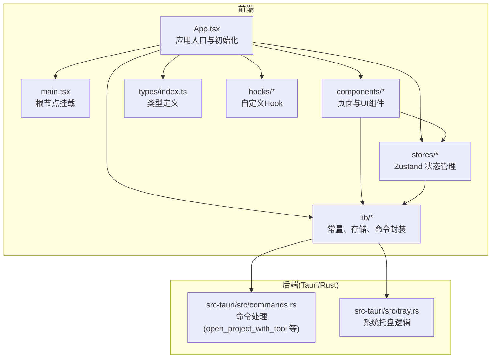
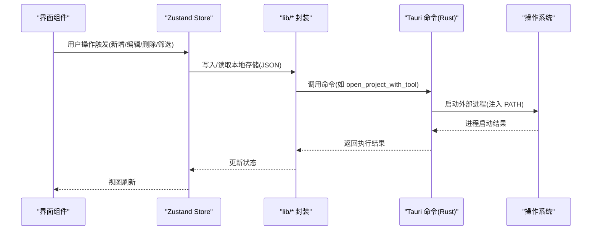
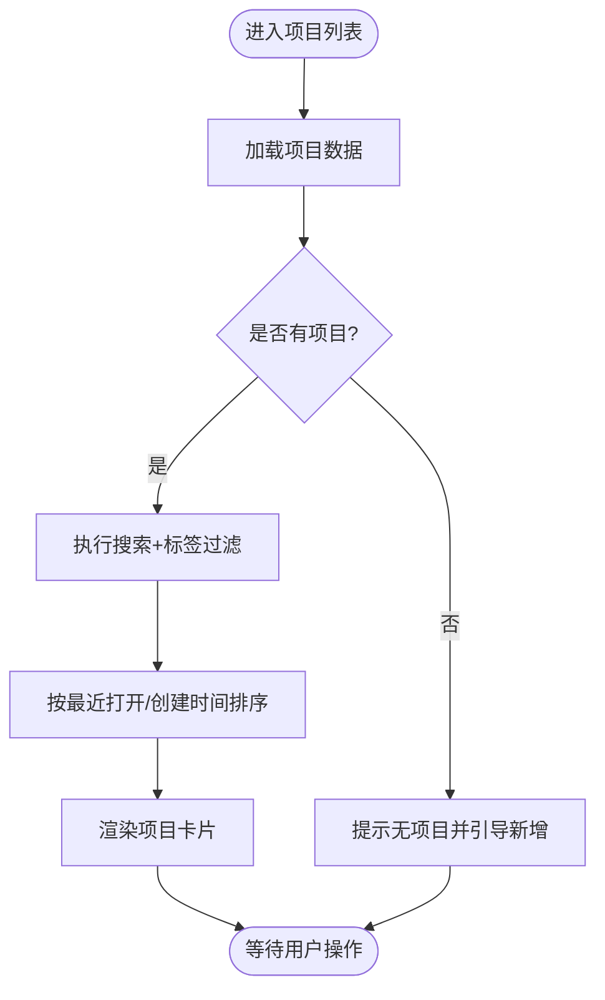
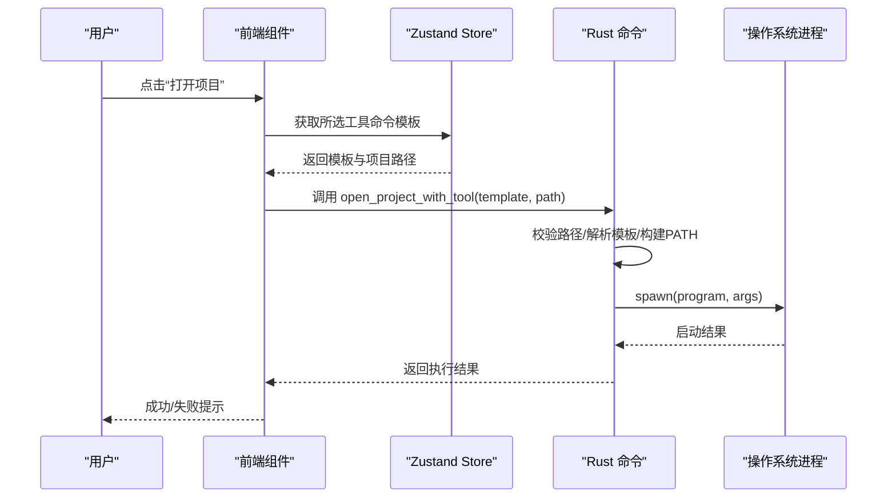
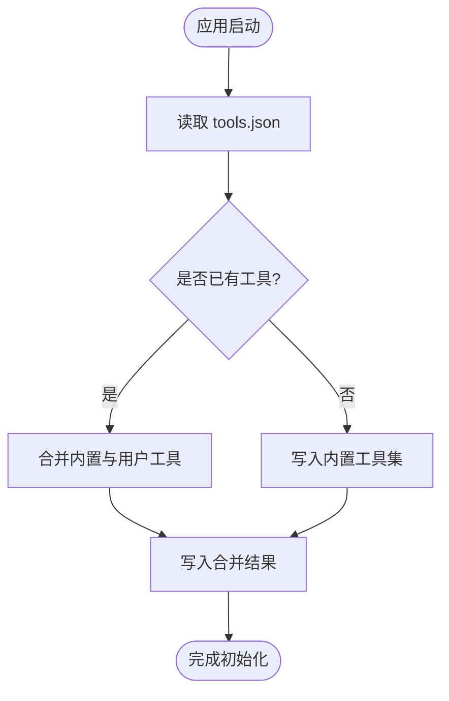
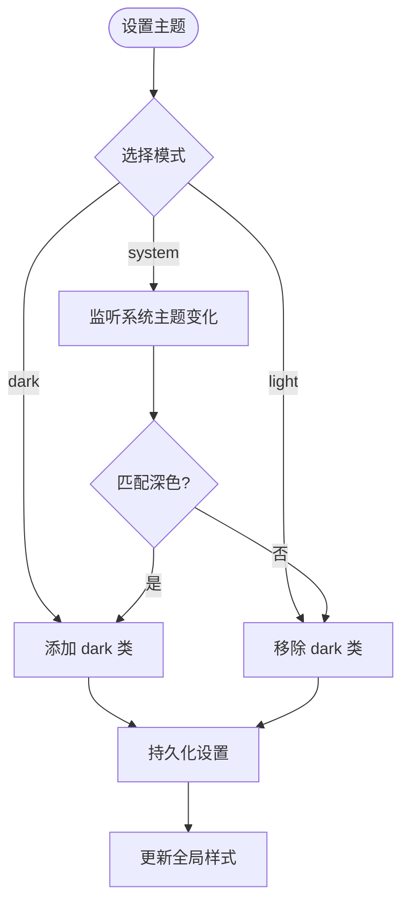
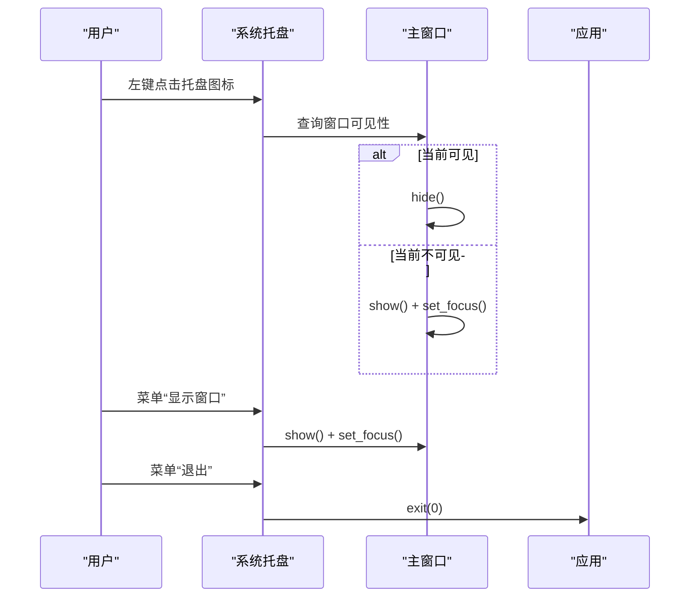
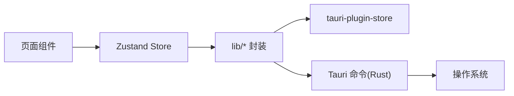

# 核心功能

<cite>
**本文引用的文件**
- [README.md](file://README.md)
- [src/App.tsx](file://src/App.tsx)
- [src/main.tsx](file://src/main.tsx)
- [src/lib/constants.ts](file://src/lib/constants.ts)
- [src/lib/storage.ts](file://src/lib/storage.ts)
- [src/lib/tauri-commands.ts](file://src/lib/tauri-commands.ts)
- [src/stores/useProjectStore.ts](file://src/stores/useProjectStore.ts)
- [src/stores/useToolStore.ts](file://src/stores/useToolStore.ts)
- [src/stores/useSettingsStore.ts](file://src/stores/useSettingsStore.ts)
- [src/hooks/useTheme.ts](file://src/hooks/useTheme.ts)
- [src/types/index.ts](file://src/types/index.ts)
- [src/components/project/ProjectList.tsx](file://src/components/project/ProjectList.tsx)
- [src/components/project/ProjectCard.tsx](file://src/components/project/ProjectCard.tsx)
- [src/components/project/ProjectFormDialog.tsx](file://src/components/project/ProjectFormDialog.tsx)
- [src/components/tool/ToolList.tsx](file://src/components/tool/ToolList.tsx)
- [src/components/tool/ToolFormDialog.tsx](file://src/components/tool/ToolFormDialog.tsx)
- [src/components/settings/SettingsView.tsx](file://src/components/settings/SettingsView.tsx)
- [src-tauri/src/commands.rs](file://src-tauri/src/commands.rs)
- [src-tauri/src/tray.rs](file://src-tauri/src/tray.rs)
</cite>

## 目录
1. [简介](#简介)
2. [项目结构](#项目结构)
3. [核心组件](#核心组件)
4. [架构总览](#架构总览)
5. [详细组件分析](#详细组件分析)
6. [依赖关系分析](#依赖关系分析)
7. [性能考虑](#性能考虑)
8. [故障排除指南](#故障排除指南)
9. [结论](#结论)
10. [附录](#附录)

## 简介
本文件围绕 LaunchPro 的核心功能进行系统化说明，涵盖项目管理、一键启动、自定义工具配置、最近历史记录、工具管理、主题切换、系统托盘集成与本地存储等模块。文档以“功能价值—使用场景—实现思路”的方式组织，既适合新手快速上手，也为进阶用户提供了可追溯到源码的技术实现路径。

## 项目结构
前端采用 React + TypeScript + Vite 构建，状态管理使用 Zustand，UI 组件基于 Radix UI 与 shadcn/ui；后端使用 Tauri 2 + Rust 提供桌面能力与系统交互。数据持久化通过 tauri-plugin-store 实现本地 JSON 文件存储。

图表来源
- [src/App.tsx:1-40](file://src/App.tsx#L1-L40)
- [src/main.tsx:1-11](file://src/main.tsx#L1-L11)
- [src-tauri/src/commands.rs:1-95](file://src-tauri/src/commands.rs#L1-L95)
- [src-tauri/src/tray.rs:1-58](file://src-tauri/src/tray.rs#L1-L58)

章节来源
- [README.md:115-135](file://README.md#L115-L135)
- [src/App.tsx:1-40](file://src/App.tsx#L1-L40)
- [src/main.tsx:1-11](file://src/main.tsx#L1-L11)

## 核心组件
- 项目管理：增删改查、标签筛选、搜索、最近打开排序、默认工具绑定
- 一键启动：通过工具命令模板执行，自动注入项目路径，继承系统 PATH
- 自定义工具配置：内置工具集合与用户自定义工具合并，支持增删改
- 最近历史记录：按最后打开时间倒序展示，未打开时回退到创建时间
- 工具管理：区分内置与自定义工具，内置不可删除，自定义可编辑/删除
- 主题切换：支持亮色、暗色、跟随系统，动态更新根元素类名
- 系统托盘：最小化到托盘，左键切换窗口显隐，菜单项显示/退出
- 本地存储：项目、工具、设置分别持久化到独立 JSON 文件，首次启动自动初始化

章节来源
- [src/stores/useProjectStore.ts:1-67](file://src/stores/useProjectStore.ts#L1-L67)
- [src/stores/useToolStore.ts:1-75](file://src/stores/useToolStore.ts#L1-L75)
- [src/stores/useSettingsStore.ts:1-34](file://src/stores/useSettingsStore.ts#L1-L34)
- [src/lib/storage.ts:1-30](file://src/lib/storage.ts#L1-L30)
- [src/lib/constants.ts:1-23](file://src/lib/constants.ts#L1-L23)
- [src-tauri/src/commands.rs:48-79](file://src-tauri/src/commands.rs#L48-L79)
- [src-tauri/src/tray.rs:8-57](file://src-tauri/src/tray.rs#L8-L57)
- [src/hooks/useTheme.ts:1-37](file://src/hooks/useTheme.ts#L1-L37)

## 架构总览
下图展示了从界面到状态管理再到后端命令的整体调用链路，以及本地存储的数据流向。

图表来源
- [src/components/project/ProjectList.tsx:1-168](file://src/components/project/ProjectList.tsx#L1-L168)
- [src/stores/useProjectStore.ts:1-67](file://src/stores/useProjectStore.ts#L1-L67)
- [src/stores/useToolStore.ts:1-75](file://src/stores/useToolStore.ts#L1-L75)
- [src/lib/storage.ts:1-30](file://src/lib/storage.ts#L1-L30)
- [src-tauri/src/commands.rs:48-79](file://src-tauri/src/commands.rs#L48-L79)

## 详细组件分析

### 项目管理模块
- 设计理念
  - 以卡片形式呈现项目，支持名称、路径、标签、备注与默认工具绑定
  - 搜索与标签过滤双通道，结合“最近打开”优先级排序，提升检索效率
- 关键实现
  - 状态管理：项目列表、加载状态、增删改查、最近打开时间更新
  - 数据持久化：LazyStore 读写 projects.json，默认空数组
  - 排序策略：优先 lastOpened，其次 createdAt，确保“最近工作流”高效
- 使用场景
  - 快速定位多语言/多框架混合工程
  - 通过标签快速归类（如“前端”、“后端”、“学习”）
  - 一键打开指定项目的默认工具，减少重复选择成本
- 技术要点
  - 首次加载时自动从本地恢复数据
  - 新增项目自动分配唯一 ID 与创建时间戳

图表来源
- [src/components/project/ProjectList.tsx:29-55](file://src/components/project/ProjectList.tsx#L29-L55)
- [src/stores/useProjectStore.ts:20-65](file://src/stores/useProjectStore.ts#L20-L65)

章节来源
- [src/components/project/ProjectList.tsx:1-168](file://src/components/project/ProjectList.tsx#L1-L168)
- [src/stores/useProjectStore.ts:1-67](file://src/stores/useProjectStore.ts#L1-L67)
- [src/lib/storage.ts:19-21](file://src/lib/storage.ts#L19-L21)
- [src/types/index.ts:1-10](file://src/types/index.ts#L1-L10)

### 一键启动模块
- 设计理念
  - 通过“工具命令模板”抽象不同 IDE/编辑器/终端的启动方式
  - 在模板中使用占位符注入项目路径，统一跨平台启动体验
- 关键实现
  - 命令封装：在 Rust 层解析模板、校验路径、拼接参数、注入 PATH 并启动进程
  - 前端调用：通过 Tauri 命令桥接，传入模板与项目路径
  - 安全校验：对路径存在性与目录合法性进行前置检查
- 使用场景
  - VS Code、Cursor、WebStorm、Vim、终端等任意工具一键打开
  - 支持自定义 CLI 工具或脚本作为启动器
- 技术要点
  - PATH 构建：读取系统路径文件与常见安装位置，避免 Tauri 不继承 shell PATH 的问题
  - 错误反馈：失败时返回明确错误信息，便于用户排查

图表来源
- [src-tauri/src/commands.rs:48-79](file://src-tauri/src/commands.rs#L48-L79)
- [src/lib/tauri-commands.ts:1-200](file://src/lib/tauri-commands.ts#L1-L200)

章节来源
- [src-tauri/src/commands.rs:1-95](file://src-tauri/src/commands.rs#L1-L95)
- [src/lib/tauri-commands.ts:1-200](file://src/lib/tauri-commands.ts#L1-L200)

### 自定义工具配置模块
- 设计理念
  - 内置常用工具集合，保证开箱即用；同时允许用户扩展自定义工具
  - 工具卡片直观展示图标、名称与命令，支持编辑与删除（内置不可删）
- 关键实现
  - 初始化策略：首次启动写入内置工具；后续启动合并内置与用户自定义
  - 存储策略：LazyStore 读写 tools.json，自动保存
  - UI 分层：内置与自定义分组展示，自定义支持编辑/删除
- 使用场景
  - 添加私有 CLI 或内部工具作为启动器
  - 修改现有工具的命令模板或图标
- 技术要点
  - 合并去重：确保内置工具始终存在，用户自定义优先保留

图表来源
- [src/stores/useToolStore.ts:21-39](file://src/stores/useToolStore.ts#L21-L39)
- [src/lib/storage.ts:23-25](file://src/lib/storage.ts#L23-L25)
- [src/lib/constants.ts:3-18](file://src/lib/constants.ts#L3-L18)

章节来源
- [src/stores/useToolStore.ts:1-75](file://src/stores/useToolStore.ts#L1-L75)
- [src/components/tool/ToolList.tsx:1-129](file://src/components/tool/ToolList.tsx#L1-L129)
- [src/lib/storage.ts:1-30](file://src/lib/storage.ts#L1-L30)
- [src/lib/constants.ts:1-23](file://src/lib/constants.ts#L1-L23)

### 最近历史记录模块
- 设计理念
  - 记录每次打开的时间戳，作为“最近使用”的权威依据
  - 未打开过的新项目回退到创建时间，保证排序一致性
- 关键实现
  - 更新策略：每次成功打开后更新 lastOpened 字段
  - 排序策略：lastOpened 更新则优先；若为空则以 createdAt 排序
- 使用场景
  - 快速回到上次工作的项目
  - 通过排序自然形成“工作流时间线”

章节来源
- [src/stores/useProjectStore.ts:58-65](file://src/stores/useProjectStore.ts#L58-L65)
- [src/components/project/ProjectList.tsx:49-54](file://src/components/project/ProjectList.tsx#L49-L54)
- [src/types/index.ts:1-10](file://src/types/index.ts#L1-L10)

### 工具管理模块
- 设计理念
  - 将“工具”抽象为“命令模板 + 图标 + 是否内置”，统一不同 IDE/编辑器/终端的启动方式
- 关键实现
  - 工具卡片：展示名称、图标、命令模板；内置工具标记“built-in”
  - 编辑/删除：支持编辑命令模板与图标；内置工具不可删除
- 使用场景
  - 为不同项目类型配置专用工具
  - 快速切换默认工具，减少每次选择成本

章节来源
- [src/components/tool/ToolList.tsx:83-128](file://src/components/tool/ToolList.tsx#L83-L128)
- [src/stores/useToolStore.ts:62-69](file://src/stores/useToolStore.ts#L62-L69)
- [src/types/index.ts:12-18](file://src/types/index.ts#L12-L18)

### 主题切换模块
- 设计理念
  - 支持亮色、暗色与跟随系统三种模式，满足不同环境偏好
- 关键实现
  - 动态类名：根据当前主题在根元素添加/移除 dark 类
  - 系统监听：媒体查询变化时自动同步
- 使用场景
  - 夜间开发切换暗色主题
  - 与系统主题保持一致，减少视觉切换成本

图表来源
- [src/hooks/useTheme.ts:8-29](file://src/hooks/useTheme.ts#L8-L29)
- [src/components/settings/SettingsView.tsx:42-63](file://src/components/settings/SettingsView.tsx#L42-L63)
- [src/stores/useSettingsStore.ts:17-32](file://src/stores/useSettingsStore.ts#L17-L32)

章节来源
- [src/hooks/useTheme.ts:1-37](file://src/hooks/useTheme.ts#L1-L37)
- [src/components/settings/SettingsView.tsx:1-111](file://src/components/settings/SettingsView.tsx#L1-L111)
- [src/stores/useSettingsStore.ts:1-34](file://src/stores/useSettingsStore.ts#L1-L34)

### 系统托盘集成模块
- 设计理念
  - 应用可在后台运行，通过托盘图标快速显示/隐藏窗口，降低占用
- 关键实现
  - 托盘菜单：显示窗口、退出
  - 左键点击：切换主窗口显隐与焦点
  - 图标：优先使用应用内图标，否则回退默认图标
- 使用场景
  - 长时间驻留后台，随时一键唤起
  - 减少任务栏图标数量，保持界面整洁

图表来源
- [src-tauri/src/tray.rs:24-53](file://src-tauri/src/tray.rs#L24-L53)

章节来源
- [src-tauri/src/tray.rs:1-58](file://src-tauri/src/tray.rs#L1-L58)

### 本地存储模块
- 设计理念
  - 将项目、工具、设置分别持久化，避免耦合，便于扩展与迁移
- 关键实现
  - LazyStore：延迟初始化、默认值、自动保存
  - 文件隔离：projects.json、tools.json、settings.json
  - 首次启动：根据默认值初始化对应文件
- 使用场景
  - 卸载重装后数据不丢失
  - 导出/导入数据目录进行备份迁移

章节来源
- [src/lib/storage.ts:1-30](file://src/lib/storage.ts#L1-L30)
- [src/lib/constants.ts:20-23](file://src/lib/constants.ts#L20-L23)

## 依赖关系分析
- 组件耦合
  - 页面组件依赖 Zustand 状态，通过状态驱动视图更新
  - lib 层封装存储与命令，降低组件对底层细节的感知
- 外部依赖
  - tauri-plugin-store：本地 JSON 存储
  - Radix UI/shadcn/ui：基础 UI 组件库
  - Zustand：轻量状态管理
- 可能的优化点
  - 对工具命令模板进行语法校验与缓存
  - 对 PATH 构建过程增加缓存，避免重复 IO

图表来源
- [src/stores/useProjectStore.ts:1-67](file://src/stores/useProjectStore.ts#L1-L67)
- [src/stores/useToolStore.ts:1-75](file://src/stores/useToolStore.ts#L1-L75)
- [src/lib/storage.ts:1-30](file://src/lib/storage.ts#L1-L30)
- [src-tauri/src/commands.rs:1-95](file://src-tauri/src/commands.rs#L1-L95)

章节来源
- [src/stores/useProjectStore.ts:1-67](file://src/stores/useProjectStore.ts#L1-L67)
- [src/stores/useToolStore.ts:1-75](file://src/stores/useToolStore.ts#L1-L75)
- [src/lib/storage.ts:1-30](file://src/lib/storage.ts#L1-L30)

## 性能考虑
- 渲染优化
  - 项目列表使用 useMemo 进行搜索与标签过滤，避免重复计算
  - 列表滚动区域按需渲染，减少 DOM 节点数量
- 状态与存储
  - LazyStore 自动保存，避免频繁手动写入
  - 首次启动合并内置与用户工具，减少后续 IO
- 启动性能
  - Rust 层一次性构建 PATH，避免每次启动重复解析
  - 命令模板解析与进程启动分离，前端仅负责调度

## 故障排除指南
- 无法打开项目
  - 检查项目路径是否存在且为目录
  - 确认工具命令模板中的占位符已正确注入路径
  - 查看系统 PATH 是否包含目标工具所在目录
- 工具命令无效
  - 确认命令模板格式正确（程序名与参数之间用空白分隔）
  - 如为自定义工具，检查命令是否可执行且无需额外前置条件
- 主题不生效
  - 系统模式下确认系统深色/浅色切换是否正常
  - 刷新页面或重启应用以确保类名同步
- 托盘无响应
  - 确认托盘图标是否显示正常
  - 尝试重新启动应用，检查系统托盘权限

章节来源
- [src-tauri/src/commands.rs:50-56](file://src-tauri/src/commands.rs#L50-L56)
- [src-tauri/src/commands.rs:61-76](file://src-tauri/src/commands.rs#L61-L76)
- [src/hooks/useTheme.ts:17-27](file://src/hooks/useTheme.ts#L17-L27)
- [src-tauri/src/tray.rs:24-53](file://src-tauri/src/tray.rs#L24-L53)

## 结论
LaunchPro 通过“统一的工具命令模板 + 本地持久化 + 系统托盘 + 主题切换”的组合，为开发者提供了一个轻量、高效、可扩展的项目管理方案。其模块化设计与清晰的职责边界，使得功能迭代与维护更加简单；而跨平台的原生体验与一键启动能力，则显著提升了日常开发效率。

## 附录
- 默认内置工具清单与命令模板示例可参考常量定义
- 设置项包括主题与默认工具，可通过设置面板进行调整
- 数据目录可通过设置面板查看，便于备份与迁移

章节来源
- [src/lib/constants.ts:3-18](file://src/lib/constants.ts#L3-L18)
- [src/components/settings/SettingsView.tsx:65-89](file://src/components/settings/SettingsView.tsx#L65-L89)
- [src-tauri/src/commands.rs:87-94](file://src-tauri/src/commands.rs#L87-L94)