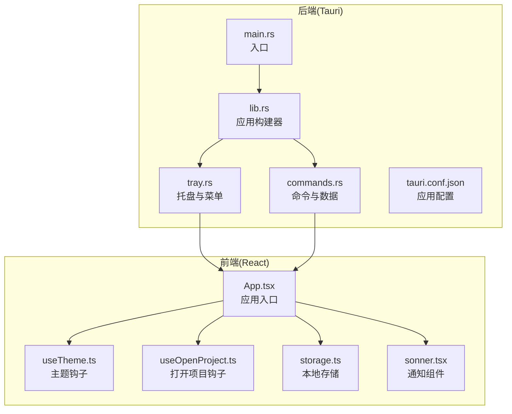
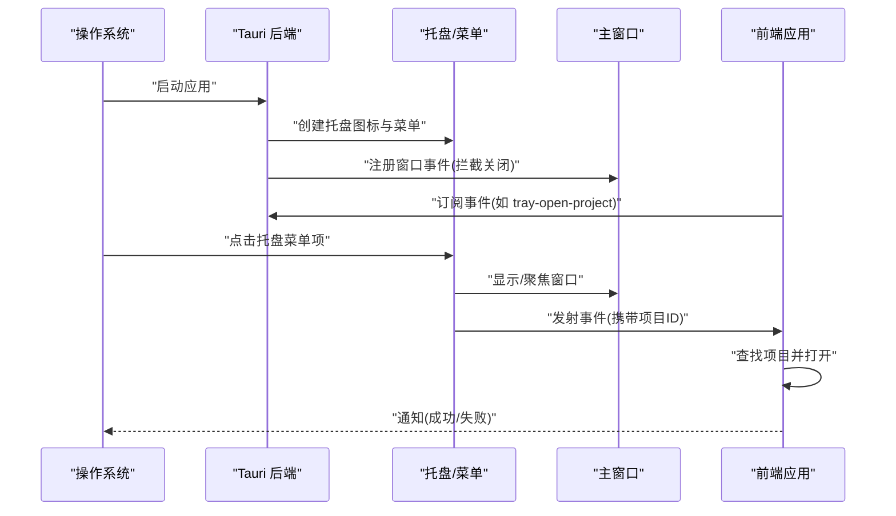
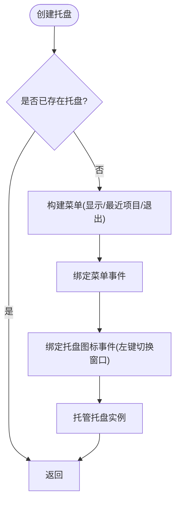
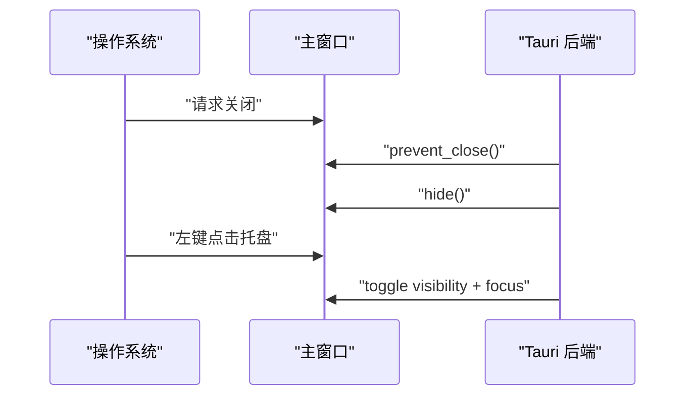
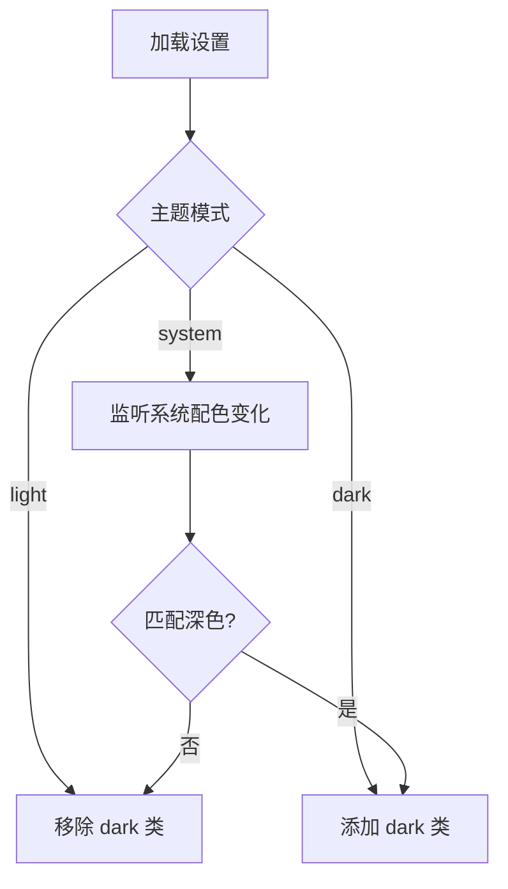
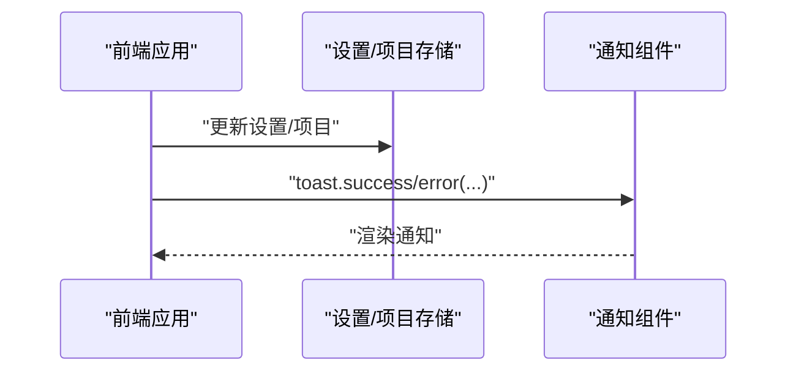
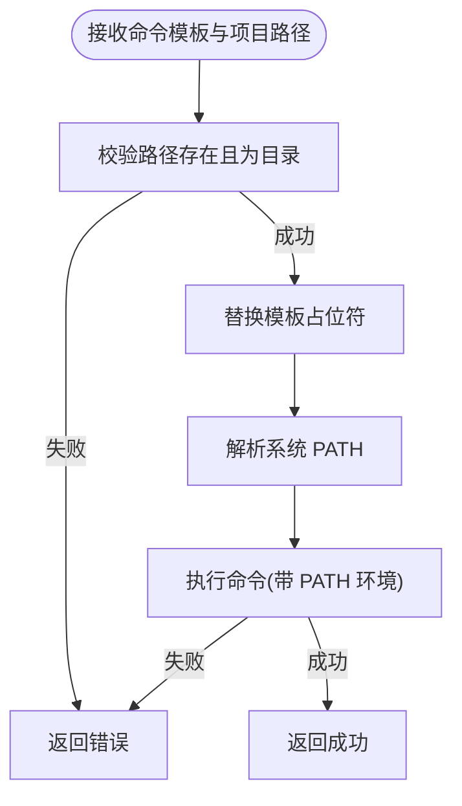
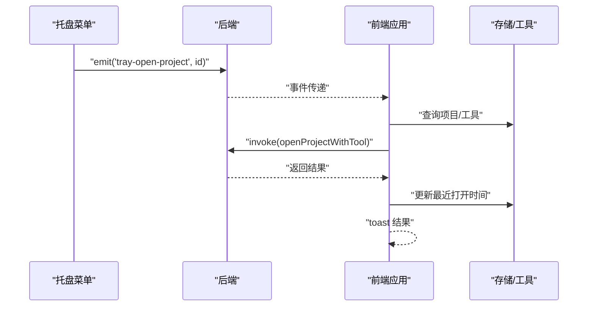
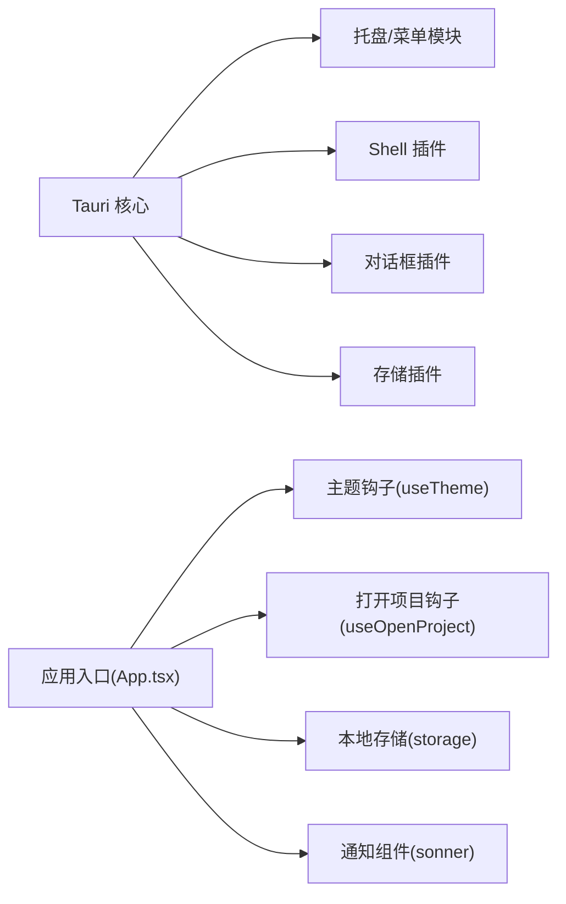

# 系统集成

<cite>
**本文引用的文件**
- [src-tauri/src/main.rs](file://src-tauri/src/main.rs)
- [src-tauri/src/lib.rs](file://src-tauri/src/lib.rs)
- [src-tauri/src/tray.rs](file://src-tauri/src/tray.rs)
- [src-tauri/src/commands.rs](file://src-tauri/src/commands.rs)
- [src-tauri/tauri.conf.json](file://src-tauri/tauri.conf.json)
- [src/App.tsx](file://src/App.tsx)
- [src/hooks/useTheme.ts](file://src/hooks/useTheme.ts)
- [src/hooks/useOpenProject.ts](file://src/hooks/useOpenProject.ts)
- [src/lib/storage.ts](file://src/lib/storage.ts)
- [src/lib/constants.ts](file://src/lib/constants.ts)
- [src/components/ui/sonner.tsx](file://src/components/ui/sonner.tsx)
</cite>

## 目录
1. [简介](#简介)
2. [项目结构](#项目结构)
3. [核心组件](#核心组件)
4. [架构总览](#架构总览)
5. [详细组件分析](#详细组件分析)
6. [依赖分析](#依赖分析)
7. [性能考虑](#性能考虑)
8. [故障排除指南](#故障排除指南)
9. [结论](#结论)
10. [附录](#附录)

## 简介
本章节概述 LaunchPro 的系统集成功能目标与整体思路。系统集成围绕“后台运行、快速访问、个性化设置”三大体验目标展开，通过系统托盘、窗口管理、主题切换、通知系统以及系统菜单等能力，为用户提供稳定、高效且可定制的桌面应用体验。后文将从架构、组件、数据流、事件处理与跨平台兼容性等方面进行深入解析，并提供可操作的配置示例与最佳实践。

## 项目结构
LaunchPro 的系统集成功能主要由 Rust 后端（Tauri）与前端 React 应用协同完成：
- 后端负责：托盘图标与菜单构建、窗口事件拦截、系统命令执行、应用数据持久化、系统路径解析等。
- 前端负责：主题切换逻辑、通知展示、事件监听与响应、工具与项目数据管理等。

**图表来源**
- [src-tauri/src/main.rs:1-7](file://src-tauri/src/main.rs#L1-L7)
- [src-tauri/src/lib.rs:1-29](file://src-tauri/src/lib.rs#L1-L29)
- [src-tauri/src/tray.rs:1-105](file://src-tauri/src/tray.rs#L1-L105)
- [src-tauri/src/commands.rs:1-157](file://src-tauri/src/commands.rs#L1-L157)
- [src-tauri/tauri.conf.json:1-40](file://src-tauri/tauri.conf.json#L1-L40)
- [src/App.tsx:1-62](file://src/App.tsx#L1-L62)
- [src/hooks/useTheme.ts:1-37](file://src/hooks/useTheme.ts#L1-L37)
- [src/hooks/useOpenProject.ts:1-44](file://src/hooks/useOpenProject.ts#L1-L44)
- [src/lib/storage.ts:1-30](file://src/lib/storage.ts#L1-L30)
- [src/components/ui/sonner.tsx:1-20](file://src/components/ui/sonner.tsx#L1-L20)

**章节来源**
- [src-tauri/src/main.rs:1-7](file://src-tauri/src/main.rs#L1-L7)
- [src-tauri/src/lib.rs:1-29](file://src-tauri/src/lib.rs#L1-L29)
- [src-tauri/tauri.conf.json:1-40](file://src-tauri/tauri.conf.json#L1-L40)

## 核心组件
- 托盘与系统菜单：在应用启动时创建系统托盘图标，动态生成包含“显示窗口”“退出”以及“最近项目”的菜单项；支持左键点击托盘图标切换主窗口显示状态。
- 窗口管理：拦截关闭请求，将窗口隐藏而非销毁，实现后台运行；提供窗口焦点控制。
- 主题切换：根据设置自动切换明暗主题，支持跟随系统；提供主题变更接口。
- 通知系统：基于前端通知组件统一展示操作结果与错误提示。
- 数据持久化：使用本地存储模块管理项目、工具与设置，提供默认值与自动保存。
- 系统命令执行：解析系统 PATH 并以安全方式调用外部工具打开项目。

**章节来源**
- [src-tauri/src/tray.rs:1-105](file://src-tauri/src/tray.rs#L1-L105)
- [src-tauri/src/lib.rs:16-25](file://src-tauri/src/lib.rs#L16-L25)
- [src/hooks/useTheme.ts:1-37](file://src/hooks/useTheme.ts#L1-L37)
- [src/App.tsx:10-21](file://src/App.tsx#L10-L21)
- [src/lib/storage.ts:1-30](file://src/lib/storage.ts#L1-L30)
- [src-tauri/src/commands.rs:14-55](file://src-tauri/src/commands.rs#L14-L55)

## 架构总览
下图展示了系统集成功能的端到端交互流程：后端负责托盘与窗口事件、命令执行与数据读写；前端负责主题与通知、事件监听与项目打开。

**图表来源**
- [src-tauri/src/lib.rs:16-25](file://src-tauri/src/lib.rs#L16-L25)
- [src-tauri/src/tray.rs:39-98](file://src-tauri/src/tray.rs#L39-L98)
- [src/App.tsx:37-52](file://src/App.tsx#L37-L52)

## 详细组件分析

### 托盘与系统菜单
- 动态菜单构建：根据最近打开的项目列表动态生成菜单项，支持一键打开项目；菜单包含“显示窗口”“退出”等基础项。
- 菜单事件处理：点击“显示窗口”显示并聚焦主窗口；点击“退出”退出应用；点击“最近项目”项通过事件机制通知前端打开对应项目。
- 托盘图标事件：左键点击托盘图标切换主窗口可见性；支持模板图标以适配不同主题。
- 防重复创建：检查是否存在同 ID 的托盘图标，避免重复创建导致资源泄漏。

**图表来源**
- [src-tauri/src/tray.rs:39-104](file://src-tauri/src/tray.rs#L39-L104)

**章节来源**
- [src-tauri/src/tray.rs:9-37](file://src-tauri/src/tray.rs#L9-L37)
- [src-tauri/src/tray.rs:47-98](file://src-tauri/src/tray.rs#L47-L98)

### 窗口管理
- 关闭请求拦截：当收到窗口关闭请求时，阻止默认关闭行为并将窗口隐藏，实现后台运行。
- 窗口可见性切换：通过托盘图标事件在显示与隐藏之间切换，并在显示时设置焦点。
- 窗口配置：在应用配置中定义窗口尺寸、最小尺寸、居中与装饰等属性。

**图表来源**
- [src-tauri/src/lib.rs:20-25](file://src-tauri/src/lib.rs#L20-L25)
- [src-tauri/tauri.conf.json:13-23](file://src-tauri/tauri.conf.json#L13-L23)

**章节来源**
- [src-tauri/src/lib.rs:20-25](file://src-tauri/src/lib.rs#L20-L25)
- [src-tauri/tauri.conf.json:13-23](file://src-tauri/tauri.conf.json#L13-L23)

### 主题切换
- 设置驱动：主题状态来自设置存储，支持 light、dark、system 三种模式。
- 自动适配：当选择 system 时，监听系统配色变化并实时更新根元素类名。
- 前端钩子：通过自定义 Hook 在组件挂载时应用主题策略，并暴露 setTheme 接口供设置界面调用。

**图表来源**
- [src/hooks/useTheme.ts:8-29](file://src/hooks/useTheme.ts#L8-L29)
- [src/lib/constants.ts:20-23](file://src/lib/constants.ts#L20-L23)

**章节来源**
- [src/hooks/useTheme.ts:1-37](file://src/hooks/useTheme.ts#L1-L37)
- [src/lib/constants.ts:20-23](file://src/lib/constants.ts#L20-L23)

### 通知系统
- 统一通知：前端使用通知组件在右下角展示操作结果与错误信息，支持丰富样式与关闭按钮。
- 事件触发：在项目打开、错误处理等场景触发 toast 展示。

**图表来源**
- [src/App.tsx:10-21](file://src/App.tsx#L10-L21)
- [src/components/ui/sonner.tsx:1-20](file://src/components/ui/sonner.tsx#L1-L20)

**章节来源**
- [src/App.tsx:10-21](file://src/App.tsx#L10-L21)
- [src/components/ui/sonner.tsx:1-20](file://src/components/ui/sonner.tsx#L1-L20)

### 系统命令执行与 PATH 解析
- 命令模板：支持将项目路径注入命令模板，调用外部工具打开项目。
- PATH 解析：在 macOS 上读取系统路径文件与常见位置，合并当前 PATH，确保工具可被正确找到。
- 错误处理：对不存在路径、非目录、命令执行失败等情况进行错误反馈。

**图表来源**
- [src-tauri/src/commands.rs:57-88](file://src-tauri/src/commands.rs#L57-L88)
- [src-tauri/src/commands.rs:14-55](file://src-tauri/src/commands.rs#L14-L55)

**章节来源**
- [src-tauri/src/commands.rs:57-88](file://src-tauri/src/commands.rs#L57-L88)
- [src-tauri/src/commands.rs:14-55](file://src-tauri/src/commands.rs#L14-L55)

### 事件与数据流
- 托盘事件到前端：后端在点击“最近项目”菜单项时向前端发射事件，携带项目 ID；前端监听该事件并打开对应项目。
- 项目打开流程：前端根据项目与工具设置选择合适工具，调用后端命令执行打开操作，并更新最近打开时间。

**图表来源**
- [src-tauri/src/tray.rs:66-76](file://src-tauri/src/tray.rs#L66-L76)
- [src/App.tsx:37-52](file://src/App.tsx#L37-L52)
- [src/hooks/useOpenProject.ts:15-40](file://src/hooks/useOpenProject.ts#L15-L40)
- [src-tauri/src/commands.rs:57-88](file://src-tauri/src/commands.rs#L57-L88)

**章节来源**
- [src-tauri/src/tray.rs:66-76](file://src-tauri/src/tray.rs#L66-L76)
- [src/App.tsx:37-52](file://src/App.tsx#L37-L52)
- [src/hooks/useOpenProject.ts:15-40](file://src/hooks/useOpenProject.ts#L15-L40)

## 依赖分析
- 后端依赖：Tauri 核心、Shell 插件、对话框插件、存储插件；托盘与菜单功能依赖 Tauri 的 tray 与 menu 模块。
- 前端依赖：Zustand 存储、Radix UI 下拉菜单、Sonner 通知、@tauri-apps/api 事件监听。
- 配置依赖：应用配置文件定义窗口属性、打包图标与最低系统版本等。

**图表来源**
- [src-tauri/src/lib.rs:6-19](file://src-tauri/src/lib.rs#L6-L19)
- [src-tauri/src/main.rs:1-7](file://src-tauri/src/main.rs#L1-L7)
- [src/App.tsx:1-62](file://src/App.tsx#L1-L62)

**章节来源**
- [src-tauri/src/lib.rs:6-19](file://src-tauri/src/lib.rs#L6-L19)
- [src-tauri/src/main.rs:1-7](file://src-tauri/src/main.rs#L1-L7)
- [src/App.tsx:1-62](file://src/App.tsx#L1-L62)

## 性能考虑
- 托盘菜单动态生成：仅在应用启动时构建一次菜单，避免频繁重建；最近项目列表限制为固定数量，降低渲染与事件绑定开销。
- 窗口隐藏而非销毁：减少窗口生命周期成本，提升后台运行时的响应速度。
- 事件监听去抖：前端对事件监听采用一次性解绑，避免重复监听导致的内存泄漏。
- PATH 解析缓存：当前实现每次执行命令时重新解析 PATH，可在高频调用场景下考虑缓存策略以减少文件 IO。

[本节为通用建议，不直接分析具体文件]

## 故障排除指南
- 托盘图标未显示或重复创建
  - 检查托盘 ID 是否唯一，确认未重复创建；确认图标路径存在或回退到默认窗口图标。
  - 参考：[src-tauri/src/tray.rs:40-43](file://src-tauri/src/tray.rs#L40-L43)、[src-tauri/src/tray.rs:47-51](file://src-tauri/src/tray.rs#L47-L51)
- 左键点击托盘无反应
  - 确认未启用左键显示菜单的配置；检查托盘图标事件回调是否正确绑定。
  - 参考：[src-tauri/src/tray.rs:53-53](file://src-tauri/src/tray.rs#L53-L53)、[src-tauri/src/tray.rs:80-96](file://src-tauri/src/tray.rs#L80-L96)
- 点击“最近项目”无法打开项目
  - 检查事件发射与前端监听是否正常；确认项目 ID 与项目列表一致。
  - 参考：[src-tauri/src/tray.rs:66-76](file://src-tauri/src/tray.rs#L66-L76)、[src/App.tsx:37-52](file://src/App.tsx#L37-L52)
- 窗口关闭即退出
  - 确认窗口事件拦截逻辑生效；检查 prevent_close 是否被调用。
  - 参考：[src-tauri/src/lib.rs:20-25](file://src-tauri/src/lib.rs#L20-L25)
- 外部工具无法启动
  - 检查命令模板与项目路径；确认 PATH 解析是否包含工具所在目录。
  - 参考：[src-tauri/src/commands.rs:57-88](file://src-tauri/src/commands.rs#L57-L88)、[src-tauri/src/commands.rs:14-55](file://src-tauri/src/commands.rs#L14-L55)
- 主题未生效
  - 检查设置存储中的主题字段；确认系统配色监听是否正确绑定。
  - 参考：[src/hooks/useTheme.ts:8-29](file://src/hooks/useTheme.ts#L8-L29)、[src/lib/constants.ts:20-23](file://src/lib/constants.ts#L20-L23)

**章节来源**
- [src-tauri/src/tray.rs:40-53](file://src-tauri/src/tray.rs#L40-L53)
- [src-tauri/src/tray.rs:66-76](file://src-tauri/src/tray.rs#L66-L76)
- [src-tauri/src/lib.rs:20-25](file://src-tauri/src/lib.rs#L20-L25)
- [src-tauri/src/commands.rs:57-88](file://src-tauri/src/commands.rs#L57-L88)
- [src/hooks/useTheme.ts:8-29](file://src/hooks/useTheme.ts#L8-L29)

## 结论
LaunchPro 的系统集成功能以 Tauri 为核心，结合前端 React 实现了完整的后台运行、快速访问与个性化体验。托盘菜单与窗口事件处理保证了良好的系统级交互；主题与通知系统提升了用户体验的一致性与反馈效率；命令执行与数据持久化则确保了功能的可用性与可靠性。整体设计在跨平台兼容性与扩展性方面具备良好基础，便于后续进一步增强。

[本节为总结性内容，不直接分析具体文件]

## 附录

### 配置示例与最佳实践
- 自定义托盘菜单
  - 在菜单构建函数中添加新的菜单项与事件处理，确保事件 ID 唯一并绑定相应行为。
  - 参考：[src-tauri/src/tray.rs:9-37](file://src-tauri/src/tray.rs#L9-L37)、[src-tauri/src/tray.rs:54-79](file://src-tauri/src/tray.rs#L54-L79)
- 实现主题切换
  - 使用主题钩子读取设置并应用到根元素；在设置界面提供切换入口。
  - 参考：[src/hooks/useTheme.ts:1-37](file://src/hooks/useTheme.ts#L1-L37)、[src/lib/constants.ts:20-23](file://src/lib/constants.ts#L20-L23)
- 处理系统事件
  - 在前端监听后端发射的事件，结合项目与工具存储执行打开操作。
  - 参考：[src/App.tsx:37-52](file://src/App.tsx#L37-L52)、[src/hooks/useOpenProject.ts:15-40](file://src/hooks/useOpenProject.ts#L15-L40)
- 跨平台兼容性
  - 在 macOS 上注意 PATH 解析与工具命令差异；在 Windows 上关注图标格式与系统托盘行为。
  - 参考：[src-tauri/src/commands.rs:14-55](file://src-tauri/src/commands.rs#L14-L55)、[src-tauri/tauri.conf.json:25-38](file://src-tauri/tauri.conf.json#L25-L38)

**章节来源**
- [src-tauri/src/tray.rs:9-37](file://src-tauri/src/tray.rs#L9-L37)
- [src-tauri/src/tray.rs:54-79](file://src-tauri/src/tray.rs#L54-L79)
- [src/hooks/useTheme.ts:1-37](file://src/hooks/useTheme.ts#L1-L37)
- [src/lib/constants.ts:20-23](file://src/lib/constants.ts#L20-L23)
- [src/App.tsx:37-52](file://src/App.tsx#L37-L52)
- [src/hooks/useOpenProject.ts:15-40](file://src/hooks/useOpenProject.ts#L15-L40)
- [src-tauri/src/commands.rs:14-55](file://src-tauri/src/commands.rs#L14-L55)
- [src-tauri/tauri.conf.json:25-38](file://src-tauri/tauri.conf.json#L25-L38)