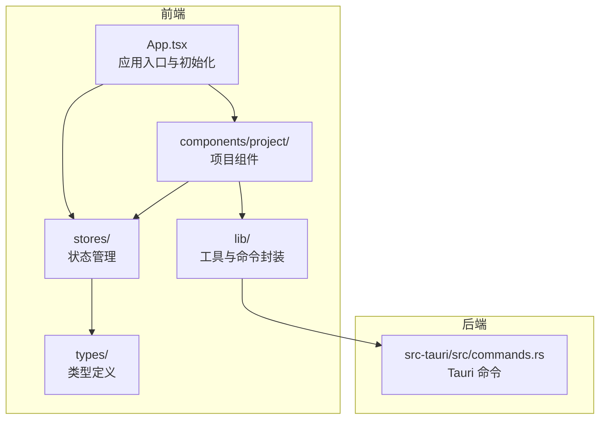
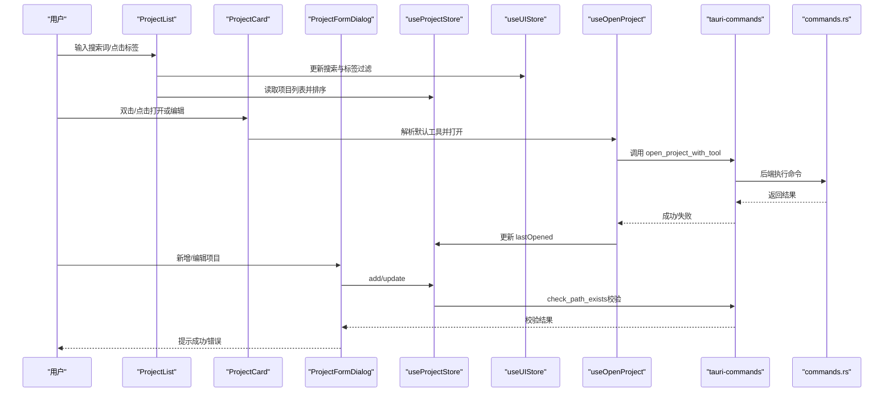
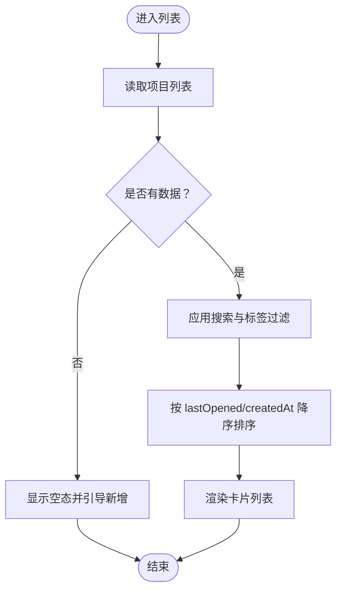
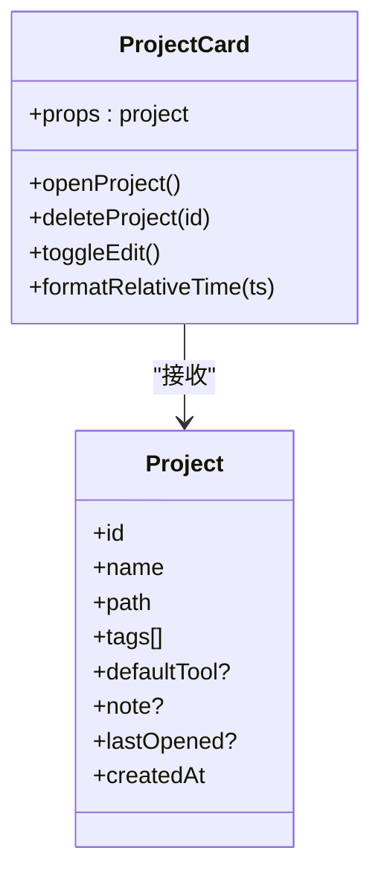
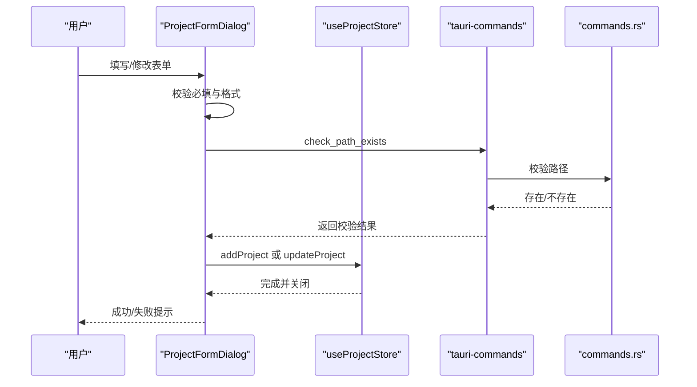
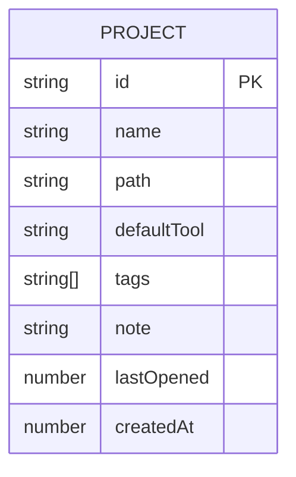
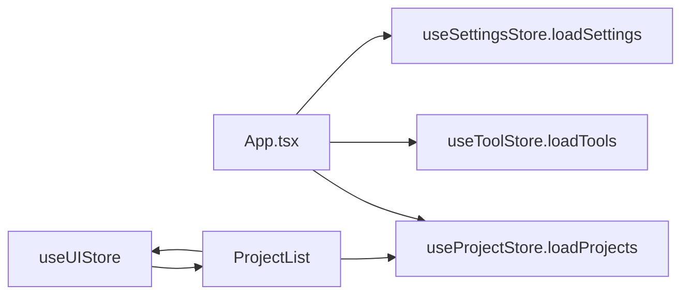
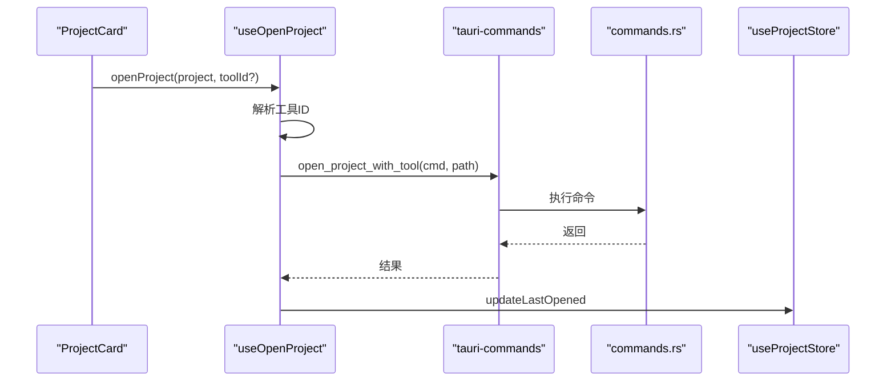
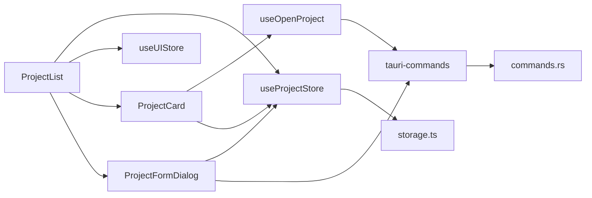

# 项目管理

<cite>
**本文引用的文件**
- [ProjectList.tsx](file://src/components/project/ProjectList.tsx)
- [ProjectCard.tsx](file://src/components/project/ProjectCard.tsx)
- [ProjectFormDialog.tsx](file://src/components/project/ProjectFormDialog.tsx)
- [useProjectStore.ts](file://src/stores/useProjectStore.ts)
- [useUIStore.ts](file://src/stores/useUIStore.ts)
- [storage.ts](file://src/lib/storage.ts)
- [index.ts（类型定义）](file://src/types/index.ts)
- [useOpenProject.ts](file://src/hooks/useOpenProject.ts)
- [tauri-commands.ts](file://src/lib/tauri-commands.ts)
- [commands.rs（后端命令）](file://src-tauri/src/commands.rs)
- [App.tsx](file://src/App.tsx)
- [constants.ts](file://src/lib/constants.ts)
- [README.md](file://README.md)
</cite>

## 目录
1. [简介](#简介)
2. [项目结构](#项目结构)
3. [核心组件](#核心组件)
4. [架构总览](#架构总览)
5. [详细组件分析](#详细组件分析)
6. [依赖关系分析](#依赖关系分析)
7. [性能考量](#性能考量)
8. [故障排查指南](#故障排查指南)
9. [结论](#结论)
10. [附录：使用示例与最佳实践](#附录使用示例与最佳实践)

## 简介
本功能文档聚焦于“项目管理”模块，涵盖项目列表展示、项目卡片组件、项目表单对话框、项目搜索与标签过滤、排序机制、数据模型、CRUD 实现、状态管理与用户交互流程。通过本地持久化存储与跨平台桌面运行时集成，帮助开发者高效组织本地项目、快速打开、追踪最近使用，并以标签与备注进行分类管理。

## 项目结构
项目采用分层组织：前端 React 组件位于 src/components、状态管理位于 src/stores、工具与设置位于对应目录；后端 Rust 命令位于 src-tauri/src，通过 Tauri 命令桥接前端与系统。

图表来源
- [App.tsx:1-40](file://src/App.tsx#L1-L40)
- [ProjectList.tsx:1-168](file://src/components/project/ProjectList.tsx#L1-L168)
- [useProjectStore.ts:1-67](file://src/stores/useProjectStore.ts#L1-L67)
- [tauri-commands.ts:1-17](file://src/lib/tauri-commands.ts#L1-L17)
- [commands.rs:1-95](file://src-tauri/src/commands.rs#L1-L95)

章节来源
- [README.md:115-135](file://README.md#L115-L135)

## 核心组件
- 项目列表容器：负责搜索、标签过滤、排序与渲染卡片列表。
- 项目卡片：展示项目基本信息、默认工具、标签、相对时间、操作菜单。
- 项目表单对话框：新增/编辑项目，选择路径、输入名称、标签、默认工具与备注。
- 状态管理：项目数据、UI 过滤状态、加载状态。
- 打开项目钩子：解析默认工具、调用后端命令执行打开操作并更新最近打开时间。

章节来源
- [ProjectList.tsx:12-159](file://src/components/project/ProjectList.tsx#L12-L159)
- [ProjectCard.tsx:27-164](file://src/components/project/ProjectCard.tsx#L27-L164)
- [ProjectFormDialog.tsx:33-228](file://src/components/project/ProjectFormDialog.tsx#L33-L228)
- [useProjectStore.ts:16-66](file://src/stores/useProjectStore.ts#L16-L66)
- [useUIStore.ts:14-32](file://src/stores/useUIStore.ts#L14-L32)
- [useOpenProject.ts:9-43](file://src/hooks/useOpenProject.ts#L9-L43)

## 架构总览
从前端到后端的数据流与交互如下：

图表来源
- [ProjectList.tsx:12-159](file://src/components/project/ProjectList.tsx#L12-L159)
- [ProjectCard.tsx:27-164](file://src/components/project/ProjectCard.tsx#L27-L164)
- [ProjectFormDialog.tsx:33-228](file://src/components/project/ProjectFormDialog.tsx#L33-L228)
- [useProjectStore.ts:16-66](file://src/stores/useProjectStore.ts#L16-L66)
- [useUIStore.ts:14-32](file://src/stores/useUIStore.ts#L14-L32)
- [useOpenProject.ts:9-43](file://src/hooks/useOpenProject.ts#L9-L43)
- [tauri-commands.ts:1-17](file://src/lib/tauri-commands.ts#L1-L17)
- [commands.rs:48-79](file://src-tauri/src/commands.rs#L48-L79)

## 详细组件分析

### 项目列表（ProjectList）
- 功能要点
  - 搜索：支持按名称、路径、标签模糊匹配。
  - 标签过滤：聚合所有标签，支持多选过滤。
  - 排序：优先按 lastOpened 或 createdAt 降序排列。
  - 加载态：统一显示加载提示。
  - 新增入口：顶部按钮触发新增对话框。
- 关键逻辑
  - 使用 useMemo 缓存标签集合与过滤/排序结果，避免重复计算。
  - 与 UI 状态（搜索词、选中标签）联动，清空过滤器。
- 交互细节
  - 无项目时引导新增；有项目但无匹配时提示“无匹配”。

图表来源
- [ProjectList.tsx:22-55](file://src/components/project/ProjectList.tsx#L22-L55)

章节来源
- [ProjectList.tsx:12-159](file://src/components/project/ProjectList.tsx#L12-L159)

### 项目卡片（ProjectCard）
- 功能要点
  - 展示：名称、路径（带缩略）、标签、相对打开时间、默认工具徽标。
  - 操作：双击打开、下拉菜单（打开方式子菜单、编辑、删除）。
  - 工具选择：从工具列表中选择特定工具打开。
- 用户体验
  - 路径过长时使用 Tooltip 显示完整路径。
  - 悬停显示操作按钮，提升可用性。

图表来源
- [ProjectCard.tsx:23-177](file://src/components/project/ProjectCard.tsx#L23-L177)
- [index.ts（类型定义）:1-10](file://src/types/index.ts#L1-L10)

章节来源
- [ProjectCard.tsx:27-164](file://src/components/project/ProjectCard.tsx#L27-L164)

### 项目表单对话框（ProjectFormDialog）
- 功能要点
  - 新增/编辑模式切换。
  - 文件夹选择器自动填充名称。
  - 标签逗号分隔解析。
  - 默认工具选择（全局默认或项目默认）。
  - 路径存在性校验。
- 表单字段
  - 名称、路径、标签、默认工具、备注。
- 错误处理
  - 必填校验、路径不存在、保存异常均通过通知提示。

图表来源
- [ProjectFormDialog.tsx:64-134](file://src/components/project/ProjectFormDialog.tsx#L64-L134)
- [tauri-commands.ts:10-12](file://src/lib/tauri-commands.ts#L10-L12)
- [commands.rs:81-85](file://src-tauri/src/commands.rs#L81-L85)
- [useProjectStore.ts:30-49](file://src/stores/useProjectStore.ts#L30-L49)

章节来源
- [ProjectFormDialog.tsx:33-228](file://src/components/project/ProjectFormDialog.tsx#L33-L228)

### 数据模型与 CRUD
- 数据模型（Project）
  - 字段：id、name、path、defaultTool（可选）、tags（数组）、note（可选）、lastOpened（可选）、createdAt。
- CRUD 实现
  - 加载：从本地存储读取并设置 isLoading。
  - 新增：生成唯一 id 与创建时间，写入存储。
  - 更新：按 id 替换项目，写入存储。
  - 删除：过滤掉目标 id，写入存储。
  - 最近打开：更新 lastOpened 并写入存储。
- 存储
  - 使用 tauri-plugin-store 的 LazyStore，自动保存 projects.json。

图表来源
- [index.ts（类型定义）:1-10](file://src/types/index.ts#L1-L10)

章节来源
- [useProjectStore.ts:16-66](file://src/stores/useProjectStore.ts#L16-L66)
- [storage.ts:19-21](file://src/lib/storage.ts#L19-L21)

### 状态管理机制
- useProjectStore：项目数据、加载状态、CRUD 方法、最近打开时间更新。
- useUIStore：活动视图、搜索词、选中标签、切换标签与清空过滤。
- 初始化：应用启动时一次性加载工具、项目与设置。

图表来源
- [App.tsx:21-30](file://src/App.tsx#L21-L30)
- [useProjectStore.ts:20-28](file://src/stores/useProjectStore.ts#L20-L28)
- [useUIStore.ts:14-32](file://src/stores/useUIStore.ts#L14-L32)

章节来源
- [App.tsx:10-37](file://src/App.tsx#L10-L37)
- [useUIStore.ts:14-32](file://src/stores/useUIStore.ts#L14-L32)

### 打开项目与系统集成
- 解析工具：优先参数传入，其次项目默认，再次全局默认。
- 执行命令：模板替换 {path}，拆分为程序名与参数，设置 PATH 并异步启动。
- 成功/失败反馈：通过通知提示，同时更新最近打开时间。

图表来源
- [useOpenProject.ts:15-39](file://src/hooks/useOpenProject.ts#L15-L39)
- [tauri-commands.ts:3-8](file://src/lib/tauri-commands.ts#L3-L8)
- [commands.rs:48-79](file://src-tauri/src/commands.rs#L48-L79)
- [useProjectStore.ts:58-65](file://src/stores/useProjectStore.ts#L58-L65)

章节来源
- [useOpenProject.ts:9-43](file://src/hooks/useOpenProject.ts#L9-L43)
- [tauri-commands.ts:1-17](file://src/lib/tauri-commands.ts#L1-L17)
- [commands.rs:48-79](file://src-tauri/src/commands.rs#L48-L79)

## 依赖关系分析
- 组件耦合
  - ProjectList 依赖 useProjectStore、useUIStore、ProjectCard、ProjectFormDialog。
  - ProjectCard 依赖 useOpenProject、useProjectStore、useToolStore。
  - ProjectFormDialog 依赖 useProjectStore、useToolStore、tauri-commands。
- 外部依赖
  - tauri-plugin-store：本地持久化。
  - Tauri 命令：路径校验、打开项目、获取应用数据目录。
- 状态耦合
  - UI 过滤状态与项目列表强关联，通过 useMemo 降低重算成本。

图表来源
- [ProjectList.tsx:7-10](file://src/components/project/ProjectList.tsx#L7-L10)
- [ProjectCard.tsx:17-21](file://src/components/project/ProjectCard.tsx#L17-L21)
- [ProjectFormDialog.tsx:20-25](file://src/components/project/ProjectFormDialog.tsx#L20-L25)
- [useProjectStore.ts:3-4](file://src/stores/useProjectStore.ts#L3-L4)
- [storage.ts:19-21](file://src/lib/storage.ts#L19-L21)
- [tauri-commands.ts:1-17](file://src/lib/tauri-commands.ts#L1-L17)
- [commands.rs:48-79](file://src-tauri/src/commands.rs#L48-L79)

章节来源
- [ProjectList.tsx:12-159](file://src/components/project/ProjectList.tsx#L12-L159)
- [ProjectCard.tsx:27-164](file://src/components/project/ProjectCard.tsx#L27-L164)
- [ProjectFormDialog.tsx:33-228](file://src/components/project/ProjectFormDialog.tsx#L33-L228)

## 性能考量
- 计算优化
  - 使用 useMemo 缓存标签集合与过滤/排序结果，减少不必要的渲染与计算。
- 渲染优化
  - 列表滚动区域使用 ScrollArea，避免全量 DOM。
- I/O 优化
  - 本地存储自动保存，批量写入减少磁盘压力。
- 异步处理
  - 打开项目与路径校验均为异步，避免阻塞 UI。

## 故障排查指南
- 无法打开项目
  - 检查工具命令模板是否包含 {path} 占位符。
  - 确认系统 PATH 是否正确注入，必要时检查后端 PATH 构建逻辑。
- 路径不存在
  - 表单提交前会校验路径是否存在且为目录；若失败，请确认路径正确。
- 未选择工具
  - 若未设置项目默认工具与全局默认工具，将提示未选择工具。
- 数据未持久化
  - 确认 tauri-plugin-store 正常工作，JSON 文件可读写。

章节来源
- [useOpenProject.ts:15-39](file://src/hooks/useOpenProject.ts#L15-L39)
- [tauri-commands.ts:10-12](file://src/lib/tauri-commands.ts#L10-L12)
- [commands.rs:48-79](file://src-tauri/src/commands.rs#L48-L79)

## 结论
项目管理模块通过清晰的组件职责划分、稳定的本地存储与可靠的后端命令桥接，实现了从“新增/编辑/删除”到“搜索/标签/排序”的完整闭环。配合最近打开时间与默认工具配置，显著提升开发者对本地项目的组织效率与一键访问体验。

## 附录：使用示例与最佳实践
- 添加新项目
  - 点击“Add”，填写名称与路径，可选标签与默认工具，提交后自动校验路径并保存。
- 编辑项目
  - 在项目卡片中选择“Edit”，修改信息后保存。
- 删除项目
  - 在项目卡片中选择“Delete”，确认后移除。
- 按标签筛选
  - 在标签区点击标签启用过滤，支持多标签组合；点击“Clear”清空过滤。
- 搜索项目
  - 在搜索框输入关键词，支持名称、路径、标签模糊匹配。
- 快速打开
  - 双击项目卡片或使用“Open with...”子菜单选择工具打开。
- 最近使用
  - 卡片右上角显示相对打开时间，便于快速定位最近项目。

章节来源
- [ProjectList.tsx:68-120](file://src/components/project/ProjectList.tsx#L68-L120)
- [ProjectCard.tsx:115-152](file://src/components/project/ProjectCard.tsx#L115-L152)
- [ProjectFormDialog.tsx:64-134](file://src/components/project/ProjectFormDialog.tsx#L64-L134)
- [useOpenProject.ts:15-39](file://src/hooks/useOpenProject.ts#L15-L39)