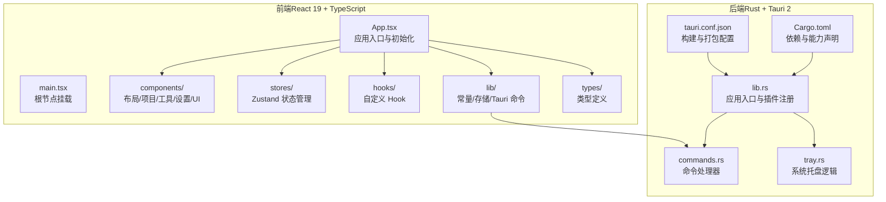
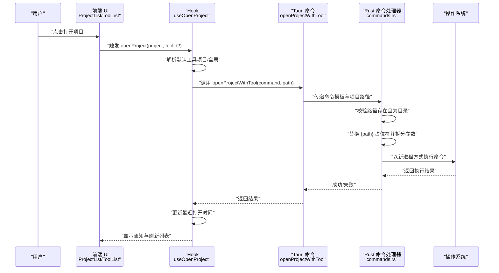
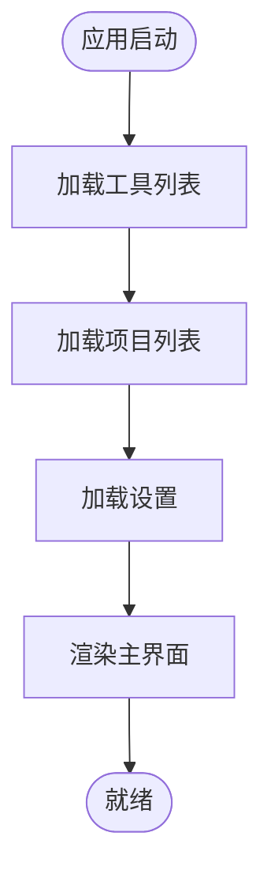
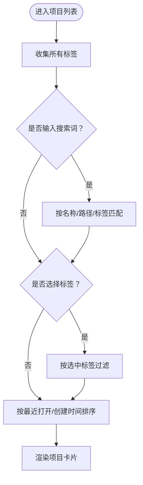
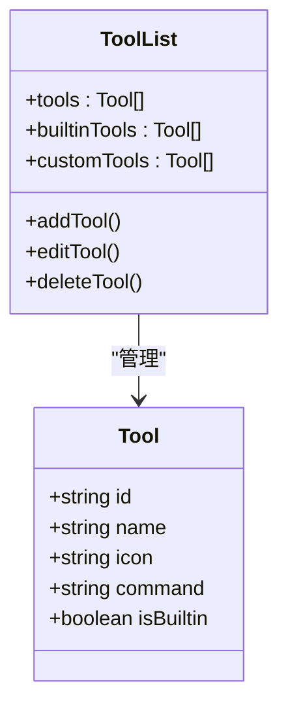
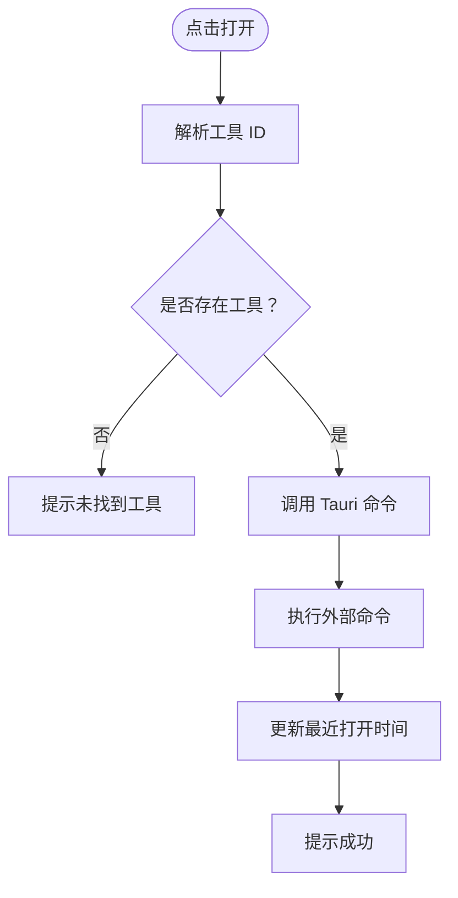
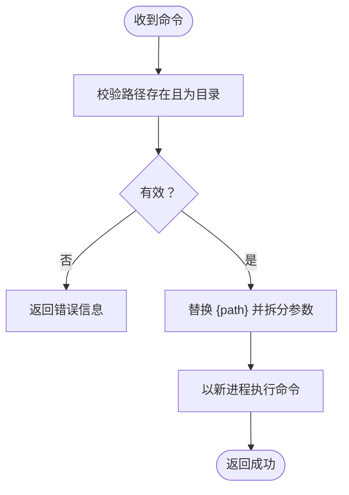
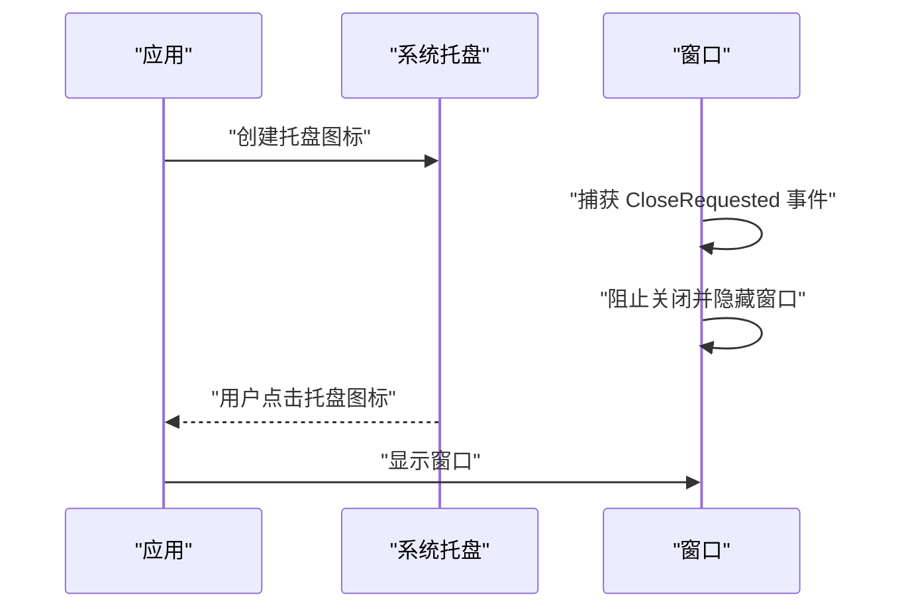
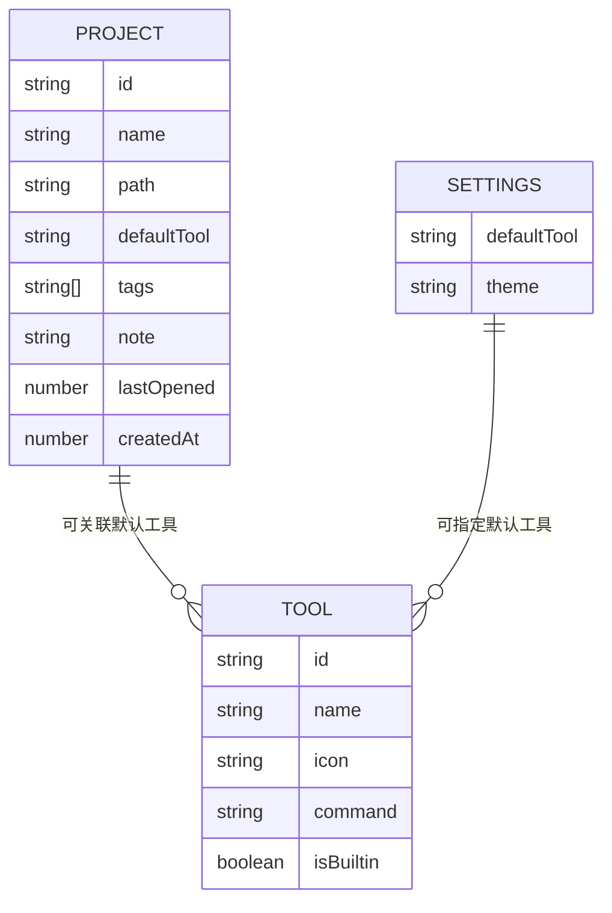
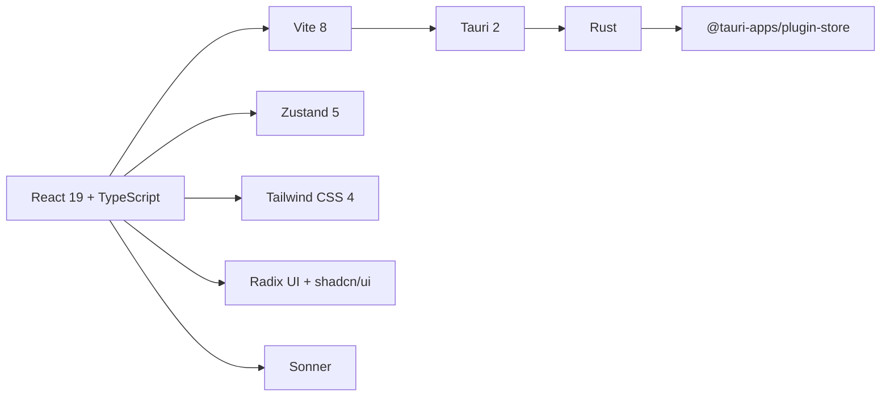

# 项目概述

<cite>
**本文档引用的文件**
- [README.md](file://README.md)
- [package.json](file://package.json)
- [src-tauri/Cargo.toml](file://src-tauri/Cargo.toml)
- [src-tauri/tauri.conf.json](file://src-tauri/tauri.conf.json)
- [src/main.tsx](file://src/main.tsx)
- [src/App.tsx](file://src/App.tsx)
- [src/lib/constants.ts](file://src/lib/constants.ts)
- [src/lib/storage.ts](file://src/lib/storage.ts)
- [src/lib/tauri-commands.ts](file://src/lib/tauri-commands.ts)
- [src/hooks/useOpenProject.ts](file://src/hooks/useOpenProject.ts)
- [src/hooks/useTheme.ts](file://src/hooks/useTheme.ts)
- [src/stores/useProjectStore.ts](file://src/stores/useProjectStore.ts)
- [src/stores/useToolStore.ts](file://src/stores/useToolStore.ts)
- [src/stores/useSettingsStore.ts](file://src/stores/useSettingsStore.ts)
- [src/stores/useUIStore.ts](file://src/stores/useUIStore.ts)
- [src/types/index.ts](file://src/types/index.ts)
- [src/components/project/ProjectList.tsx](file://src/components/project/ProjectList.tsx)
- [src/components/project/ProjectCard.tsx](file://src/components/project/ProjectCard.tsx)
- [src/components/project/ProjectFormDialog.tsx](file://src/components/project/ProjectFormDialog.tsx)
- [src/components/tool/ToolList.tsx](file://src/components/tool/ToolList.tsx)
- [src/components/tool/ToolFormDialog.tsx](file://src/components/tool/ToolFormDialog.tsx)
- [src/components/settings/SettingsView.tsx](file://src/components/settings/SettingsView.tsx)
- [src/components/layout/MainLayout.tsx](file://src/components/layout/MainLayout.tsx)
- [src/components/layout/Sidebar.tsx](file://src/components/layout/Sidebar.tsx)
- [src-tauri/src/lib.rs](file://src-tauri/src/lib.rs)
- [src-tauri/src/commands.rs](file://src-tauri/src/commands.rs)
- [src-tauri/src/tray.rs](file://src-tauri/src/tray.rs)
</cite>

## 目录
1. [简介](#简介)
2. [项目结构](#项目结构)
3. [核心组件](#核心组件)
4. [架构总览](#架构总览)
5. [详细组件分析](#详细组件分析)
6. [依赖关系分析](#依赖关系分析)
7. [性能考虑](#性能考虑)
8. [故障排除指南](#故障排除指南)
9. [结论](#结论)
10. [附录](#附录)

## 简介
LaunchPro 是一个轻量级的跨平台开发者项目管理器，旨在帮助开发者在一个原生、简洁的界面中集中管理本地项目，并通过“一键启动”快速打开到任意 IDE 或编辑器。其核心价值在于：
- 本地化：所有数据存储在本地，无需云端同步或账户登录
- 一体化：统一管理项目、工具与最近打开历史
- 高效性：支持系统托盘常驻与一键启动，减少上下文切换
- 可扩展：内置多种常用开发工具的启动模板，同时允许自定义命令

LaunchPro 解决了开发者在多项目、多工具环境下的痛点：找不到项目位置、切换工具繁琐、忘记上次工作位置等问题。

章节来源
- [README.md:17-29](file://README.md#L17-L29)

## 项目结构
项目采用前后端分离的桌面应用架构，前端基于 React 19 + TypeScript，后端基于 Rust，运行时由 Tauri 2 提供。核心目录划分如下：
- 前端（React）：src/ 下的组件、状态管理、类型定义、工具函数与 UI 组件库
- 后端（Rust）：src-tauri/ 下的 Tauri 应用入口、命令处理与系统托盘逻辑
- 构建与配置：Vite、TypeScript、Tailwind CSS、pnpm 等

图表来源
- [src/main.tsx:1-11](file://src/main.tsx#L1-L11)
- [src/App.tsx:1-40](file://src/App.tsx#L1-L40)
- [src-tauri/src/lib.rs:1-28](file://src-tauri/src/lib.rs#L1-L28)
- [src-tauri/tauri.conf.json:1-44](file://src-tauri/tauri.conf.json#L1-L44)
- [src-tauri/Cargo.toml:1-22](file://src-tauri/Cargo.toml#L1-L22)

章节来源
- [README.md:115-135](file://README.md#L115-L135)
- [package.json:1-48](file://package.json#L1-L48)
- [src-tauri/Cargo.toml:1-22](file://src-tauri/Cargo.toml#L1-L22)
- [src-tauri/tauri.conf.json:1-44](file://src-tauri/tauri.conf.json#L1-L44)

## 核心组件
- 项目管理（Project Management）
  - 支持添加、编辑、删除、按标签与备注组织项目
  - 按最近打开时间与创建时间排序，便于快速定位
- 一键启动（One-click Open）
  - 将项目路径注入工具命令模板，自动替换占位符并执行
  - 支持默认工具与项目级默认工具的优先级策略
- 工具管理（Tool Management）
  - 内置多种 IDE/编辑器与终端的启动模板
  - 支持自定义工具命令，灵活适配个人工作流
- 最近历史（Recent History）
  - 记录每次打开的时间戳，用于智能排序与追踪
- 主题与系统托盘（Theming & System Tray）
  - 支持浅色/深色/系统主题
  - 应用可最小化至托盘，常驻后台一键访问
- 本地存储（Local Storage）
  - 使用 tauri-plugin-store 进行本地持久化，确保隐私与离线可用

章节来源
- [README.md:19-29](file://README.md#L19-L29)
- [src/components/project/ProjectList.tsx:12-55](file://src/components/project/ProjectList.tsx#L12-L55)
- [src/hooks/useOpenProject.ts:9-44](file://src/hooks/useOpenProject.ts#L9-L44)
- [src/lib/constants.ts:1-23](file://src/lib/constants.ts#L1-L23)
- [src/lib/storage.ts:1-30](file://src/lib/storage.ts#L1-L30)

## 架构总览
下图展示了从用户操作到系统调用的完整流程：前端通过 Tauri 命令调用后端，后端解析命令模板、拼接路径并执行外部进程，同时更新本地存储与 UI 状态。

图表来源
- [src/hooks/useOpenProject.ts:9-44](file://src/hooks/useOpenProject.ts#L9-L44)
- [src/lib/tauri-commands.ts](file://src/lib/tauri-commands.ts)
- [src-tauri/src/commands.rs:48-79](file://src-tauri/src/commands.rs#L48-L79)

章节来源
- [src/hooks/useOpenProject.ts:9-44](file://src/hooks/useOpenProject.ts#L9-L44)
- [src-tauri/src/commands.rs:1-95](file://src-tauri/src/commands.rs#L1-L95)

## 详细组件分析

### 前端应用入口与初始化
- 应用入口负责渲染根节点、提供主题与提示器上下文，并在启动时加载项目、工具与设置数据，确保 UI 能立即响应用户操作。
- 初始化顺序：加载工具 → 加载项目 → 加载设置，避免首次渲染空白状态。

图表来源
- [src/App.tsx:21-37](file://src/App.tsx#L21-L37)
- [src/main.tsx:1-11](file://src/main.tsx#L1-L11)

章节来源
- [src/App.tsx:1-40](file://src/App.tsx#L1-L40)
- [src/main.tsx:1-11](file://src/main.tsx#L1-L11)

### 项目列表与筛选
- 支持搜索框与标签过滤，动态计算并排序项目，优先展示最近打开或最新创建的项目。
- 列表为空时提供引导按钮，鼓励用户添加首个项目。

图表来源
- [src/components/project/ProjectList.tsx:12-55](file://src/components/project/ProjectList.tsx#L12-L55)

章节来源
- [src/components/project/ProjectList.tsx:1-168](file://src/components/project/ProjectList.tsx#L1-L168)

### 工具列表与命令模板
- 工具分为内置与自定义两类，内置工具覆盖主流 IDE 与终端，自定义工具允许用户编写任意命令模板。
- 每个工具以命令模板形式保存，打开项目时会将模板中的占位符替换为项目路径后执行。

图表来源
- [src/components/tool/ToolList.tsx:12-81](file://src/components/tool/ToolList.tsx#L12-L81)
- [src/types/index.ts:12-18](file://src/types/index.ts#L12-L18)

章节来源
- [src/components/tool/ToolList.tsx:1-129](file://src/components/tool/ToolList.tsx#L1-L129)
- [src/lib/constants.ts:1-23](file://src/lib/constants.ts#L1-L23)

### 一键启动流程（Hook 层）
- 优先级：传入的 toolId > 项目默认工具 > 全局默认工具；若无可用工具则提示错误。
- 成功后更新项目最近打开时间并给出成功通知。

图表来源
- [src/hooks/useOpenProject.ts:15-42](file://src/hooks/useOpenProject.ts#L15-L42)

章节来源
- [src/hooks/useOpenProject.ts:1-44](file://src/hooks/useOpenProject.ts#L1-L44)

### 后端命令处理（Rust）
- 负责安全地执行命令：校验路径存在且为目录、解析命令模板、构建系统 PATH 并执行外部进程。
- 返回执行结果给前端，以便统一处理成功与失败通知。

图表来源
- [src-tauri/src/commands.rs:48-79](file://src-tauri/src/commands.rs#L48-L79)

章节来源
- [src-tauri/src/commands.rs:1-95](file://src-tauri/src/commands.rs#L1-L95)

### 系统托盘与窗口行为
- 应用启动时创建系统托盘图标，窗口关闭事件改为隐藏而非退出，实现常驻托盘。
- 托盘图标与最小系统版本在配置中声明，确保跨平台兼容性。

图表来源
- [src-tauri/src/lib.rs:15-24](file://src-tauri/src/lib.rs#L15-L24)
- [src-tauri/tauri.conf.json:24-27](file://src-tauri/tauri.conf.json#L24-L27)

章节来源
- [src-tauri/src/lib.rs:1-28](file://src-tauri/src/lib.rs#L1-L28)
- [src-tauri/tauri.conf.json:1-44](file://src-tauri/tauri.conf.json#L1-L44)

### 本地存储与状态管理
- 使用 tauri-plugin-store 对项目、工具与设置进行本地持久化，默认值来自常量模块。
- 前端使用 Zustand 管理状态，Store 在初始化时读取本地存储并在变更时自动保存。

图表来源
- [src/types/index.ts:1-26](file://src/types/index.ts#L1-L26)
- [src/lib/storage.ts:19-29](file://src/lib/storage.ts#L19-L29)
- [src/lib/constants.ts:20-23](file://src/lib/constants.ts#L20-L23)

章节来源
- [src/lib/storage.ts:1-30](file://src/lib/storage.ts#L1-L30)
- [src/stores/useProjectStore.ts:1-67](file://src/stores/useProjectStore.ts#L1-L67)
- [src/stores/useToolStore.ts](file://src/stores/useToolStore.ts)
- [src/stores/useSettingsStore.ts](file://src/stores/useSettingsStore.ts)
- [src/stores/useUIStore.ts](file://src/stores/useUIStore.ts)
- [src/types/index.ts:1-26](file://src/types/index.ts#L1-L26)

## 依赖关系分析
- 技术栈概览
  - UI 框架：React 19 + TypeScript
  - 构建工具：Vite 8
  - 桌面运行时：Tauri 2
  - 后端语言：Rust
  - 样式：Tailwind CSS 4
  - UI 组件：Radix UI + shadcn/ui
  - 状态管理：Zustand 5
  - 持久化：tauri-plugin-store
  - 通知：Sonner

图表来源
- [README.md:101-114](file://README.md#L101-L114)
- [package.json:13-29](file://package.json#L13-L29)
- [src-tauri/Cargo.toml:15-22](file://src-tauri/Cargo.toml#L15-L22)

章节来源
- [README.md:101-114](file://README.md#L101-L114)
- [package.json:1-48](file://package.json#L1-48)
- [src-tauri/Cargo.toml:1-22](file://src-tauri/Cargo.toml#L1-L22)

## 性能考虑
- 前端优化
  - 使用 Zustand 减少不必要的重渲染，仅订阅所需状态片段
  - 列表渲染采用虚拟滚动与懒加载，提升大数据集下的滚动性能
- 后端优化
  - 命令执行采用异步进程启动，避免阻塞主线程
  - 自动保存本地存储，降低频繁写入开销
- 资源占用
  - 系统托盘常驻降低窗口切换成本，减少内存抖动
  - 本地存储避免网络请求，提高启动速度与离线可用性

## 故障排除指南
- 无法打开项目
  - 检查项目路径是否存在且为目录
  - 确认所选工具命令模板正确，占位符已替换
  - 查看通知消息与日志，确认命令执行是否成功
- 工具未生效
  - 若工具被删除或修改，尝试恢复内置模板或重新配置
  - 检查默认工具设置是否正确
- 启动异常（macOS）
  - 首次启动出现安全警告时，请前往系统设置并允许应用运行

章节来源
- [src-tauri/src/commands.rs:82-85](file://src-tauri/src/commands.rs#L82-L85)
- [src/hooks/useOpenProject.ts:31-38](file://src/hooks/useOpenProject.ts#L31-L38)
- [README.md:55-56](file://README.md#L55-L56)

## 结论
LaunchPro 通过“本地化 + 一键启动 + 工具管理 + 系统托盘”的组合，为开发者提供了高效、私密且易用的本地项目管理体验。其基于 Tauri 2 + React 19 + Rust 的技术栈，既保证了跨平台一致性，又兼顾了性能与安全性。对于初学者，它提供了开箱即用的功能与清晰的界面；对于有经验的开发者，它具备良好的扩展性与可定制性。

## 附录

### 安装指南
- 推荐方式：下载预编译二进制包
  - macOS：根据芯片选择对应 dmg 包
  - Windows：选择 exe 或 msi 安装包
  - Linux：选择 deb、AppImage 或 rpm 包
- 源码构建
  - 前置条件：Node.js >= 18、pnpm >= 8、Rust（稳定版）、平台构建依赖
  - 步骤：克隆仓库 → 安装依赖 → 开发模式（热重载）→ 生产构建

章节来源
- [README.md:44-84](file://README.md#L44-L84)

### 快速开始示例
- 添加项目
  - 在项目列表中点击“添加”，填写项目名称、路径与标签
- 配置工具
  - 在工具面板中选择或新增自定义工具，设置命令模板（如 code {path}）
- 一键打开
  - 在项目卡片上选择工具或使用项目默认工具，点击打开即可

章节来源
- [src/components/project/ProjectList.tsx:153-157](file://src/components/project/ProjectList.tsx#L153-L157)
- [src/components/tool/ToolList.tsx:30-34](file://src/components/tool/ToolList.tsx#L30-L34)
- [src/hooks/useOpenProject.ts:15-42](file://src/hooks/useOpenProject.ts#L15-L42)

### 基本使用场景
- 多项目快速切换：通过搜索与标签筛选快速定位目标项目
- 多工具适配：为不同项目配置专属工具，一键打开到对应 IDE
- 历史追踪：查看最近打开记录，快速回到上次工作位置
- 离线使用：所有数据本地存储，无需网络即可使用

章节来源
- [src/components/project/ProjectList.tsx:29-55](file://src/components/project/ProjectList.tsx#L29-L55)
- [src/lib/storage.ts:19-29](file://src/lib/storage.ts#L19-L29)